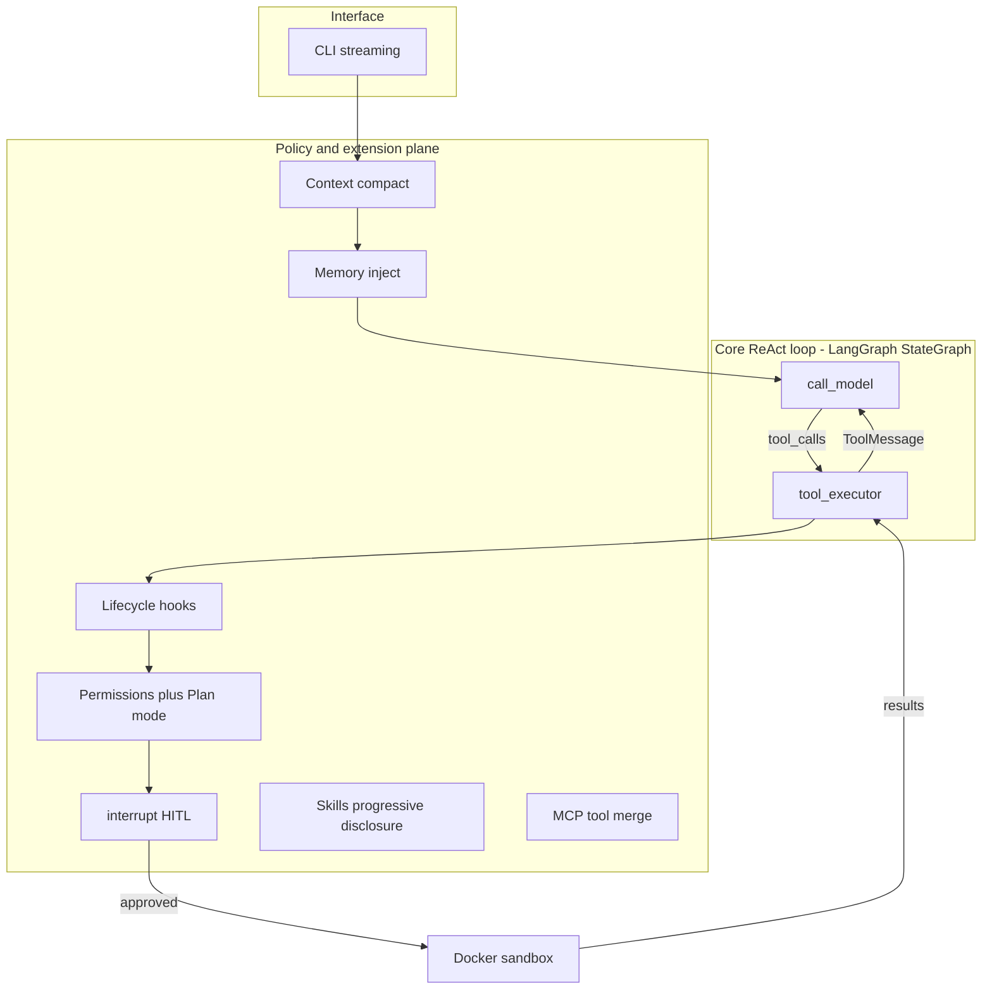

# Architecture (living document)

Current end-to-end picture. Historical planned/as-built graphs live in `docs/milestones/`.

**Last updated:** bootstrap (pre-M0 implementation)  
**Chosen approach:** Option B — layered runtime

## Goals

Build a mini Claude Code while learning LangGraph + LangChain ecosystem pieces deeply enough to design agents independently after this project.

## Layered runtime (Option B)

### Why this split

| Layer | Responsibility | Without it |
|---|---|---|
| Core ReAct loop | Cognition: model ↔ tools | Manual `while` loops that cannot checkpoint/interrupt cleanly |
| Policy / extension plane | Permissions, hooks, skills, MCP, compaction, memory, sandbox | Every concern becomes another graph node; graph becomes a god-object |

Rejected alternatives:

- **Option A — monolithic StateGraph:** fine for a toy; collapses under Tier-3 mechanisms.
- **Option C — multi-graph from day one:** forces Plan/Execute early but muddies subgraph learning before a working tool loop exists.

## LLM providers

Config-driven factory (no hardcoded vendor in agent code).

| Provider | Default model when selected | LangChain entry | Protocol family |
|---|---|---|---|
| `ollama` (project default) | `gemma4:31b` | `ChatOllama` | Local OpenAI-compatible-ish + Ollama quirks |
| `anthropic` | pin in `.env.example` (e.g. Claude Sonnet) | `ChatAnthropic` | Anthropic Messages API |
| `openai` | pin in `.env.example` | `ChatOpenAI` | OpenAI Chat Completions + tools |
| `openrouter` | any OpenRouter slug | `ChatOpenAI` + OpenRouter `base_url` | OpenAI protocol via gateway |

**Project defaults:** `LLM_PROVIDER=ollama`, `LLM_MODEL=gemma4:31b`.

**Simplification:** one `(provider, model)` pair per run. Per-role multi-model routing is a later optional dig.

Sub-agents (M12) are orchestration in *our* runtime — supported on all four providers if tool calling is reliable. First sub-agent milestone uses the same provider/model for parent and children.

## Infrastructure (planned for M0)

| Concern | Choice | Notes |
|---|---|---|
| Python | `uv` + `pyproject.toml` | Backend under `backend/` |
| Sessions / checkpoints | PostgreSQL | LangGraph Postgres checkpointer from M5 |
| Vectors | `pgvector` on same Postgres | Prefer before introducing Qdrant |
| Graph memory | Neo4j Community | In compose from M0; used from memory/KG milestone |
| Sandbox | Docker SDK ephemeral containers | M11; host subprocess until then (labeled insecure) |
| Frontend | Deferred | Until streaming/trace visualization helps learning |

## Milestone progress

See [ROADMAP.md](ROADMAP.md). Nothing implemented yet beyond this bootstrap skeleton.
