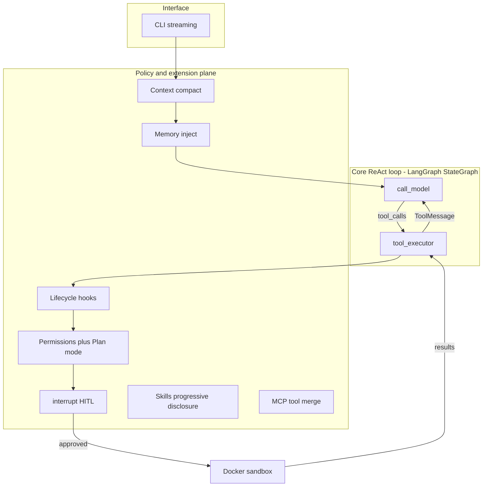

# Architecture (living document)

Current end-to-end picture. Historical planned/as-built graphs live in `docs/milestones/`.

**Last updated:** M0 complete  
**Chosen approach:** Option B — layered runtime

## Goals

Build a mini Claude Code while learning LangGraph + LangChain ecosystem pieces deeply enough to design agents independently after this project.

## Current status (M0)

Infra and LLM factory skeleton are live. No agent loop yet.

| Piece | Status |
|---|---|
| Docker Compose (Postgres+pgvector, Neo4j) | Running via `./scripts/setup.sh` |
| `create_chat_model()` (4 providers) | Done — construct-only smoke |
| ReAct StateGraph / tools | Not started (M2+) |
| Checkpointer / Neo4j queries | Provisioned, unused |

## Layered runtime (Option B)

### Why this split

| Layer | Responsibility | Without it |
|---|---|---|
| Core ReAct loop | Cognition: model ↔ tools | Manual `while` loops that cannot checkpoint/interrupt cleanly |
| Policy / extension plane | Permissions, hooks, skills, MCP, compaction, memory, sandbox | Every concern becomes another graph node; graph becomes a god-object |

Rejected alternatives:

- **Option A — monolithic StateGraph:** fine for a toy; collapses under Tier-3 mechanisms.
- **Option C — multi-graph from day one:** forces Plan/Execute early but muddies subgraph learning before a working tool loop exists.

## LLM providers

Config-driven factory (no hardcoded vendor in agent code).

| Provider | Default model when selected | LangChain entry | Protocol family |
|---|---|---|---|
| `ollama` (project default) | `gemma4:31b` | `ChatOllama` | Local OpenAI-compatible-ish + Ollama quirks |
| `anthropic` | pin in `.env.example` (e.g. Claude Sonnet) | `ChatAnthropic` | Anthropic Messages API |
| `openai` | pin in `.env.example` | `ChatOpenAI` | OpenAI Chat Completions + tools |
| `openrouter` | any OpenRouter slug | `ChatOpenAI` + OpenRouter `base_url` | OpenAI protocol via gateway |

**Project defaults:** `LLM_PROVIDER=ollama`, `LLM_MODEL=gemma4:31b`.

**Simplification:** one `(provider, model)` pair per run. Per-role multi-model routing is a later optional dig.

Sub-agents (M12) are orchestration in *our* runtime — supported on all four providers if tool calling is reliable. First sub-agent milestone uses the same provider/model for parent and children.

## Infrastructure (M0 landed)

| Concern | Choice | Notes |
|---|---|---|
| Python | `uv` + `pyproject.toml` under `backend/` | `uv sync` via `setup.sh` |
| Sessions / checkpoints | PostgreSQL (`mcc-postgres`) | LangGraph checkpointer from M5 |
| Vectors | `pgvector` extension enabled on boot | Unused until embedding search |
| Graph memory | Neo4j Community (`mcc-neo4j`, Browser `:7474`) | Unused until M8 |
| Sandbox | Docker SDK ephemeral containers | M11; host subprocess until then (labeled insecure) |
| Frontend | Deferred | Until streaming/trace visualization helps learning |

## Milestone progress

- **M0 Done** — see [milestones/M0-environment.md](milestones/M0-environment.md)
- Full list: [ROADMAP.md](ROADMAP.md)
