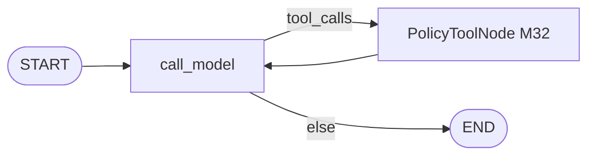
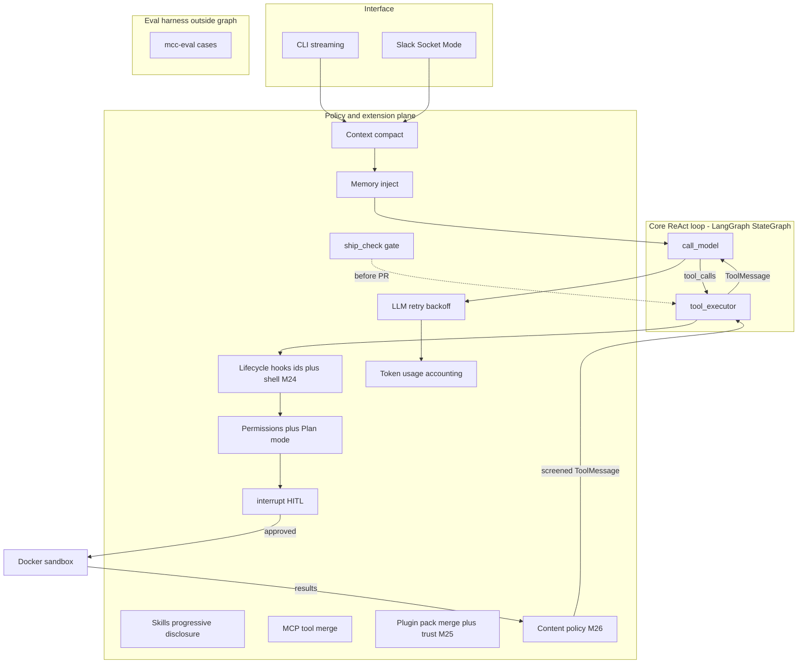

# Architecture (living document)

Current end-to-end picture. Historical planned/as-built graphs live in `docs/milestones/`.

**Last updated:** M35 complete  
**Chosen approach:** Option B — layered runtime

## Goals

Build a mini Claude Code while learning LangGraph + LangChain ecosystem pieces deeply enough to design agents independently after this project.

## Current status (M35)

| Piece | Status |
|---|---|
| Core ReAct + tools + sessions + stream | M2–M6 |
| Compact + memory + permissions + HITL + sandbox | M7–M11 |
| Sub-agents / Skills / MCP / Hooks / plugins | M12–M16, M23–M25 |
| Eval / Slack / ship / ingest / ES / async / content policy | M17–M22, M26 |
| Hybrid retrieval (`search_hybrid`) | **M27 Done** |
| Graph-neighbor expand (`expand_chunks`) | **M28 Done** |
| MCP HTTP + sticky session | **M29 Done** |
| LangGraph Store (cross-thread KV) | **M30 Done** |
| Time-travel / fork sessions | **M31 Done** |
| Parallel tools / fan-out policy | **M32 Done** |
| Structured output / forced tool_choice | **M33 Done** |
| Observability traces (LangSmith / JSONL) | **M34 Done** |
| Multi-agent handoff (swarm-lite) | **M35 Done** |

Ship: `ship_check` → fix loop → gated `open_pull_request` (`SHIP_REQUIRE_GREEN`). Optional `SHIP_MODE=push` + `git_push` (ask).

## ReAct core (M2–M11)

**Security note:** `run_shell` defaults to an ephemeral Docker container (M11). Host backend (`SHELL_BACKEND=host`) is still not a sandbox. M9/M10 ask/deny apply before execution.

## Message & tool compatibility (M1)

Agent code uses LangChain messages + `AIMessage.tool_calls`. Provider packages adapt wire formats. Details: [notes/tool-calling-parity.md](notes/tool-calling-parity.md).

## Testing (project-wide)

Every milestone ships unit + integration tests. Strategy: [notes/testing.md](notes/testing.md). M0/M1 catch-up tests are in `backend/tests/`.

## Layered runtime (Option B)

Note: Content policy also runs **inside** MCP servers that enforce it (e.g. `fake_docs`); the plane node above is the **client wrap** path on returned text.

### Why this split

| Layer | Responsibility | Without it |
|---|---|---|
| Core ReAct loop | Cognition: model ↔ tools | Manual `while` loops that cannot checkpoint/interrupt cleanly |
| Policy / extension plane | Permissions, hooks, skills, MCP (stdio cold + HTTP sticky M29), plugins, content policy, compaction, memory, sandbox, ship gate | Every concern becomes another graph node; graph becomes a god-object |

Rejected alternatives:

- **Option A — monolithic StateGraph:** fine for a toy; collapses under Tier-3 mechanisms.
- **Option C — multi-graph from day one:** forces Plan/Execute early but muddies subgraph learning before a working tool loop exists.

## LLM providers

Config-driven factory (no hardcoded vendor in agent code).

| Provider | Default model when selected | LangChain entry | Protocol family |
|---|---|---|---|
| `ollama` (project default) | `gemma4:31b` | `ChatOllama` | Local OpenAI-compatible-ish + Ollama quirks |
| `anthropic` | pin in `.env.example` (e.g. Claude Sonnet) | `ChatAnthropic` | Anthropic Messages API |
| `openai` | pin in `.env.example` | `ChatOpenAI` | OpenAI Chat Completions + tools |
| `openrouter` | any OpenRouter slug | `ChatOpenAI` + OpenRouter `base_url` | OpenAI protocol via gateway |

**Project defaults:** `LLM_PROVIDER=ollama`, `LLM_MODEL=gemma4:31b`.

**Simplification:** one `(provider, model)` pair per run. Per-role multi-model routing is a later optional dig.

Sub-agents (M12) are orchestration in *our* runtime — supported on all four providers if tool calling is reliable. First sub-agent milestone uses the same provider/model for parent and children.

## Infrastructure (M0 landed)

| Concern | Choice | Notes |
|---|---|---|
| Python | `uv` + `pyproject.toml` under `backend/` | `uv sync` via `setup.sh` |
| Sessions / checkpoints | PostgreSQL (`mcc-postgres`) | Sync `PostgresSaver` via `open_checkpointer` (`--sync`); async `AsyncPostgresSaver` via `open_async_checkpointer` (default CLI `ainvoke`/`astream`); MemorySaver optional; M31 list/fork via `get_state_history` + `update_state` (new `thread_id`) |
| Cross-thread KV | LangGraph Store (M30) | `InMemoryStore` or Postgres `store` table via `open_store` / `open_async_store`; tools `store_put` / `store_get`; namespace `("mcc","project",id)` — not `thread_id` |
| Vectors | `pgvector` + `memory_notes` + `memory_chunks` | M8-B notes; M20 ingest chunks (`doc_id`, path, index) via Ollama embed |
| Graph memory | Neo4j Community (`mcc-neo4j`, Browser `:7474`) | M8 `Fact`; M20 `Document`/`Chunk` + `HAS_CHUNK`/`NEXT`; M28 `expand_chunks` (NEXT ±N) |
| Full-text | Elasticsearch (`mcc-elasticsearch`, `:9200`) | M21: `search_keyword` (BM25); M27: `search_hybrid` (ES → pgvector re-rank on `(doc_id, chunk_index)`) |
| Sandbox | Docker SDK ephemeral containers | M11; host subprocess until then (labeled insecure) |
| Frontend | Deferred | Until streaming/trace visualization helps learning |

## Milestone progress

- **M0 Done** — [milestones/M0-environment.md](milestones/M0-environment.md)
- **M1 Done** — [milestones/M1-tool-calling-parity.md](milestones/M1-tool-calling-parity.md)
- **M2 Done** — [milestones/M2-react-stategraph.md](milestones/M2-react-stategraph.md)
- **M3 Done** — [milestones/M3-filesystem-tools.md](milestones/M3-filesystem-tools.md)
- **M4 Done** — [milestones/M4-shell-git-tools.md](milestones/M4-shell-git-tools.md)
- **M5 Done** — [milestones/M5-postgres-checkpointer.md](milestones/M5-postgres-checkpointer.md)
- **M6 Done** — [milestones/M6-streaming-cli.md](milestones/M6-streaming-cli.md)
- **M7 Done** — [milestones/M7-context-compaction.md](milestones/M7-context-compaction.md)
- **M8 Done** — [milestones/M8-project-long-term-memory.md](milestones/M8-project-long-term-memory.md)
- **M9–M19 Done** — permissions through ship gate — see [ROADMAP.md](ROADMAP.md)
- **M20 Done** — [milestones/M20-doc-ingestion-memory-pipeline.md](milestones/M20-doc-ingestion-memory-pipeline.md)
- **M21 Done** — [milestones/M21-elasticsearch-fulltext.md](milestones/M21-elasticsearch-fulltext.md)
- **M22 Done** — [milestones/M22-async-agent-runtime.md](milestones/M22-async-agent-runtime.md)
- **M23 Done** — [milestones/M23-plugin-pack-expansion.md](milestones/M23-plugin-pack-expansion.md)
- **M24 Done** — [milestones/M24-plugin-hooks-discovery.md](milestones/M24-plugin-hooks-discovery.md)
- **M25 Done** — [milestones/M25-plugin-install-trust.md](milestones/M25-plugin-install-trust.md) (plugin lane complete; M26 Done earlier)
- **M26 Done** — [milestones/M26-mcp-content-policy.md](milestones/M26-mcp-content-policy.md)
- **M27 Done** — [milestones/M27-hybrid-retrieval.md](milestones/M27-hybrid-retrieval.md)
- **M28 Done** — [milestones/M28-graph-neighbor-expand.md](milestones/M28-graph-neighbor-expand.md)
- **M29 Done** — [milestones/M29-mcp-http-session.md](milestones/M29-mcp-http-session.md)
- **M30 Done** — [milestones/M30-langgraph-store.md](milestones/M30-langgraph-store.md)
- **M31 Done** — [milestones/M31-time-travel-branch.md](milestones/M31-time-travel-branch.md)
- **M32 Done** — [milestones/M32-parallel-tools-fanout.md](milestones/M32-parallel-tools-fanout.md)
- **M33 Done** — [milestones/M33-structured-output-tool-choice.md](milestones/M33-structured-output-tool-choice.md)
- **M34 Done** — [milestones/M34-observability-traces.md](milestones/M34-observability-traces.md)
- **M35 Done** — [milestones/M35-multi-agent-handoff.md](milestones/M35-multi-agent-handoff.md)
- Full list: [ROADMAP.md](ROADMAP.md)
