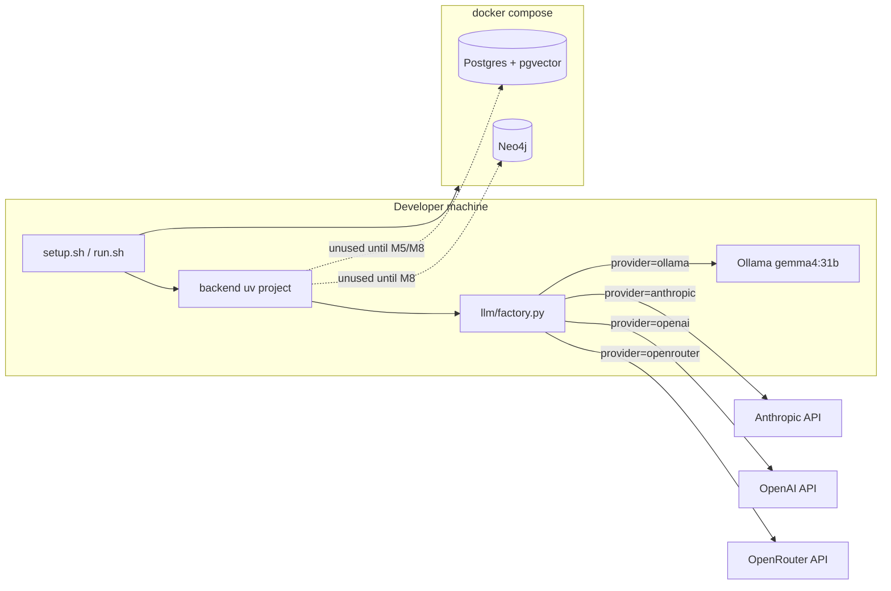
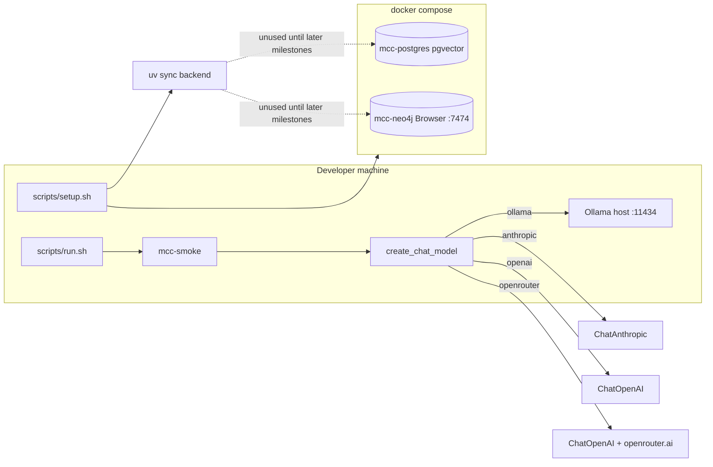

# Milestone 0: Environment & provider skeleton

## Status

Done

## Goal

Clean checkout can bring up infra stubs and a config-driven LLM factory skeleton (four providers; default Ollama + `gemma4:31b`) via `scripts/setup.sh` and a smoke `scripts/run.sh` — no coding agent loop yet.

## Why this milestone (learning objectives)

- Agents need **swappable models** and **durable stores** before the ReAct loop, or every later milestone hardcodes a vendor and loses session state.
- Neo4j can sit idle in Compose until memory/KG has a real query shape — learn **provision vs use**.
- Establishing the factory early makes M1's tool-calling parity lesson possible.

## Concepts introduced

- **Provider vs model vs protocol:** selecting Claude on Anthropic-native vs via OpenRouter is not the same wire path.
- **Config-driven LLM factory:** agent code depends on a LangChain chat interface, not a vendor SDK call site.
- **Infrastructure for agent state:** Postgres (checkpoints / later vectors) and Neo4j (later graph memory) as first-class local services.
- **Idempotent bootstrap:** learning repos must recreate environment without tribal knowledge.

## Design decisions & alternatives considered

| Decision | Choice | Alternatives rejected |
|---|---|---|
| Architecture | Option B layered runtime (skeleton only here) | Monolithic graph; multi-graph from day one |
| Package manager | `uv` + `pyproject.toml` | Plain venv+pip only (still fine, less reproducible UX) |
| Default LLM | `ollama` + `gemma4:31b` | Cloud-only default (worse for offline learning) |
| Providers in factory | ollama, anthropic, openai, openrouter | Ollama+Anthropic only (too narrow) |
| Vectors | pgvector later on same Postgres | Qdrant from day one (extra ops before need) |
| Ollama process | Host `:11434`, not in Compose | Containerized Ollama (GPU/passthrough complexity) |
| Frontend | Deferred | Build UI before agent concepts |

**Simplification:** local DBs without auth/HA; smoke test hits only the configured provider. Production would add secrets, network policy, pinned digests, and often multi-provider fallback.

## Architecture graph (planned)



## Tasks

- [x] Add `docker-compose.yml` with Postgres (`pgvector/pgvector:pg16`) and Neo4j Community + healthchecks
- [x] Scaffold `backend/` with `uv` / `pyproject.toml` and dependency placeholders
- [x] Implement `llm/factory.py` stub: `LLM_PROVIDER` + `LLM_MODEL` → LangChain chat model constructors
- [x] Add `.env.example` (defaults `ollama` / `gemma4:31b`; keys for anthropic, openai, openrouter)
- [x] Implement idempotent `scripts/setup.sh` (venv/deps, compose up, guidance for `ollama pull`)
- [x] Implement `scripts/run.sh` smoke (print resolved provider/model; optional connectivity check)
- [x] Do **not** auto-pull `gemma4:31b` by default (20GB) — document optional flag
- [x] Fill Results + LEARNING_LOG after implementation

## Demo / acceptance criteria

After M0 implementation is approved and landed:

1. `cp .env.example .env` (optional key edits)
2. `./scripts/setup.sh` — creates/syncs Python env, starts Compose, exits 0 on repeat runs
3. `./scripts/run.sh` — prints active provider/model; clear message if Ollama/API key missing
4. `docker compose ps` shows healthy Postgres and Neo4j

## Results

### What we did

- Real `docker-compose.yml`: Postgres (`pgvector/pgvector:pg16`) + Neo4j 5 community, healthchecks, named volumes; init SQL enables `vector` extension on first boot.
- `backend/` uv project with LangChain provider packages + early `langgraph` dep; package `mini_claude_code` under `src/`.
- Config via `pydantic-settings` (`LLM_PROVIDER` / `LLM_MODEL` + keys).
- `create_chat_model()` for ollama / anthropic / openai / openrouter (OpenRouter = `ChatOpenAI` + gateway URL/headers).
- Idempotent `scripts/setup.sh` and smoke `scripts/run.sh` (`mcc-smoke`, optional `--ping`).
- Default: no automatic `ollama pull`; opt-in `PULL_OLLAMA_MODEL=1`.

### Commands & how to reproduce

```bash
cp .env.example .env          # setup also creates this if missing
./scripts/setup.sh            # compose up + uv sync; idempotent
./scripts/run.sh              # construct ChatOllama for gemma4:31b
./scripts/run.sh --ping       # optional live invoke (needs Ollama + model pulled)
PULL_OLLAMA_MODEL=1 ./scripts/setup.sh   # optional ~20GB pull
docker compose ps
docker exec mcc-postgres psql -U mcc -d mini_claude_code -c '\dx'
# Neo4j Browser: http://localhost:7474
```

Expected smoke (without `--ping`):

```
provider: ollama
model:    gemma4:31b
client:   langchain_ollama.chat_models.ChatOllama
construct: OK
```

### As-built graph



- Delta vs planned graph: added explicit `mcc-smoke` entrypoint and OpenRouter as `ChatOpenAI`+gateway (clarifies protocol family). Infra edges still dotted (unused) — as planned.

### Why this approach

- Factory before ReAct loop: every later node imports one interface; switching Claude/GPT/Gemma is env-only.
- OpenRouter as a named provider teaches gateway ≠ new protocol (vs Anthropic-native).
- Provision Neo4j/pgvector now so M5/M8 do not reinvent ops mid-learning.
- Without this: hardcoded Anthropic calls, MemorySaver-only demos, and “it works on my laptop” setup.

### Deviations from plan

- Dropped `readme = "../README.md"` in `pyproject.toml` — hatchling rejects paths outside the project dir.
- Smoke uses console script `mcc-smoke` rather than only `python -m` (same outcome, clearer UX).

### Pitfalls & aha moments

- Hatchling `readme` must live inside the package project directory.
- Neo4j needs a longer `start_period` before healthchecks pass (cold pull).
- `pgvector` extension appears only after first volume init (init SQL); recreate volume if you add init scripts later on an existing volume.

### Open questions / next dig

- M1: same tool across all four providers — document wire-format differences and Gemma thinking-channel behavior.
- Whether to add a tiny Postgres/Neo4j connectivity check in smoke (currently compose `ps` only).
