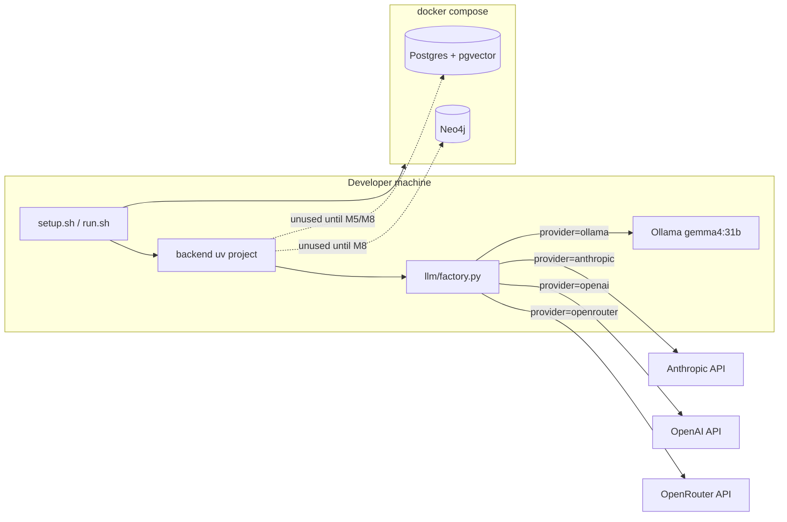

# Milestone 0: Environment & provider skeleton

## Status

Planned

## Goal

Clean checkout can bring up infra stubs and a config-driven LLM factory skeleton (four providers; default Ollama + `gemma4:31b`) via `scripts/setup.sh` and a smoke `scripts/run.sh` — no coding agent loop yet.

## Why this milestone (learning objectives)

- Agents need **swappable models** and **durable stores** before the ReAct loop, or every later milestone hardcodes a vendor and loses session state.
- Neo4j can sit idle in Compose until memory/KG has a real query shape — learn **provision vs use**.
- Establishing the factory early makes M1's tool-calling parity lesson possible.

## Concepts introduced

- **Provider vs model vs protocol:** selecting Claude on Anthropic-native vs via OpenRouter is not the same wire path.
- **Config-driven LLM factory:** agent code depends on a LangChain chat interface, not a vendor SDK call site.
- **Infrastructure for agent state:** Postgres (checkpoints / later vectors) and Neo4j (later graph memory) as first-class local services.
- **Idempotent bootstrap:** learning repos must recreate environment without tribal knowledge.

## Design decisions & alternatives considered

| Decision | Choice | Alternatives rejected |
|---|---|---|
| Architecture | Option B layered runtime (skeleton only here) | Monolithic graph; multi-graph from day one |
| Package manager | `uv` + `pyproject.toml` | Plain venv+pip only (still fine, less reproducible UX) |
| Default LLM | `ollama` + `gemma4:31b` | Cloud-only default (worse for offline learning) |
| Providers in factory | ollama, anthropic, openai, openrouter | Ollama+Anthropic only (too narrow) |
| Vectors | pgvector later on same Postgres | Qdrant from day one (extra ops before need) |
| Ollama process | Host `:11434`, not in Compose | Containerized Ollama (GPU/passthrough complexity) |
| Frontend | Deferred | Build UI before agent concepts |

**Simplification:** local DBs without auth/HA; smoke test hits only the configured provider. Production would add secrets, network policy, pinned digests, and often multi-provider fallback.

## Architecture graph (planned)



## Tasks

- [ ] Add `docker-compose.yml` with Postgres (`pgvector/pgvector:pg16`) and Neo4j Community + healthchecks
- [ ] Scaffold `backend/` with `uv` / `pyproject.toml` and dependency placeholders
- [ ] Implement `llm/factory.py` stub: `LLM_PROVIDER` + `LLM_MODEL` → LangChain chat model constructors
- [ ] Add `.env.example` (defaults `ollama` / `gemma4:31b`; keys for anthropic, openai, openrouter)
- [ ] Implement idempotent `scripts/setup.sh` (venv/deps, compose up, guidance for `ollama pull`)
- [ ] Implement `scripts/run.sh` smoke (print resolved provider/model; optional connectivity check)
- [ ] Do **not** auto-pull `gemma4:31b` by default (20GB) — document optional flag
- [ ] Fill Results + LEARNING_LOG after implementation

## Demo / acceptance criteria

After M0 implementation is approved and landed:

1. `cp .env.example .env` (optional key edits)
2. `./scripts/setup.sh` — creates/syncs Python env, starts Compose, exits 0 on repeat runs
3. `./scripts/run.sh` — prints active provider/model; clear message if Ollama/API key missing
4. `docker compose ps` shows healthy Postgres and Neo4j

## Results

*(Fill after implementation — do not mark Done until complete.)*

### What we did

### Commands & how to reproduce

### As-built graph

```mermaid
%% fill after implementation
```

- Delta vs planned graph:

### Why this approach

### Deviations from plan

### Pitfalls & aha moments

### Open questions / next dig
