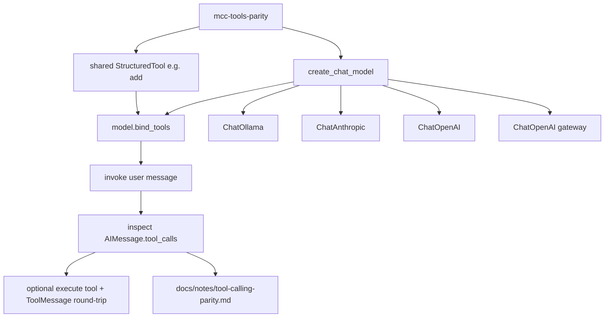
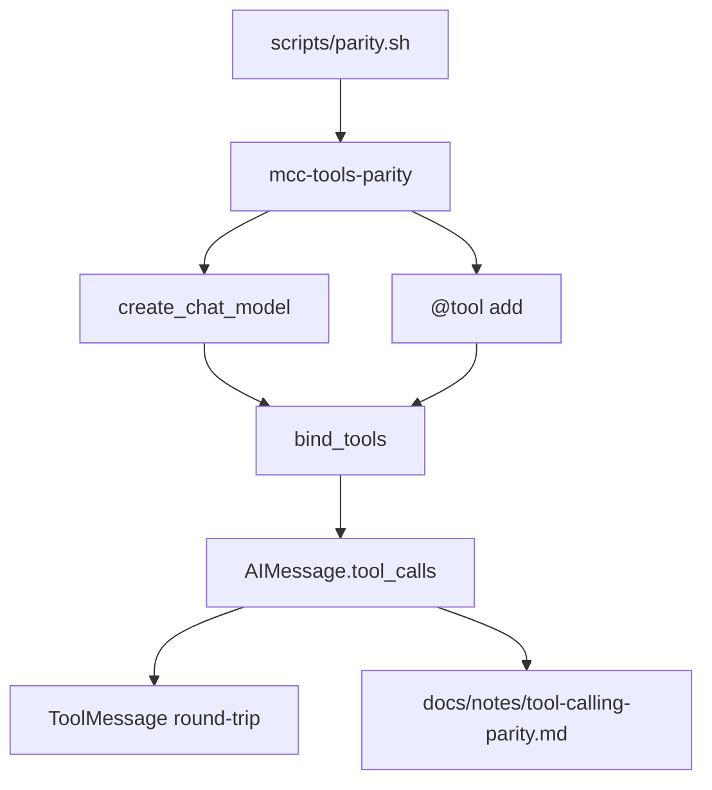

# Milestone 1: LLM provider abstraction & tool-calling parity

## Status

Done

## Goal

Prove the same LangChain tool works across **ollama / anthropic / openai / openrouter** via `bind_tools` + one tool round-trip, and document what LangChain normalizes vs what still differs on the wire (especially Anthropic vs OpenAI-family, and Gemma thinking channels).

## Why this milestone (learning objectives)

- M0 only **constructed** clients. Agents live or die on **tool calling**: wrong assumptions about schema/normalization cause flaky loops that look like “the model is dumb.”
- You need a concrete mental model: **provider ≠ model ≠ protocol**, and LangChain’s `AIMessage.tool_calls` is a *compatibility layer*, not identity of underlying APIs.
- Without this milestone, M2’s ReAct graph will hide provider bugs inside graph complexity.

## Concepts introduced

- **Tool binding (`bind_tools`):** attach JSON-schema tool defs to a chat model so the model can emit structured tool calls.
- **Normalized tool call surface:** `AIMessage.tool_calls` / `ToolMessage` vs Anthropic `tool_use` / `tool_result` content blocks.
- **Protocol families:** Anthropic Messages API vs OpenAI Chat Completions tools (Ollama + OpenRouter sit in the OpenAI-compatible family, with quirks).
- **Gemma 4 thinking channel:** thoughts must not be replayed as history the same way as final answers (Ollama/docs caution) — observe and document impact on tool turns.
- **Parity harness (not yet an agent):** one shared tool + invoke path; no StateGraph yet (that is M2).

## Design decisions & alternatives considered

| Decision | Choice | Alternatives rejected |
|---|---|---|
| Scope | Single deterministic tool (`add`) + bind/invoke/inspect | Jump straight into ReAct graph (hides provider issues) |
| How to run | `mcc-tools-parity` / `./scripts/parity.sh` | Only test default Ollama (too narrow) |
| Missing credentials | Skip provider with clear SKIP reason | Require all four keys |
| OpenRouter | Same tool path as OpenAI client | Treat as unique protocol (incorrect) |
| Documentation | `docs/notes/tool-calling-parity.md` + Results | Only chat notes |

**Simplification:** no retries/rate-limit matrix; one tool; no parallel tool-call stress test. Production suites also pin model versions and track schema-rejection rates.

## Architecture graph (planned)



## Tasks

- [x] Add a tiny shared tool module (deterministic args → result)
- [x] Add `mcc-tools-parity` CLI: construct → `bind_tools` → invoke → print normalized `tool_calls` (+ raw content summary)
- [x] Support `--provider X` and `--all-configured` (skip missing keys)
- [x] Complete one tool round-trip (ToolMessage + second invoke)
- [x] Write `docs/notes/tool-calling-parity.md`
- [x] Add `scripts/parity.sh`
- [x] Fill Results + LEARNING_LOG; commit + push

## Demo / acceptance criteria

1. With Ollama + pulled model: parity command shows a normalized tool call for `gemma4:31b` — **met**
2. With any cloud key set: that provider also produces comparable `tool_calls` — **N/A this run** (keys unset → SKIP)
3. Doc notes contrast Anthropic-native vs OpenAI-family — **met**
4. Missing providers are SKIP’d — **met**
5. Still no LangGraph agent loop — **met**

## Results

### What we did

- Added `tools/demo.py` with deterministic `@tool add`.
- Added `parity.py` / `mcc-tools-parity` / `scripts/parity.sh`: bind → invoke → inspect `tool_calls` → execute → `ToolMessage` round-trip.
- Documented compatibility model in `docs/notes/tool-calling-parity.md`.
- Live PASS on Ollama `gemma4:31b`; cloud providers SKIP without keys.

### Commands & how to reproduce

```bash
./scripts/parity.sh
./scripts/parity.sh --provider ollama
./scripts/parity.sh --provider anthropic --model claude-sonnet-4-20250514  # needs key
```

### As-built graph



- Delta vs planned graph: none material; harness matches the plan. Cloud branches exist but SKIP without credentials.

### Why this approach

- Compatibility is **adapter normalization**, not “same base_url.” Agent code stays on LangChain messages + `tool_calls`.
- Probing before StateGraph prevents blaming the graph for provider bugs.
- Without this: four bespoke parsers, or silent assumptions that break when switching Ollama → Anthropic.

### Deviations from plan

- Cloud providers not live-exercised (empty API keys). Expected Anthropic block-shape differences documented as expectations until keys are available.

### Pitfalls & aha moments

- Gemma tool-call turn had **empty `content`** with a populated `tool_calls` list — loops must not require assistant text on tool turns.
- Round-trip reply correctly used the tool result (`42`).

### Open questions / next dig

- Re-run with Anthropic/OpenAI/OpenRouter keys to capture real content-block dumps.
- M2: put this same message cycle inside a StateGraph with conditional edges.
