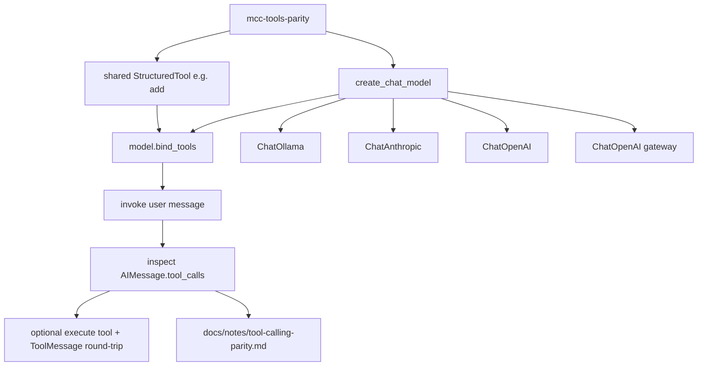

# Milestone 1: LLM provider abstraction & tool-calling parity

## Status

Planned

## Goal

Prove the same LangChain tool works across **ollama / anthropic / openai / openrouter** via `bind_tools` + one tool round-trip, and document what LangChain normalizes vs what still differs on the wire (especially Anthropic vs OpenAI-family, and Gemma thinking channels).

## Why this milestone (learning objectives)

- M0 only **constructed** clients. Agents live or die on **tool calling**: wrong assumptions about schema/normalization cause flaky loops that look like “the model is dumb.”
- You need a concrete mental model: **provider ≠ model ≠ protocol**, and LangChain’s `AIMessage.tool_calls` is a *compatibility layer*, not identity of underlying APIs.
- Without this milestone, M2’s ReAct graph will hide provider bugs inside graph complexity.

## Concepts introduced

- **Tool binding (`bind_tools`):** attach JSON-schema tool defs to a chat model so the model can emit structured tool calls.
- **Normalized tool call surface:** `AIMessage.tool_calls` / `ToolMessage` vs Anthropic `tool_use` / `tool_result` content blocks.
- **Protocol families:** Anthropic Messages API vs OpenAI Chat Completions tools (Ollama + OpenRouter sit in the OpenAI-compatible family, with quirks).
- **Gemma 4 thinking channel:** thoughts must not be replayed as history the same way as final answers (Ollama/docs caution) — observe and document impact on tool turns.
- **Parity harness (not yet an agent):** one shared tool + invoke path; no StateGraph yet (that is M2).

## Design decisions & alternatives considered

| Decision | Choice | Alternatives rejected |
|---|---|---|
| Scope | Single deterministic tool (`add` or `echo_args`) + bind/invoke/inspect | Jump straight into ReAct graph (hides provider issues) |
| How to run | `mcc-tools-parity` CLI: `--provider` or `--all-configured` | Only test default Ollama (too narrow) |
| Missing credentials | Skip provider with clear SKIP reason; do not fail whole run | Require all four keys (blocks local-only learners) |
| OpenRouter | Same tool path as OpenAI client | Treat as unique protocol (incorrect) |
| Documentation | `docs/notes/tool-calling-parity.md` + Results | Only chat notes (not durable) |

**Simplification:** no retries/rate-limit matrix; one tool, one user prompt that forces a tool call; no parallel tool-call stress test yet. Production parity suites also track latency, schema-rejection rates, and model-version pins.

## Architecture graph (planned)



## Tasks

- [ ] Add a tiny shared tool module (deterministic args → result)
- [ ] Add `mcc-tools-parity` CLI: construct → `bind_tools` → invoke → print normalized `tool_calls` (+ raw content summary)
- [ ] Support `--provider X` and `--all-configured` (skip missing keys / unreachable Ollama with SKIP)
- [ ] Optionally complete one tool round-trip (append `ToolMessage`, second invoke) to show the full message cycle
- [ ] Write `docs/notes/tool-calling-parity.md` with observed differences (fill during/after runs)
- [ ] Extend `scripts/run.sh` or document a dedicated command for the parity demo
- [ ] Fill Results + LEARNING_LOG; commit + push

## Demo / acceptance criteria

1. With Ollama + pulled model: parity command shows a normalized tool call for `gemma4:31b` (or configured model).
2. With any cloud key set: that provider also produces a comparable `tool_calls` entry for the **same** tool schema.
3. Doc notes explicitly contrast Anthropic-native vs OpenAI-family and call out Gemma thinking-channel behavior if observed.
4. Missing providers are SKIP’d, not silent failures.
5. Still **no** LangGraph agent loop (M2).

## Results

*(Fill after implementation.)*

### What we did

### Commands & how to reproduce

### As-built graph

```mermaid
%% fill after implementation
```

- Delta vs planned graph:

### Why this approach

### Deviations from plan

### Pitfalls & aha moments

### Open questions / next dig
