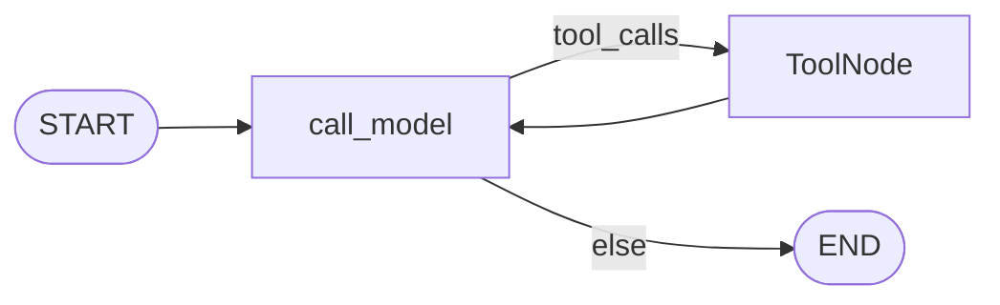
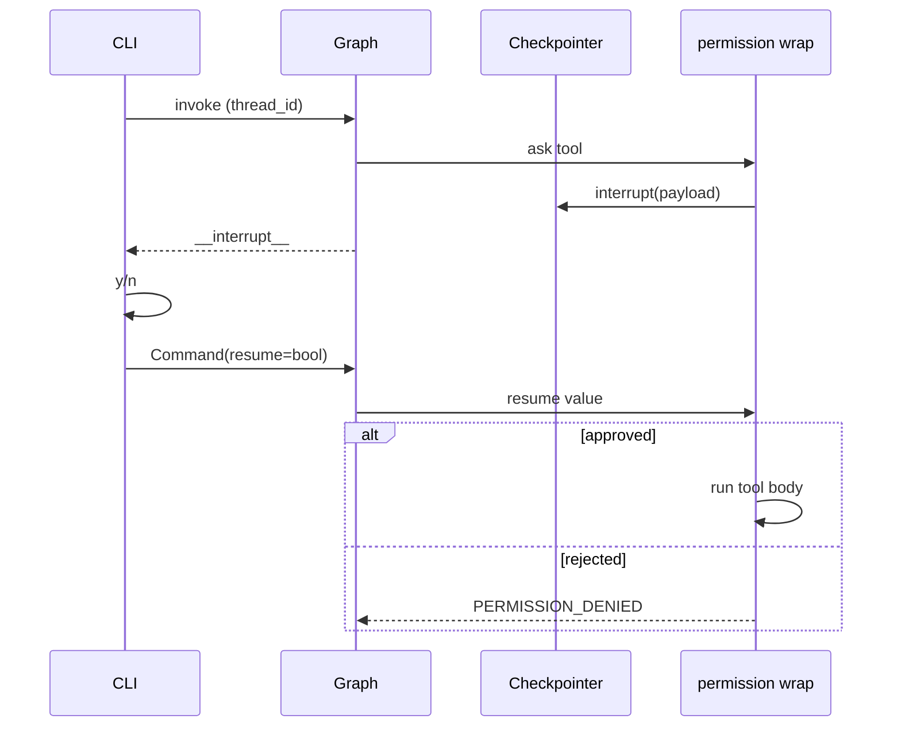

# Milestone 10: Human-in-the-loop (`interrupt`)

## Status

Done

## Goal

Replace M9’s **TTY `ask_callback` / stdin y-n inside the tool wrap** with LangGraph **`interrupt()` + checkpointer resume**, so `ask`-mode tools pause the graph durably and can continue after the human decides — including across process boundaries on the same `thread_id`. Keep M9’s **policy plane** (`auto` / `ask` / `deny` + Plan Mode); change only **how ask waits**.

## Why this milestone (learning objectives)

- M9 taught **what** is allowed. M10 teaches **how the runtime pauses** without blocking forever inside one process’s tool body as the only story.
- Without interrupt: ask dies when the process exits; Slack/Discord/web (M18) cannot approve a pending tool. With interrupt: state is checkpointed; any client can resume with `Command(resume=...)`.
- Industry parallel: Claude Code / Cursor-style approvals are **paused agent runs** waiting for an external decision.

### With vs without

| Concern | M9 only (stdin ask in wrap) | M9 + M10 (`interrupt`) |
|---|---|---|
| Approve `write_file` in REPL | Works if TTY stays open | Works; also after process restart with same `thread_id` (Postgres) |
| CI / pipe / non-TTY | ask → deny via missing callback | Interrupt pending; CLI prompts or test `approve_fn` |
| Remote channel later | Cannot reuse stdin | Resume API is the same |
| Checkpointer | Optional for ask | **Required** for ask |

## Concepts introduced

- **`interrupt(payload)`** inside the permission wrap on `ask`.
- **`Command(resume=bool)`** to continue.
- **Checkpointer required** for ask (CLI auto-allocates `thread_id` when not in Plan Mode).
- **Simplification:** HITL path uses `invoke` (not token streaming); Plan Mode can still stream.

## Design decisions & alternatives considered

| Decision | Choice | Alternatives rejected |
|---|---|---|
| Where to `interrupt` | Permission wrap on `ask` | Always `interrupt_before=["tools"]` |
| New graph node? | No | Dedicated `approve` node |
| Resume payload | Boolean approve/reject | Edit tool args |
| Streaming + HITL | Invoke-based HITL; stream OK in Plan Mode | Full stream+Command in one milestone |

## Architecture graph (planned / as-built)

Topology **unchanged**:





## Testing (planned)

### Unit

- [x] Interrupt payload + resume approve/reject
- [x] Plan/auto never interrupt
- [x] `invoke_with_hitl` + fake LLM
- [x] Topology unchanged

### Integration

- [x] MemorySaver approve + reject
- [x] Live skip unless `MCC_LIVE_LLM=1`

## Tasks

- [x] `interrupt` in permissions ask path
- [x] `agent/hitl.py` + CLI wiring; auto thread for non-plan
- [x] Stream simplification labeled
- [x] Tests
- [x] Results + LEARNING_LOG + architecture; commit + push

## Demo / acceptance criteria

1. Non-plan run allocates/uses `thread_id`; ask pauses; y/n resumes.
2. `--plan` denies mutators without interrupt; can stream.
3. Topology still `call_model` + `tools`.
4. Unit/integration tests green.

## Results

### What we did

- Ask branch: `interrupt(approval_interrupt_payload(...))` unless test `ask_callback` override.
- Added `agent/hitl.py` (`invoke_with_hitl`, prompt helpers).
- CLI: no production `ask_callback`; HITL via interrupt; auto `thread_id` when not Plan Mode.
- Stream: Plan Mode only for token stream; otherwise invoke + HITL note.

### Commands & how to reproduce

```bash
./scripts/test.sh tests/unit/test_m10_hitl.py -v
./scripts/test.sh tests/integration/test_m10_hitl_live.py -v
# Interactive approve (Postgres or --checkpointer memory):
./scripts/agent.sh --checkpointer memory --no-stream \
  "Use write_file to create demo.txt with contents hello"
# Plan Mode (no interrupt on writes — denied):
./scripts/agent.sh --plan --no-stream "Use write_file to create x.txt with hi"
```

### As-built graph + delta

Topology unchanged vs M9. Delta: ask → `interrupt` + CLI `Command(resume=…)`.

### Why this approach

Same policy plane; durable pause is a LangGraph primitive shared by future channel adapters.

### Deviations

- Stream+HITL combined path deferred (labeled simplification).
- `ask_callback` kept for unit tests only.

### Pitfalls

- Interrupt without checkpointer fails — CLI forces a session for non-plan runs.
- Multiple pending interrupts: we resume one bool for the batch (simplification).

### Testing results

- Unit `test_m10_hitl.py`: 6 passed; M9 still 8 passed.
- Integration: 1 passed, 1 skipped without live LLM.

### Open questions / next dig

- Edit args on resume; sticky allow; stream+Command polish.
- M11 Docker sandbox after approve.
