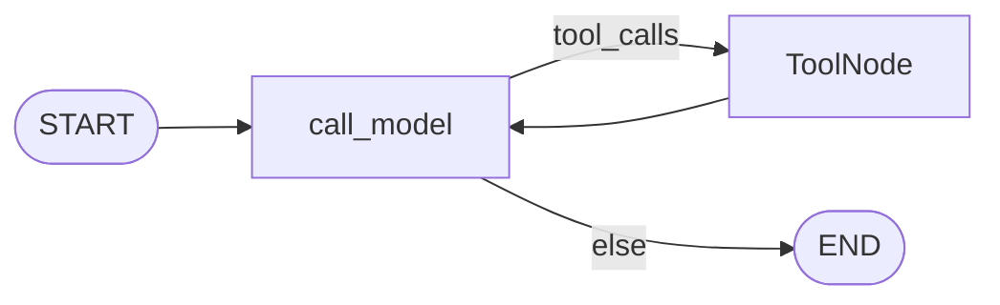
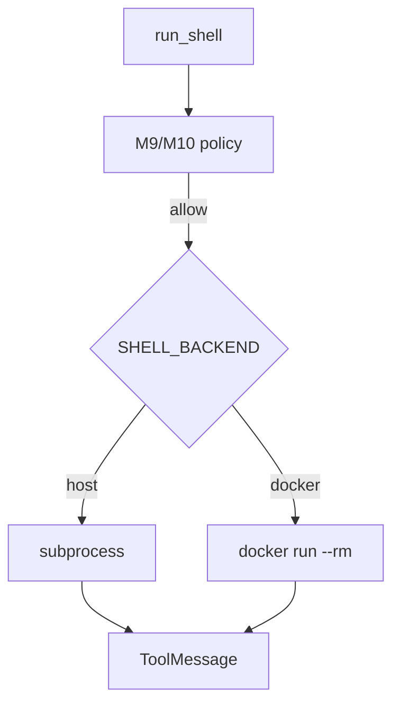

# Milestone 11: Docker sandbox for shell

## Status

Done

## Goal

Make **`run_shell` execute inside an ephemeral Docker container** (workspace bind-mounted), so “cwd = workspace” is no longer mistaken for isolation. Keep the ReAct graph and M9/M10 policy/HITL unchanged: permissions still decide auto/ask/deny; sandbox only changes **where** an approved shell command runs. Host subprocess for `run_shell` is **opt-in** (`SHELL_BACKEND=host`).

## Why this milestone (learning objectives)

- M4 footgun: **`cwd=workspace` ≠ sandbox**. M9/M10 gate intent; M11 isolates execution.
- Three layers: path jail (FS) | permission/HITL | **container isolation (shell)**.

### With vs without

| Concern | Without M11 | With M11 |
|---|---|---|
| Approved destructive shell | Host damage possible | Contained (+ mount policy) |
| Denylist only | Bypassable | Defense-in-depth only |

## Concepts introduced

- `SHELL_BACKEND=docker|host`, `SHELL_DOCKER_IMAGE`, `SHELL_DOCKER_NETWORK` (default `none`)
- Per-command `docker run --rm` + workspace bind mount at `/workspace`
- `git_*` stay on host (VCS on project tree)

## Design decisions & alternatives considered

| Decision | Choice | Alternatives rejected |
|---|---|---|
| What runs in Docker | `run_shell` only | Also wrap `git_*` |
| Topology | Unchanged | New sandbox node |
| Default backend | `docker` | Host forever |
| Network | `none` | Full egress |

## Architecture graph (as-built)





## Testing (planned)

### Unit

- [x] Argv builder / settings defaults / denylist before docker / missing docker / host backend

### Integration

- [x] Present; skip when Docker daemon unavailable

## Tasks

- [x] Settings + `.env.example`
- [x] `tools/sandbox_docker.py` + `shell.py` dispatch
- [x] Tests + docs + LEARNING_LOG + push

## Demo / acceptance criteria

1. Docker backend reports `sandbox=docker` and `cwd=/workspace`
2. `SHELL_BACKEND=host` still works
3. M9/M10 still gate before container starts
4. Topology unchanged

## Results

### What we did

- Added `tools/sandbox_docker.py` (`build_docker_run_argv`, `run_in_docker`).
- `run_shell` dispatches on `SHELL_BACKEND` (default `docker`).
- `build_default_tools` passes settings into shell builder.
- M4 unit tests force `backend="host"`.

### Commands & how to reproduce

```bash
./scripts/test.sh tests/unit/test_m11_sandbox.py -v
./scripts/test.sh tests/integration/test_m11_sandbox_live.py -v
# Needs Docker Desktop / daemon + image pull:
# docker pull python:3.12-slim
SHELL_BACKEND=docker ./scripts/agent.sh --plan --no-stream \
  "Use run_shell to run: echo hi && pwd"
```

### As-built graph + delta

Topology unchanged. Delta: shell execution backend only.

### Why this approach

Isolation after policy approval; keep cognition loop tiny (Option B).

### Deviations

None material. Integration skipped in CI/sandbox without Docker daemon (expected).

### Pitfalls

- First run may pull image (slow).
- `--network none` blocks package installs inside container — intentional teaching default.
- Docker Desktop ≠ production isolation (label in code/docs).

### Testing results

- Unit: 5 passed (`test_m11_sandbox.py`); M4 shell still green with host backend.
- Integration: 2 skipped without Docker daemon in this environment.

### Open questions / next dig

- Persistent sandbox; allowlisted egress; non-root + read-only rootfs.
- Tier-3: M12 sub-agents.
