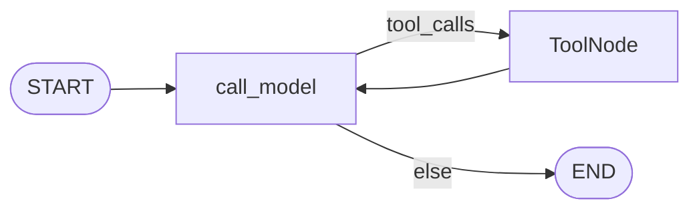
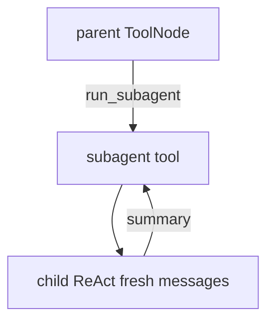

# Milestone 12: Sub-agents

## Status

Done

## Goal

Teach **sub-agents** as orchestration in our runtime: parent delegates via `run_subagent` to a child ReAct graph with **isolated messages**, YAML-defined **tool allowlist**, and the **same model**. Parent topology stays `call_model` ↔ `tools`.

## Why this milestone

- Fresh child context avoids transcript noise; allowlist limits blast radius.
- Nested graph invoke inside a tool — not a vendor subagent API.

## Concepts introduced

- YAML defs under `workspace/subagents/`
- `run_subagent(name, task)` → child summary string
- No `run_subagent` inside child (anti-recursion)

## Design decisions

| Decision | Choice |
|---|---|
| Call style | Tool → child `build_agent_graph` |
| Isolation | Fresh messages only |
| Model | Same settings |
| Child HITL | `ask_callback=False` (deny asks) — simplification |

## Architecture (as-built)





## Testing

- [x] Unit: load YAML, unknown name, allowlist, isolated fake-LLM parent/child
- [x] Integration: repo explore.yaml + parent delegate (fake LLM)

## Results

### What we did

- `agent/subagents.py` loader + `run_subagent`
- `workspace/subagents/explore.yaml`
- Wired via `build_default_tools`
- `pyyaml` dependency
- `run_subagent` treated as auto in permissions (orchestration)

### Commands

```bash
./scripts/test.sh tests/unit/test_m12_subagents.py -v
./scripts/test.sh tests/integration/test_m12_subagents_live.py -v
```

### As-built graph + delta

Parent topology unchanged. New tool + nested child graph at runtime.

### Why this approach

Option B: grow capability via tools; teach isolation without multi-model routing.

### Deviations

Child ask → deny (no nested HITL loop).

### Pitfalls

Circular import avoided with lazy `build_agent_graph` import inside the tool.

### Testing results

Unit 5 passed; integration 2 passed.

### Open questions / next dig

- M13 Skills vs subagents; parallel children; per-subagent model.
