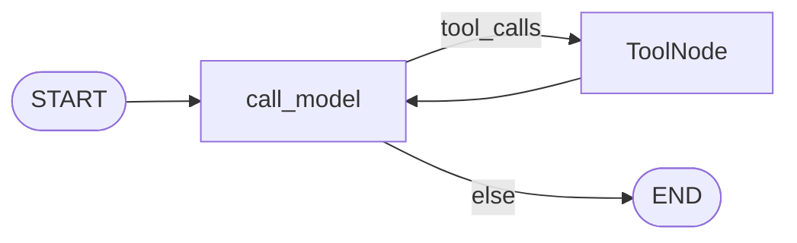

# Milestone 13: Skills (progressive disclosure)

## Status

Done

## Goal

**Skills**: name + description always in context (catalog); full body loaded via `load_skill`. Contrast with M12 sub-agents. Parent topology unchanged.

## Why this milestone

Progressive disclosure saves context; skills ≠ subagents (same thread vs nested graph).

## Concepts introduced

- `workspace/skills/<name>/SKILL.md` + frontmatter
- L0 catalog inject; L1 `load_skill` + prompt re-inject from ToolMessages

## Design decisions

| Decision | Choice |
|---|---|
| Activation | Explicit `load_skill` |
| Persistence | ToolMessage body + scan into prompt view |
| Scripts | Deferred |

## Architecture (as-built)



## Testing

- [x] Unit: parse, catalog, load, inject, fake-LLM graph
- [x] Integration: workspace-layout skill present

## Results

### What we did

- `agent/skills.py` + example `workspace-layout`
- Inject in `_inject_memory_view`; `build_skill_tools` in defaults
- `load_skill` permission: auto

### Commands

```bash
./scripts/test.sh tests/unit/test_m13_skills.py -v
./scripts/test.sh tests/integration/test_m13_skills_live.py -v
```

### As-built graph + delta

Topology unchanged. Delta: catalog/loaded inject + `load_skill` tool.

### Why this approach

Teach L0/L1 disclosure without RAG opacity; keep Option B.

### Deviations

None material. Compaction may drop ToolMessages → may need reload (labeled simplification).

### Pitfalls

Do not confuse `load_skill` with `run_subagent`.

### Testing results

Unit 5 passed; integration 1 passed.

### Open questions / next dig

- M14 MCP; auto-match; skill scripts.
