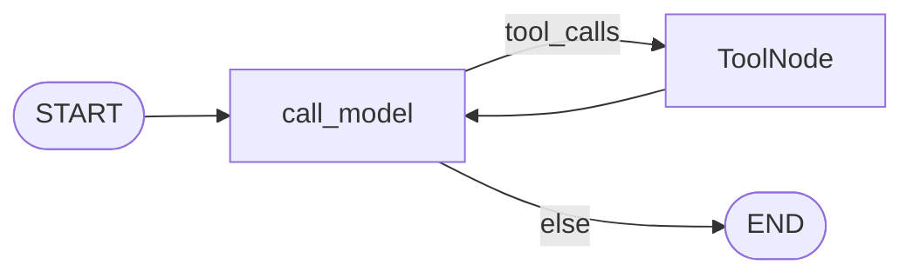
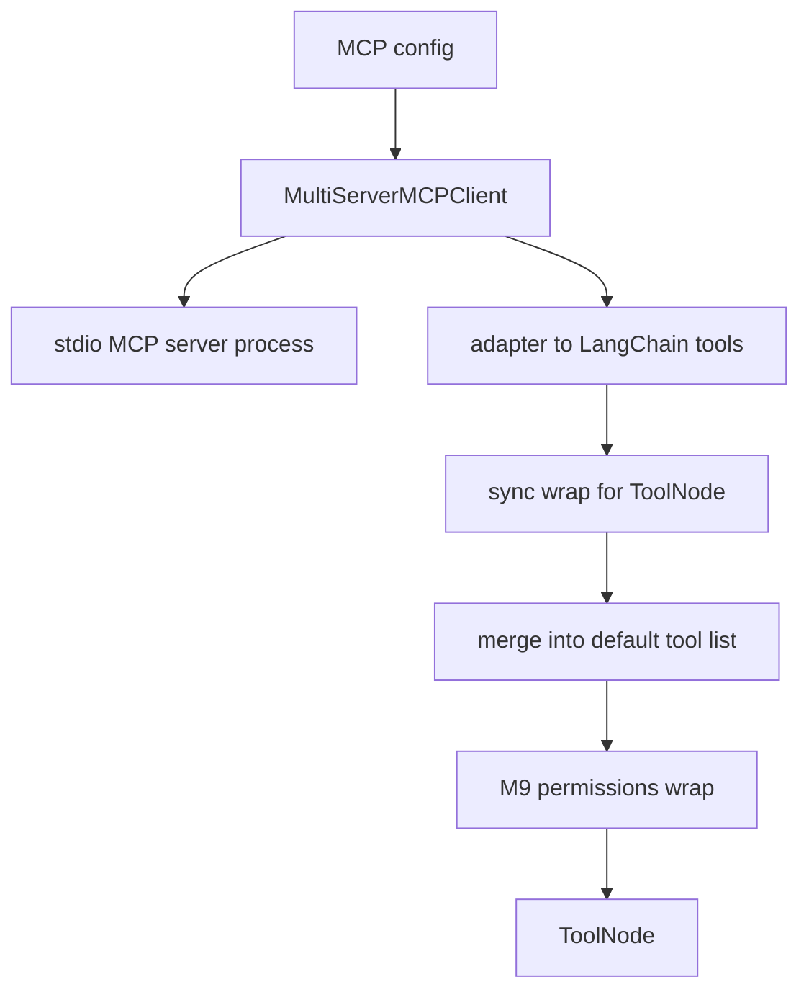
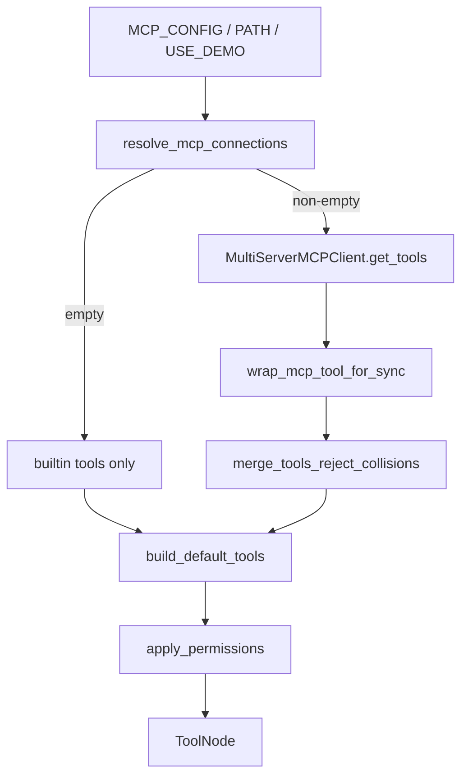

# Milestone 14: MCP client

## Status

**Done**

## Goal

Connect the agent to **MCP (Model Context Protocol)** servers: **discover** remote/local tools and **merge** them into the same LangGraph ReAct loop as first-class LangChain tools. Dissect the **adapter** path (MCP tool schema → `BaseTool` → `bind_tools` / `ToolNode`). Topology stays `call_model` ↔ `tools`. Contrast with skills (prompt inject) and sub-agents (nested graphs).

## Why this milestone (learning objectives)

- Hardcoding every integration as a Python `@tool` does not scale. MCP is an **open protocol** so Cursor / Claude Code / IDEs can share the same server (filesystem, browser, DB, …).
- Without an adapter: the model cannot call MCP tools through LangGraph’s ToolNode — wire formats differ.
- Without this milestone: “MCP” stays a buzzword. You should be able to draw: **stdio/HTTP server ↔ MCP session ↔ langchain-mcp-adapters ↔ our tool list ↔ permissions/HITL**.
- Option B again: MCP expands the **tool list**, not the graph topology.

### With vs without

| Concern | Without M14 | With M14 |
|---|---|---|
| External capability | Reimplement as local tools | Speak MCP; reuse servers |
| LangGraph | No native MCP nodes needed | Adapter → same ToolNode |
| vs Skills | — | Skills = instructions; MCP = **callable tools** |
| vs Subagents | — | Subagent = nested agent; MCP tool = one shot (usually) |

## Concepts introduced

- **MCP:** protocol for tools (and resources/prompts — **tools only in M14**).
- **Transport:** start with **stdio** (spawn a local server process); document HTTP as later.
- **Adapter:** `langchain-mcp-adapters` (`MultiServerMCPClient` / `get_tools`) converts MCP tools to LangChain tools.
- **Merge:** `build_default_tools` (+ optional MCP list) → same `apply_permissions` wrap.
- **Config:** `MCP_CONFIG` JSON, `MCP_CONFIG_PATH`, or teaching shortcut `MCP_USE_DEMO=1`.

### Teaching server (in-repo)

Ship a **tiny stdio MCP server** in-repo (`mini_claude_code.mcp_servers.echo_math` with `add` / `echo`) so tests do not depend on `npx` or network. Integration: start via adapter config, call one tool through the agent or direct invoke.

## Design decisions & alternatives considered

| Decision | Choice | Alternatives rejected |
|---|---|---|
| Library | `langchain-mcp-adapters` (+ `mcp`) | Hand-roll JSON-RPC (opaque / error-prone for learning) |
| First transport | **stdio** + in-repo server | Only remote HTTP (harder locally) |
| Sync graph | Load MCP tools at graph build via `asyncio.run` + **sync wrap** (`func` via `asyncio.run(ainvoke)`) | Rewrite whole agent async in M14 |
| When enabled | Opt-in (`MCP_CONFIG_PATH` > `MCP_CONFIG` > `MCP_USE_DEMO`); empty = no MCP | Always spawn servers |
| Permissions | MCP tools go through M9 wrap; unknown names → **ask**; demo `echo`/`add` allowlisted as read-safe | Auto-allow all MCP (unsafe teaching) |
| Name collision | **Reject MCP duplicate** (keep builtin; log warning) | Silent shadow / always prefix |
| Module layout | `tools/mcp_loader.py` (avoid `agent` ↔ `tools` circular import) | `agent/mcp_tools.py` |
| Resources/prompts | **Out of scope** | Full MCP surface |
| Session model | Adapter default often **stateless per tool call**; labeled dig | Full stateful session redesign |

**Simplification:** one stdio server; no multi-server production mesh; no MCP auth; sync agent stays sync.

## Architecture graph (planned)





## Testing (planned)

### Unit

- [x] Config parse: empty → no MCP tools; valid stdio entry → loader called (mock client).
- [x] Name merge / collision policy documented (reject if clash with builtin).
- [x] Permissions: unknown MCP tool name → ask; Plan Mode → deny for unknowns.

### Integration

- [x] Real stdio in-repo server: load + invoke `echo` / `add`.
- [x] Fake LLM parent calls MCP `add` once through compiled graph.

## Tasks

- [x] Add deps: `langchain-mcp-adapters` + `mcp`.
- [x] In-repo demo MCP server + config example (`.env.example` / `mcp_servers/`).
- [x] `tools/mcp_loader.py`: load + merge + sync wrap.
- [x] Wire `build_default_tools` / settings.
- [x] Unit + integration tests.
- [x] Results + LEARNING_LOG Concept Q&A + architecture; commit + push.

## Demo / acceptance criteria

1. With `MCP_USE_DEMO=1` (or config pointing at echo_math), agent tool list includes MCP tools.
2. Calling that tool (test or CLI) returns a correct result via the adapter.
3. Docs explain adapter call chain and MCP vs skills vs subagents.
4. Parent graph nodes unchanged.
5. MCP off by default when config empty.

## Results

### What we did

- Added `langchain-mcp-adapters` + `mcp`.
- In-repo FastMCP stdio server: `mini_claude_code/mcp_servers/echo_math.py` (`echo`, `add`).
- `tools/mcp_loader.py`: resolve config → `MultiServerMCPClient.get_tools` → sync wrap → merge (reject collisions).
- Settings: `MCP_CONFIG`, `MCP_CONFIG_PATH`, `MCP_USE_DEMO` (priority path > inline > demo).
- `build_default_tools` merges MCP when configured; M9 permissions unchanged (demo names in `READ_SAFE_TOOLS`).
- Example JSON: `mcp_servers/echo_math.config.example.json`.

### Commands & how to reproduce

```bash
cd backend
uv sync
uv run pytest tests/unit/test_m14_mcp.py tests/integration/test_m14_mcp_live.py -v

# Opt-in demo MCP tools in the CLI agent:
# MCP_USE_DEMO=1 uv run mcc-agent "use the echo tool to say hello"
```

### As-built graph + delta

Parent ReAct topology **unchanged**. Delta is the MCP merge plane:



### Why this approach

Adapter keeps Option B: grow capability via tools, not new graph nodes. In-repo stdio server makes the protocol tangible without Cursor/npx. Sync wrap is the cost of staying on sync `graph.invoke` / ToolNode.

### Deviations

- Module layout: `tools/mcp_loader.py`; lazy-import skills/subagents inside `build_default_tools` to avoid `tools` ↔ `agent.graph` circular import.
- Added explicit sync wrap + MCP content-block flatten (adapter returns async-only tools + text blocks).

### Pitfalls

- MCP LangChain tools from the adapter often have **only `coroutine`** → sync `invoke` raises unless wrapped.
- Nested `asyncio.run` fails if you already sit inside an event loop (full-async agent is the long-term fix).
- Default adapter `get_tools()` path may spawn a **new stdio session per call** (stateless teaching default).
- Name collision: builtin wins; rename the MCP tool or drop the builtin if you need the remote one.

### Testing results

- Unit: `tests/unit/test_m14_mcp.py` — 9 passed (config, demo resolve, collision, mock load, permissions).
- Integration: `tests/integration/test_m14_mcp_live.py` — 2 passed (stdio invoke + fake-LLM graph).

### Open questions / next dig

- M15 Hooks; MCP resources/prompts; HTTP transport; stateful `client.session(...)`; async agent end-to-end.
