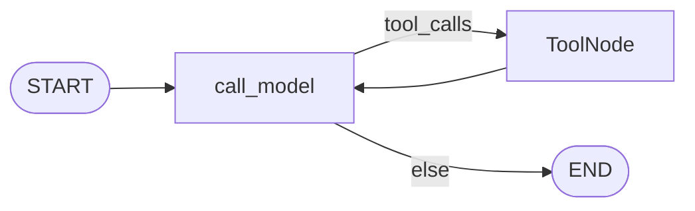
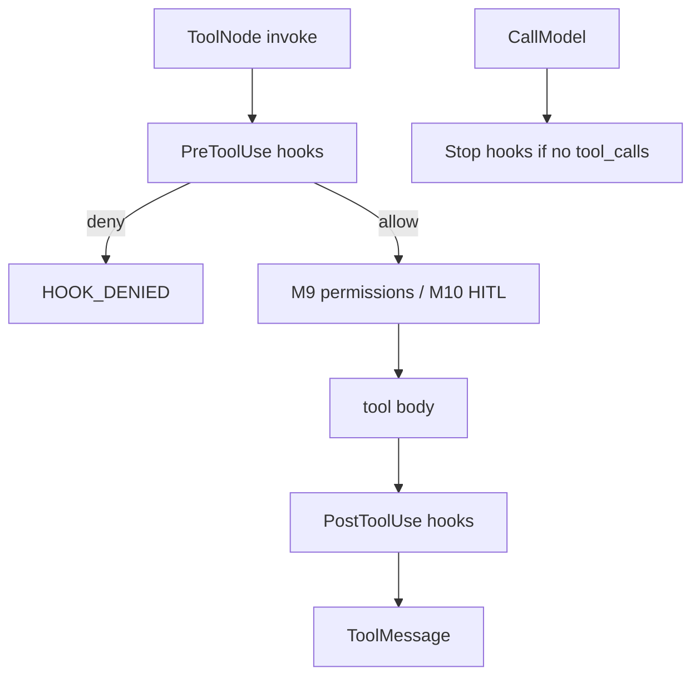
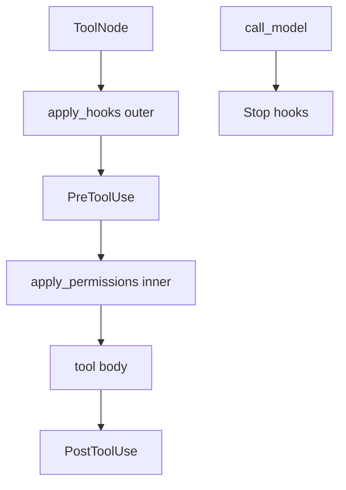

# Milestone 15: Lifecycle hooks

## Status

**Done**

## Goal

Add a small **hooks plane** around tool (and optional stop) lifecycle: **PreToolUse** / **PostToolUse** / **Stop**-style callbacks that can observe, log, block, or lightly rewrite — without adding new LangGraph nodes. Dissect how this differs from **permissions** (M9) and **HITL interrupt** (M10). Topology stays `call_model` ↔ `tools`.

## Why this milestone (learning objectives)

- Production coding agents expose **lifecycle hooks** so users/plugins can audit shell, redact secrets, enforce team policy, or record telemetry **without forking the agent core**.
- Without hooks: every cross-cutting concern either becomes another graph node or is hardcoded inside each tool.
- Option B: hooks live in the **policy/extension plane** — wraps/callbacks, not new cognition nodes.

### With vs without

| Concern | Without M15 | With M15 |
|---|---|---|
| Audit / redact / custom gate | Hardcode in each tool or new nodes | Register Pre/Post/Stop handlers |
| vs Permissions | — | Permissions = fixed auto/ask/deny table; hooks = **pluggable** lifecycle |
| vs HITL | — | HITL = durable human pause; hooks may deny/log **without** interrupt |
| Topology | Tempted to add Hook nodes | Unchanged ReAct loop |

## Concepts introduced

- **PreToolUse / PostToolUse / Stop** lifecycle points.
- **Hook registry** from YAML ids → in-process demo callables.
- Compose order: **Pre → permissions/HITL → body → Post**; Stop on final AIMessage without tool_calls.

## Design decisions & alternatives considered

| Decision | Choice | Alternatives rejected |
|---|---|---|
| Where they run | Outer tool wrap + Stop in `call_model` | New `hooks` graph node |
| Relation to M9 | Permissions **inner**, hooks **outer** | Replace permissions with hooks |
| Config | `HOOKS_CONFIG_PATH` > `workspace/hooks.yaml` > `HOOKS_USE_DEMO` | Full plugin marketplace (M16) |
| Handler surface | Sync Python by id (`hook_demos`) | Shell-out runners in M15 |
| Fail policy | Pre error → **deny**; Post error → keep result | Silent swallow / always deny Post |

**Simplification:** no shell/HTTP hook runners; Stop = “this model turn has no tool_calls,” not process exit.

## Architecture graph (planned)





## Testing (planned)

### Unit

- [x] Empty registry → no-op
- [x] Pre deny short-circuits body
- [x] Post transforms / redacts
- [x] Pre exception → deny; Post exception → keep result
- [x] YAML / demo resolve

### Integration

- [x] Graph Pre blocks dangerous `run_shell` (fake LLM)
- [x] Graph Post redact+audit; Stop fires on final message

## Tasks

- [x] `agent/hooks.py` + `agent/hook_demos.py`
- [x] Example `workspace/hooks.example.yaml` + settings
- [x] Wire `build_agent_graph`
- [x] Unit + integration tests
- [x] Results + LEARNING_LOG + architecture; commit + push

## Demo / acceptance criteria

1. Pre can block a tool without topology change — **met**.
2. Post modifies ToolMessage content — **met**.
3. Docs contrast hooks vs permissions vs HITL — **met**.
4. Empty hooks → unchanged — **met**.
5. Tests green — **met**.

## Results

### What we did

- `agent/hooks.py`: registry, Pre/Post/Stop runners, `apply_hooks` outer wrap.
- `agent/hook_demos.py`: `block_dangerous_shell`, `redact_secret_pattern`, `append_audit_marker`, `log_stop`.
- Settings: `HOOKS_CONFIG_PATH`, `HOOKS_USE_DEMO`; default file `workspace/hooks.yaml`.
- Example: `workspace/hooks.example.yaml`.
- Graph: permissions then hooks; Stop when final AIMessage has no tool_calls.

### Commands & how to reproduce

```bash
./scripts/test.sh tests/unit/test_m15_hooks.py tests/integration/test_m15_hooks_live.py -v

# Optional CLI demo:
# HOOKS_USE_DEMO=1 in .env (or copy hooks.example.yaml → workspace/hooks.yaml)
# ./scripts/agent.sh "run a safe echo via shell"
```

### As-built graph + delta

Parent ReAct topology **unchanged**. Delta is wrap composition:



### Why this approach

Visible wrap chain teaches the same Option B lesson as M9: cross-cutting policy stays off the cognition graph. Hooks are pluggable; permissions stay the default safety table.

### Deviations

- Built-in handler **ids** instead of arbitrary import paths (enough for teaching; M16 can generalize).
- `HOOKS_USE_DEMO` shortcut (same spirit as `MCP_USE_DEMO`).

### Pitfalls

- Wrap **order matters**: hooks must be outer or Pre cannot run before HITL.
- Stop fires per final model message in an invoke — multi-turn REPL fires again each turn.
- Subagents that call `build_agent_graph` inherit the same workspace hooks (**simplification**).

### Testing results

- Unit: `tests/unit/test_m15_hooks.py` — 11 passed.
- Integration: `tests/integration/test_m15_hooks_live.py` — 4 passed.

### Open questions / next dig

- M16 Plugins & slash commands; shell/HTTP hook runners; LangChain middleware comparison; richer session Stop.
