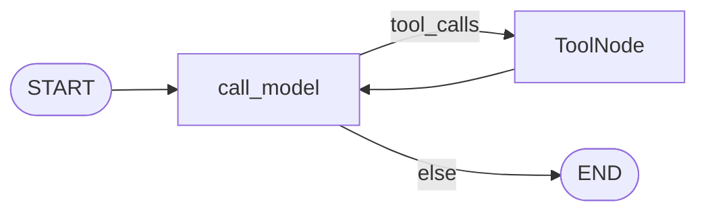
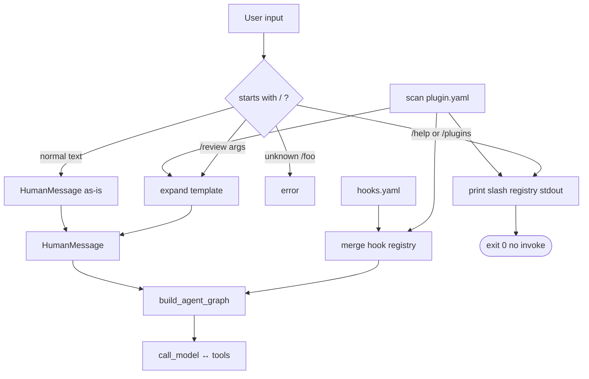
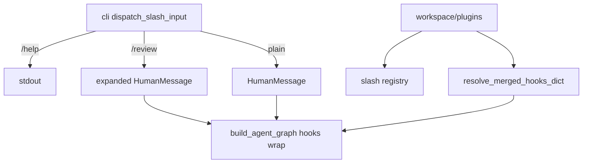

# Milestone 16: Plugins & slash commands

## Status

**Done**

## Goal

Add **declarative plugin packs** and **slash commands** (`/review`, `/plan`, …): expand user input and merge extension-plane contributions **before / beside** the ReAct loop — without new LangGraph nodes. Contrast with hooks (lifecycle), skills (playbooks), subagents (nested graphs), MCP (external tools).

## Why this milestone (learning objectives)

- Real products ship **packs** (team review workflow, security hooks, command shortcuts) as installable/declarative bundles — not one-off edits to core agent code.
- Without plugins: every slash shortcut and hook bundle is hand-wired in CLI + `hooks.yaml`.
- Without slash commands: users must paste long prompt templates; no stable “product surface” for common tasks.
- Option B again: plugins extend the **interface + policy plane**, not `call_model` ↔ `tools` topology.

### With vs without

| Concern | Without M16 | With M16 |
|---|---|---|
| Team workflows | Copy-paste prompts; edit core | Plugin pack + `/command` |
| Hooks | Single `hooks.yaml` / demo ids | Plugins **merge** hook lists |
| vs Skills | — | Skills = model-loadable playbooks; slash = **user-invoked** fixed template |
| vs Hooks | — | Hooks = around each tool call; slash = **once at turn entry** |
| Topology | Tempted to add Command nodes | Unchanged ReAct loop |

## Concepts introduced

- **Plugin pack:** manifest under `workspace/plugins/<id>/plugin.yaml` (and optional assets).
- **Slash command:** user text starting with `/name` (optional args) → expanded **HumanMessage** from a template before `graph.invoke`.
- **Discovery (方案 A):** built-in meta-commands **`/help`** and **`/plugins`** (same output) — print scanned slash commands; **does not** invoke the agent.
- **Merge semantics:** base `hooks.yaml` + plugin hook sections appended; dedupe handler ids within each list.
- **Discovery scan:** `workspace/plugins/*/plugin.yaml`; `PLUGINS_ENABLED=0` disables scan.

### Teaching plugin (in-repo)

`workspace/plugins/review/plugin.yaml`:

- Slash: `/review` → structured code review prompt (`{{args}}` placeholder)
- Hooks: appends `block_dangerous_shell` to merged registry

Package seed: `agent/plugin_examples/review/plugin.yaml` for tests.

## Design decisions & alternatives considered

| Decision | Choice | Alternatives rejected |
|---|---|---|
| Slash expansion site | **CLI / REPL** before graph invoke | New graph node `parse_slash` |
| Command discovery | **`/help` / `/plugins`** list-only | Interactive TUI picker (later dig) |
| Template format | YAML `template:` string; optional `{{args}}` | Full Jinja in M16 |
| Plugin manifest | YAML: `name`, `description`, `slash_commands`, optional `hooks` | JSON Schema marketplace |
| Hook handlers | Still **id → known handler** (M15 tables) | Arbitrary import paths (later dig) |
| Merge vs override | **Append** plugin hooks after base; slash name collision → **error** | Silent override |
| When loaded | CLI startup + graph build (scan once) | Hot reload |
| Permissions | Expanded prompt is normal user message | Slash bypasses M9 |

**Simplification:** no npm-style registry, no dynamic Python load from untrusted paths, no new tools registered by plugins in M16.

## Architecture graph (planned)





## Testing (planned)

### Unit

- [x] Plugin YAML parse: minimal pack, invalid yaml, missing name.
- [x] Slash expand: `/review`, `/review focus on tests`, unknown `/foo` → error.
- [x] **`/help` and `/plugins`:** formatted list; does not call graph.
- [x] Hook merge: base registry + plugin hooks → combined order with dedupe.
- [x] Slash collision policy (duplicate command name).
- [x] Empty plugins dir / `PLUGINS_ENABLED=0` → unchanged behavior.

### Integration

- [x] Expanded `/review` prompt reaches fake LLM through graph.
- [x] Plugin-contributed hooks: Pre deny on dangerous `run_shell`.

## Tasks

- [x] `agent/plugins.py`: discover, parse, merge hooks + slash registry.
- [x] `agent/slash_commands.py`: expand `/name [args]`; built-in **`/help` / `/plugins`** list.
- [x] Wire `cli.py` (and REPL) to expand slash before invoke.
- [x] Wire `resolve_hook_registry` to merge plugin hook sections.
- [x] Example `workspace/plugins/review/plugin.yaml` + package seed + docs.
- [x] Unit + integration tests.
- [x] Results + LEARNING_LOG Concept Q&A + architecture; commit + push.

## Demo / acceptance criteria

1. With example plugin present, `/review` expands to a structured review prompt — **met**.
2. **`/help` or `/plugins`** prints available slash commands without invoking the agent — **met**.
3. Plugin can append hook ids; merged registry runs Pre/Post as in M15 — **met**.
4. Docs explain plugin vs slash vs hooks vs skills — **met**.
5. Parent graph nodes unchanged — **met**.
6. No plugins / no slash → same as M15 — **met**.

## Results

### What we did

- `agent/plugins.py`: scan `workspace/plugins/*/plugin.yaml`, merge hook sections, build slash registry (collision → error).
- `agent/slash_commands.py`: `dispatch_slash_input`, `/help` / `/plugins`, `{{args}}` template expand.
- `resolve_hook_registry` now uses `resolve_merged_hooks_dict` (base + plugins).
- CLI/REPL: slash dispatch before invoke; banner shows plugin count and slash names.
- Example pack: `workspace/plugins/review/plugin.yaml` + `agent/plugin_examples/review/`.
- Settings: `PLUGINS_ENABLED` (default on).

### Commands & how to reproduce

```bash
./scripts/test.sh tests/unit/test_m16_plugins.py tests/integration/test_m16_plugins_live.py -v

# List commands (no LLM invoke):
./scripts/agent.sh "/help"

# Run review template (needs LLM):
./scripts/agent.sh "/review focus on tests"
```

### As-built graph + delta

Parent ReAct topology **unchanged**. Delta is CLI + hook merge plane:



### Why this approach

Plugin = declarative **bundle** for interface (slash) + policy (hooks). Slash expansion at CLI keeps the graph dumb; `/help` gives Claude Code–like **discovery** without a TUI menu (方案 A).

### Deviations

- None significant.

### Pitfalls

- Duplicate slash names across plugins → startup/CLI error (by design).
- Plugin hooks dedupe by handler id — same id from base + plugin runs once.
- `PLUGINS_ENABLED=0` skips scan entirely.
- **`/help` / `/plugins` must short-circuit before checkpointer** — otherwise a down Postgres makes discovery fail (fixed: early dispatch in `cli.main`).

### Testing results

- Unit: `tests/unit/test_m16_plugins.py` — 13 passed.
- Integration: `tests/integration/test_m16_plugins_live.py` — 2 passed.

### Open questions / next dig

- **Parked → [M23–M25](../ROADMAP.md) (Tier 4):** industry plugin parity — skills/MCP/subagents in pack; shell hook runners + interactive discovery; local install/trust.
- M18 channel adapters reusing slash expand (see M18 learning notes).
