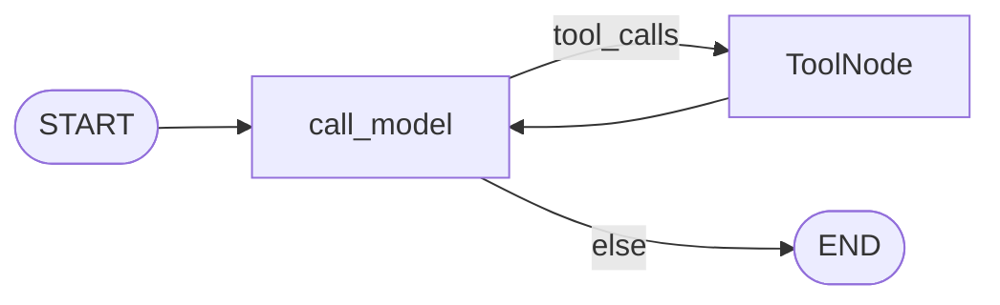
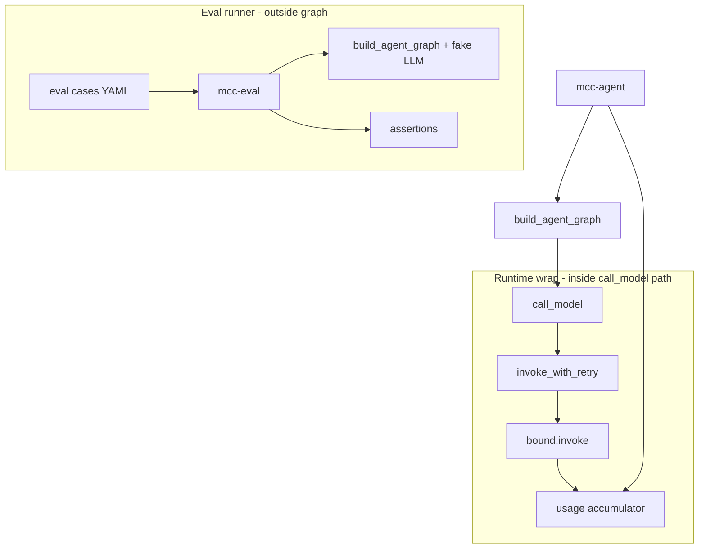
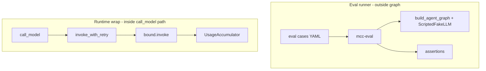

# Milestone 17: Eval harness & cost/retry

## Status

Done — M17 shipped (eval harness, LLM retry/backoff, token usage accounting).

## Goal

Add an **observability / reliability plane** around the existing ReAct loop: **tiny eval cases** (regression harness), **LLM retries with backoff**, and **token usage accounting** — without new LangGraph nodes. Optional dig: Anthropic **prompt caching** notes or minimal hook. Contrast eval vs pytest, retries vs HITL, tokens vs compaction estimate.

## Why this milestone (learning objectives)

- Agents fail in non-deterministic ways; **pytest with fakes** alone does not catch “did the agent behave sensibly on this prompt?”
- Without retries: transient rate limits / network blips kill whole sessions.
- Without usage accounting: you cannot reason about cost, context pressure, or compare runs.
- Industry stacks (LangSmith, Braintrust, etc.) sit **beside** the graph — same Option B lesson as hooks/plugins.

### With vs without

| Concern | Without M17 | With M17 |
|---|---|---|
| Regression on agent behavior | Manual CLI only | **Eval cases** (fake LLM + optional live) |
| Transient LLM errors | Run fails immediately | **Retry/backoff** at model invoke |
| Cost / context visibility | Guess from logs | **Usage summary** per run (metadata + fallback estimate) |
| Topology | Tempted to add Eval nodes | Unchanged `call_model` ↔ `tools` |

## Concepts introduced

- **Eval case:** YAML/JSON spec — prompt, toolset scope, fake-LLM script or live flag, **assertions** (e.g. final text contains, tool was called, permission denied).
- **Eval runner:** CLI `mcc-eval` (or script) loads cases, builds graph with injected fake LLM, runs assertions — **not** inside the agent loop.
- **Retry policy:** configurable max attempts + exponential backoff wrapping **`call_model`’s `bound.invoke`** (and compaction summarizer invoke if shared helper).
- **Usage accumulator:** per-run totals from `AIMessage.usage_metadata` when provider returns it; **fallback** char/4 estimate labeled simplification.
- **vs M7 `estimate_tokens`:** compaction = *prevent* overflow; M17 = *measure* spend after calls.

### Teaching eval set (in-repo)

Ship 2–3 cases under `backend/evals/` or `evals/`:

1. **Tool path:** fake LLM calls `read_file` once → assert ToolMessage + final answer.
2. **Plan Mode deny:** fake LLM calls `write_file` → assert `PERMISSION_DENIED` in transcript.
3. **Optional live:** skip without provider — same shape as M1/M2 integration.

## Design decisions & alternatives considered

| Decision | Choice | Alternatives rejected |
|---|---|---|
| Eval location | **Outside graph** — runner invokes `build_agent_graph` + fake LLM | Eval as LangGraph node |
| Eval assertions | Simple predicates (contains, tool_called, denied) | LLM-as-judge in M17 |
| Retry scope | **`call_model` LLM invoke** (incl. compaction summarizer via shared helper) | Retry whole graph invoke; retry each tool |
| Retry errors | Transient: rate limit, timeout, connection (documented tuple) | Retry on all exceptions |
| Backoff | Exponential with cap; env `LLM_MAX_RETRIES`, `LLM_RETRY_BACKOFF_SEC` | Fixed sleep only |
| Usage reporting | In-memory accumulator; CLI print summary (`--usage` or default stderr footer) | Persist to Postgres in M17 |
| Anthropic caching | **Optional dig** — doc + stub helper for cache breakpoints on system blocks | Full production cache strategy |

**Simplification:** no LangSmith dependency; no distributed tracing; retry does not apply to tool/MCP calls; usage is per-process run totals not billing-grade.

## Architecture graph (planned)





## Testing (planned)

### Unit

- [x] Eval case load: valid YAML, missing fields, unknown assertion type.
- [x] Assertion helpers: `content_contains`, `tool_called`, `permission_denied` on fake transcript.
- [x] Retry: succeeds on 2nd attempt; gives up after max; does not retry on ValueError (policy).
- [x] Usage: sums `usage_metadata` when present; fallback estimate when absent.

### Integration

- [x] Run bundled eval case(s) with fake LLM — green without network.
- [x] Optional: one live eval case skips without `LLM_PROVIDER` / keys (same pattern as M2).
- [x] CLI `--usage` wired; footer when enabled.

## Tasks

- [x] `agent/retry.py`: `invoke_with_retry` helper.
- [x] `agent/usage.py`: accumulator + extract from AIMessage.
- [x] Wire `call_model` (+ summarizer) to retry + usage; CLI `--usage` / env flag.
- [x] `eval/` cases + `eval/runner.py` + `mcc-eval` entry in pyproject.
- [x] `./scripts/eval.sh` wrapper.
- [x] Anthropic caching note in factory + Results.
- [x] Unit + integration tests.
- [x] Results + LEARNING_LOG Concept Q&A + architecture.

## Demo / acceptance criteria

1. `./scripts/eval.sh` runs fake-LLM eval cases green (no network).
2. Simulated transient LLM failure retries and succeeds (unit test).
3. `./scripts/agent.sh --usage "…"` (or env) prints token summary at end.
4. Docs explain eval vs pytest, retry vs HITL, usage vs compaction.
5. Parent graph nodes unchanged.

## Results

### What we did

- **`agent/retry.py`**: `invoke_with_retry` wraps LLM invokes with exponential backoff on transient errors (`RateLimit*`, `Timeout*`, connection errors). Config: `LLM_MAX_RETRIES`, `LLM_RETRY_BACKOFF_SEC`.
- **`agent/usage.py`**: `UsageAccumulator` reads `AIMessage.usage_metadata`; falls back to M7 `estimate_tokens` when absent. CLI `--usage` or `USAGE_REPORT=1` prints footer.
- **`graph.py`**: `call_model` uses retry + usage recording; compaction summarizer shares retry via `default_summarizer(..., on_response=...)`.
- **Eval harness**: `backend/evals/cases/*.yaml`, `eval/runner.py`, `mcc-eval` CLI, `./scripts/eval.sh`. Cases: `tool_path_add`, `plan_mode_deny_write`, `live_smoke` (skipped in batch).
- **Tests**: `test_m17_eval_retry_usage.py`, `test_m17_eval_live.py`.

### Commands & how to reproduce

```bash
./scripts/eval.sh
./scripts/eval.sh --case backend/evals/cases/tool_path_add.yaml
./scripts/test.sh tests/unit/test_m17_eval_retry_usage.py tests/integration/test_m17_eval_live.py -v
./scripts/agent.sh --usage --plan --checkpointer memory --thread-id usage-demo "Say hi"
```

### As-built graph + delta

ReAct topology **unchanged** (`call_model` ↔ `tools`). Delta is **inside** `call_model` invoke path and **outside** via eval runner:



### Why this approach

- **Eval outside graph** — regression on agent *behavior* without polluting cognition topology (same Option B as hooks/plugins).
- **Retry at LLM invoke only** — HITL is human retry; tool failures are different; whole-graph retry would replay side effects.
- **Usage from metadata + fallback** — teaches what providers expose vs what compaction *estimates* proactively.

### Deviations

- Summarizer usage recorded via `on_response` callback + optional `usage_accumulator` build param (no RunnableConfig in compact path).
- `live_smoke.yaml` skipped in `mcc-eval`; live path deferred to integration marker pattern.

### Pitfalls

- Fake LLM evals disable plugins/hooks/MCP and set `CONTEXT_COMPACT_THRESHOLD=0` for determinism — not identical to production CLI runs.
- Retry heuristics match exception **names** — vendor-specific errors may need extending.
- Usage without `usage_metadata` is chars/4 estimate — not billing-grade.

### Testing results

```
14 passed (11 unit + 3 integration) — 2026-08-30
./scripts/eval.sh → 2 passed, 1 skipped (live_smoke)
Full unit suite green after M17 land.
```

### Open questions / next dig

- M19 quality gate may reuse eval runner; LangSmith export; per-tool cost; retry on MCP adapter calls.
- Anthropic prompt caching: `cache_control` breakpoints on system blocks — documented in `llm/factory.py`, not wired.
