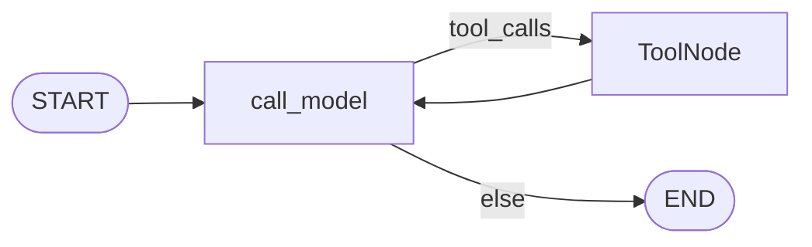
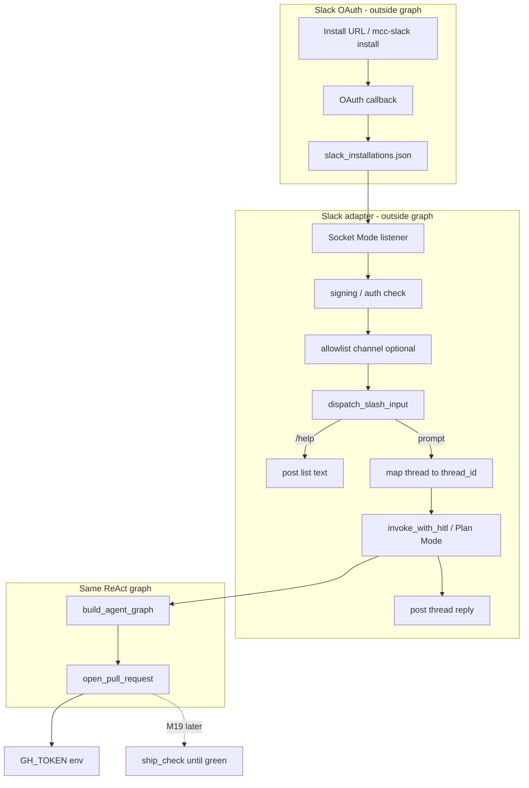

# Milestone 18: Slack OAuth → agent → open PR

## Status

Done — M18 shipped (Slack OAuth + Socket Mode adapter, `open_pull_request` via `GH_TOKEN`).

## Goal

Add a **Slack adapter with OAuth v2 install** so workspace messages become durable `thread_id` sessions into the **same** ReAct graph as CLI — not a new LangGraph topology. Add a **permissioned** `open_pull_request` tool using **`GH_TOKEN`** (no GitHub OAuth). Reuse M16 slash expansion. **Defer** format+test-until-green to **M19**.

**User choice (locked in):** **Slack OAuth** for the channel; **GitHub PAT/token** for PR — not GitHub OAuth.

## Why this milestone (learning objectives)

- Production agents often run in **Slack** with a proper **OAuth install** — not a pasted bot token in `.env` forever.
- Without a channel adapter: only CLI; no practice mapping **Slack thread ↔ checkpointer `thread_id`**.
- Without an explicit PR tool: M4 stopped before push; “ship from chat” needs a **named, ask/deny** tool — not `run_shell git push`.
- **OAuth vs token lesson:** Slack = multi-workspace **install + bot token per team**; GitHub here = single **server-side `GH_TOKEN`** (simplification for a learning repo).

### With vs without

| Concern | Without M18 | With M18 |
|---|---|---|
| Remote UX | CLI only | Slack message → agent turn |
| Workspace auth | N/A | **OAuth v2 install** → bot token per `team_id` |
| Sessions | CLI `--thread-id` | `slack:{team}:{channel}:{thread_ts}` → `thread_id` |
| Ship from chat | Manual CLI | `open_pull_request` + `GH_TOKEN` (dry-run default) |
| Slash in chat | N/A | Reuse `dispatch_slash_input` |
| Topology | Fork graph per channel | Same compiled graph; adapter only |

## Concepts introduced

- **Slack OAuth v2 install:** `client_id` + `client_secret` → redirect → exchange code → **bot token** scoped to a workspace (`team_id`).
- **Installation store:** map `team_id` → `{bot_token, bot_user_id, …}` — **simplification:** local JSON under `workspace/slack_installations.json` (production: encrypted DB + rotation).
- **Ingress:** prefer **Socket Mode** for local dev (`SLACK_APP_TOKEN` + stored bot token) — no public ngrok URL required; still verify signing on HTTP routes if we expose OAuth callback.
- **Request verification:** Slack **signing secret** on Events/interactions HTTP endpoints; OAuth callback validates `state`.
- **Channel adapter:** event → normalize (strip bot mention) → slash dispatch → `graph.invoke` / HITL → post reply to thread.
- **Session key:** `slack:{team_id}:{channel_id}:{thread_ts}` (use `thread_ts` or message `ts` for top-level) → checkpointer `thread_id`.
- **`open_pull_request` tool:** `gh pr create` or GitHub REST with **`GH_TOKEN`** from env; **dry-run default** (`PR_DRY_RUN=1`); live create = opt-in + **ask** permission.
- **HITL over Slack (simplification):** default **Plan Mode for channel bot**; optional text `approve` / `deny` to resume interrupt — no Block Kit buttons required in M18.
- **vs M19:** stub `ship_check` or doc handoff only; real until-green loop is M19.

## Design decisions & alternatives considered

| Decision | Choice | Alternatives rejected |
|---|---|---|
| Channel | **Slack + OAuth v2 install** | Discord bot-token-only path |
| GitHub auth | **`GH_TOKEN` / PAT in env** | GitHub OAuth App (deferred dig) |
| Graph | **Reuse** `build_agent_graph` + checkpointer | Separate “Slack graph” |
| Events delivery | **Socket Mode** default for local | Events API + ngrok only |
| Token storage | Local JSON installation file | Postgres multi-tenant store (overkill for M18) |
| PR creation | `open_pull_request`; **dry-run default** | `run_shell` → arbitrary `gh` |
| `git push` | **Still no** push tool | Silent owner push from bot |
| Quality gate | **Stub / M19 handoff** | Full until-green in M18 |
| Slash | Existing `dispatch_slash_input` | Re-parse in Slack handler |
| HITL | Plan Mode default + text resume | Slack interactive buttons (later dig) |

**Simplification:** single-workspace learning setup (one OAuth install); channel allowlist optional; dry-run PR default; no GitHub App / no token refresh UI; installation JSON is not encrypted.

## Architecture graph (planned)





## Testing (planned)

### Unit

- [x] OAuth state encode/decode; callback payload → installation record shape.
- [x] Session key: `team_id` + `channel` + `thread_ts` → stable `thread_id`.
- [x] Message normalize: strip `<@BOT>` mention; empty → no-op.
- [x] Slash: `/help` list-only without graph (mirror CLI).
- [x] `open_pull_request` dry-run: returns intended title/body without network.
- [x] Permission: `open_pull_request` is **ask**; **deny** in Plan Mode.

### Integration

- [x] Fake Slack event handler → fake LLM graph → reply string (no Slack network).
- [x] OAuth callback with mocked token exchange (unit); live skip without creds.
- [x] Dry-run PR tool with workspace fixture (no network).

## Tasks

- [x] `agent/channel_session.py`: Slack thread → `thread_id`.
- [x] `agent/slack_oauth.py`: install URL, callback, installation store (JSON).
- [x] `agent/slack_adapter.py` + `agent/slack_bot.py`: Socket Mode + message handler.
- [x] `tools/github_pr.py`: `open_pull_request` + dry-run; register with ask/deny.
- [x] Settings + `mcc-slack` + `./scripts/slack.sh`.
- [x] Wire slash + Plan Mode / text HITL resume for Slack threads.
- [x] Unit + integration tests; Results + LEARNING_LOG + architecture.

## Demo / acceptance criteria

1. Unit tests green without Slack/GitHub network.
2. Documented flow: create Slack app → OAuth install → store token → post message → agent reply in thread.
3. `open_pull_request` dry-run shows intended PR; Plan Mode denies; ask path documented.
4. Docs explain: Slack OAuth vs `GH_TOKEN`, adapter vs graph, M18 vs M19, no silent push.
5. Parent graph nodes unchanged.

## Results

### What we did

- **`agent/slack_oauth.py`**: OAuth v2 install URL, code exchange, JSON installation store (`workspace/slack_installations.json`).
- **`agent/slack_adapter.py`**: message normalize → slash dispatch → `thread_id` session → graph invoke; text `approve`/`deny` HITL resume.
- **`agent/slack_bot.py`**: Socket Mode listener; posts thread replies.
- **`slack_cli.py`**: `mcc-slack install` (local callback server) + `mcc-slack run`.
- **`tools/github_pr.py`**: `open_pull_request` with `PR_DRY_RUN=1` default; live via `GH_TOKEN` + `gh`/REST.
- **`CHANNEL_PLAN_MODE=1`** default for Slack bot (read-only policy).

### Commands & how to reproduce

```bash
# 1. Create Slack app (OAuth redirect + bot scopes + Socket Mode app token)
# 2. Set SLACK_* in .env
./scripts/slack.sh install
./scripts/slack.sh run

./scripts/test.sh tests/unit/test_m18_slack_pr.py tests/integration/test_m18_slack_live.py -v
```

### As-built graph + delta

ReAct topology **unchanged**. Delta = Slack adapter + OAuth store **outside** graph; `open_pull_request` added to ToolNode via default tools.

### Why this approach

- **Slack OAuth** teaches workspace install (bot token per team); **GH_TOKEN** keeps GitHub auth simple for a learning repo.
- **Socket Mode** avoids ngrok for local dev.
- **Plan Mode default** for channel avoids stdin HITL; text approve/deny for non-plan dig.

### Deviations

- Installation store is plaintext JSON (labeled simplification).
- Socket Mode only — no Events API HTTP server in M18.

### Pitfalls

- Slack app must subscribe to `message.*` events and enable Socket Mode.
- Live PR still requires branch on remote — no `git push` tool.
- Non-plan channel + ask tools need user to reply `approve`/`deny` in thread.

### Testing results

```
17 passed, 1 skipped — 2026-09-01
Full unit suite green after M18 land.
```

### Open questions / next dig

- GitHub OAuth / GitHub App; Slack Block Kit HITL buttons; **M19** `ship_check`; encrypted installation store.
