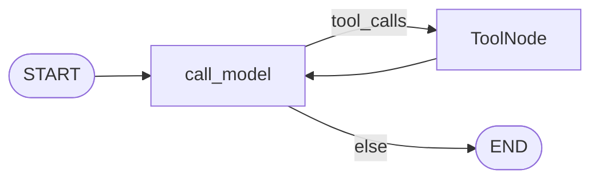
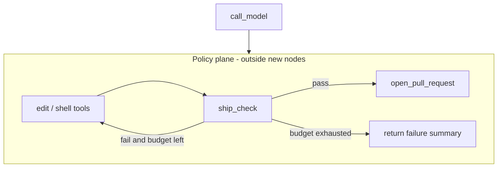

# Milestone 19: Pre-ship quality gate

## Status

Done — M19 shipped (`ship_check`, gated `open_pull_request`, optional `git_push`).

## Goal

Add an **agentic quality loop** before ship: run **formatter + full test suite**; on failure, the agent keeps editing and re-checking until green (**bounded retries**). Default ship path opens a **PR** via existing `open_pull_request` (dry-run still respected); optional owner **`SHIP_MODE=push`** with HITL. Same ReAct topology — gate is a **tool / policy-plane** concern, not new LangGraph nodes.

## Why this milestone (learning objectives)

- Channel-driven agents (M18) must not skip local CI-like checks before creating a PR.
- Without a gate: “open PR” can land red tests; without a **loop**: human must manually fix and re-run.
- Industry: ship bots treat red tests as **recoverable errors** in the ReAct loop (capped), not one-shot hope.

### With vs without

| Concern | Without M19 | With M19 |
|---|---|---|
| Pre-PR checks | Manual / forgotten | `ship_check` (format + tests) |
| Red tests | Stop or open bad PR | Agent edits → re-run until green or budget exhausted |
| Ship action | Raw `open_pull_request` | Prefer gate-then-PR; push only if policy + HITL |
| Topology | Tempted to add Ship nodes | Unchanged `call_model` ↔ `tools` |

## Concepts introduced

- **`ship_check` tool:** runs project formatter (choose one: `ruff format` / `ruff check` or document defer) + `./scripts/test.sh` (or `uv run pytest`); returns structured pass/fail + log tail.
- **Quality loop:** model sees fail output → uses edit/shell tools → calls `ship_check` again; **`SHIP_MAX_FIX_ITERS`** (or recursion / explicit counter) caps spend.
- **`ship` / gate-then-PR:** thin wrapper or prompt convention: do not call live `open_pull_request` until last `ship_check` passed (enforce in tool wrap or Pre hook — teaching choice labeled).
- **`SHIP_MODE=pr|push`:** default `pr`; `push` requires ask/HITL and still no force-push.
- **vs M17 eval:** eval = offline behavior regression; ship_check = **this repo’s** format/tests before publish.
- **vs M18:** M18 opened the PR surface; M19 makes channel/CLI ships go through the gate.

## Design decisions & alternatives considered

| Decision | Choice | Alternatives rejected |
|---|---|---|
| Gate shape | **Tool(s)** in policy plane | New LangGraph “ship” subgraph as required nodes |
| Formatter | **ruff** (format + check) if easy to add; else pytest-only + doc gap | Mandatory black + isort matrix |
| Test command | Wrap existing `./scripts/test.sh` / pytest | Invent parallel CI YAML runner |
| Loop bound | Env `SHIP_MAX_FIX_ITERS` + clear fail message | Unlimited retries |
| Enforce gate before PR | **Wrap or Pre-hook** on `open_pull_request` when `SHIP_REQUIRE_GREEN=1` | Trust prompt only |
| Remote CI wait | **Out of scope** (local only) | Block on GitHub Actions status |
| Push | Opt-in + HITL; never force-push | Silent `git push` from Slack |

**Simplification:** local checks only; no GitHub Actions polling; formatter choice kept minimal; Slack can call same tools when not in Plan Mode.

## Architecture graph (planned)





## Testing (planned)

### Unit

- [x] `ship_check` parses / returns fail when subprocess exits non-zero (fake runner).
- [x] Pass path returns ok + truncated log.
- [x] Max-iter / require-green policy: `open_pull_request` denied or gated when last check failed (if wrap chosen).
- [x] `SHIP_MODE` validation (`pr` vs `push`).

### Integration

- [x] Fake-LLM path: fail check once → edit → pass → dry-run PR (no network).
- [x] Optional live: skip without repo/tools; real `ship_check` against this repo when marked.

## Tasks

- [x] Choose formatter (ruff) and wire into backend/scripts if needed.
- [x] `tools/ship.py` (or similar): `ship_check` (+ optional `ship` orchestrator helper).
- [x] Settings: `SHIP_MAX_FIX_ITERS`, `SHIP_REQUIRE_GREEN`, `SHIP_MODE`.
- [x] Gate `open_pull_request` when require-green (wrap or M15-style hook).
- [x] Register tools; HITL on push path.
- [x] Unit + integration tests; Results + LEARNING_LOG + architecture.

## Demo / acceptance criteria

1. Unit tests green offline.
2. Demo: intentionally break a tiny test fixture or mock runner → agent loop → green → dry-run PR payload.
3. Docs: ship_check vs eval; local vs remote CI; M18 handoff.
4. Parent graph nodes unchanged.

## Results

### What we did

- **`tools/ship.py`:** `ShipGate` state; `ship_check` (ruff format --check + ruff check + `pytest -m unit`); consecutive-fail budget; wrap `open_pull_request` when `SHIP_REQUIRE_GREEN=1`; optional `git_push` when `SHIP_MODE=push` (never force).
- **Checks run on repo root** (this project), not `workspace/` jail — labeled in tool description.
- **`./scripts/ship-check.sh`** mirrors the tool for humans.
- **ruff** added to backend `dev` dependency group.

### Commands & how to reproduce

```bash
./scripts/test.sh tests/unit/test_m19_ship_gate.py tests/integration/test_m19_ship_live.py -v
./scripts/ship-check.sh   # may fail until codebase is ruff-clean — expected teaching signal
# Agent path: ship_check → fix → ship_check → open_pull_request (PR_DRY_RUN=1)
```

### As-built graph + delta

ReAct topology **unchanged**. Delta = ship tools + wrap on `open_pull_request` in the tool list.

### Why this approach

- Gate as **tool wrap** teaches enforceable policy (not prompt-only).
- ReAct loop supplies the “fix until green”; `SHIP_MAX_FIX_ITERS` stops infinite spend.
- Separates **eval (M17)** from **this-repo publish checks**.

### Deviations

- Integration demo uses always-green fake runners + scripted LLM (one ship_check then PR) rather than a multi-fail edit loop — unit tests cover budget/gate.
- Live `ship_check` against full repo is opt-in (`SKIP_M19_LIVE=0`).

### Pitfalls

- Agent workspace ≠ ship project root — easy to confuse.
- Existing code may not pass `ruff format --check` until cleaned; gate is honest.
- `git_push` still needs HITL ask + green gate; never `--force`.

### Testing results

```
8 passed, 1 skipped (M19 unit + integration) — 2026-09-05
Full unit suite green after M19 land.
```

### Open questions / next dig

- GitHub Actions status wait; Slack Block Kit approve for push; **M26** MCP content policy (`no-ai` docs).
