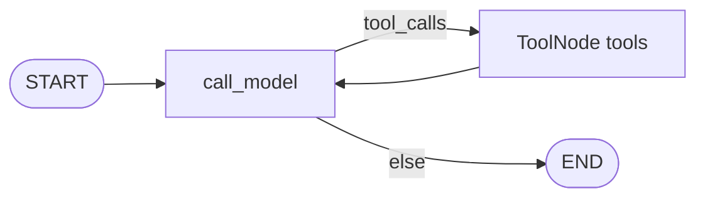

# Milestone 2: Minimal ReAct StateGraph

## Status

Done

## Goal

Run a real **LangGraph** ReAct loop: `call_model` ↔ `tools` with conditional edges, using the M0 factory + M1 `add` tool (and optionally one more stub), so a user prompt can force a tool call and return a final answer — still without filesystem/shell tools or durable Postgres checkpointing.

## Why this milestone (learning objectives)

- M1 proved **normalized** `AIMessage.tool_calls` / `ToolMessage`. M2 puts that cycle inside a **StateGraph** so you feel what LangGraph actually buys you vs a manual `while` loop.
- Without a graph: no clean place for later checkpointer, interrupt, streaming modes, or subgraphs — those attach to graph runtime, not to ad-hoc Python loops.
- Keep the graph **thin** (Option B): only cognition nodes now; permissions/hooks/sandbox stay out until later milestones.

## Concepts introduced

- **StateGraph + `MessagesState` (or equivalent):** typed/accumulated message list as graph state.
- **Nodes:** `call_model` (LLM + `bind_tools`) and `tools` (execute tool_calls → `ToolMessage`s).
- **Conditional edges:** route to `tools` if `tool_calls` present, else `END` — the ReAct branch.
- **Compiled graph / invoke:** one entrypoint for the agent loop; prep for checkpointer (M5) and streaming (M6).
- **Why not `while True`:** a manual loop can call tools, but cannot natively pause (`interrupt`), resume by `thread_id`, stream graph events, or nest as a subgraph without reinventing runtime.

## Design decisions & alternatives considered

| Decision | Choice | Alternatives rejected |
|---|---|---|
| State | LangGraph `MessagesState` (messages reducer) | Custom TypedDict without reducer (easy to get merge wrong) |
| Tools | Reuse M1 `add` + stub `get_agent_name` | Jump to filesystem tools (M3 scope) |
| Tools node | LangGraph prebuilt `ToolNode` | Hand-rolled executor (reinvents id/error handling) |
| Checkpointer | Optional in-process `MemorySaver` via CLI flags | Postgres now (M5) |
| API surface | `build_agent_graph()` + `mcc-agent` / `scripts/agent.sh` | Notebook-only script |
| Provider | Config-driven via `create_chat_model()` | Hardcode Ollama in graph |

**Simplification:** recursion limit default 10; no parallel tool stress; no HITL. Production also needs timeouts and tool-error policies.

## Architecture graph (planned)


## Testing (planned)

### Unit

- [x] `route_after_model`: AIMessage with `tool_calls` → `"tools"`; without → `END`
- [x] `tools` node: `add` → `ToolMessage` with sum (via tiny graph — ToolNode needs runtime)
- [x] `build_agent_graph()` compiles; nodes include `call_model` and `tools`
- [x] Fake LLM full invoke without network

### Integration

- [x] Real provider: add 17+25 → tool trail + 42 (skip if unavailable)
- [x] Uses configured `LLM_PROVIDER` / `LLM_MODEL`

## Tasks

- [x] Add `mini_claude_code/agent/` (`graph.py`, `cli.py`)
- [x] Wire factory + `demo_tools()` (`add`, `get_agent_name`)
- [x] CLI `mcc-agent` + `scripts/agent.sh`
- [x] Optional `MemorySaver` via `--thread-id` / `--new-thread`
- [x] Unit + integration tests
- [x] Docs + LEARNING_LOG; commit + push

## Demo / acceptance criteria

1. Agent prompt for add 17+25 completes — **met** (Ollama live)
2. Transcript shows tool call + final 42 — **met**
3. Unit green; integration skips without Ollama — **met**
4. No FS/shell — **met**
5. No Postgres checkpointer — **met**

## Results

### What we did

- Implemented thin ReAct `StateGraph`: `call_model` ↔ `ToolNode(tools)` with `route_after_model`.
- CLI `mcc-agent` / `scripts/agent.sh`; optional process-local `MemorySaver`.
- Second stub tool `get_agent_name` for multi-tool binding (not required by default demo).
- Tests: unit (17 total suite includes M2) + live integration.

### Commands & how to reproduce

```bash
./scripts/agent.sh "Use the add tool to compute 17 + 25. Do not compute it yourself."
# or:
cd backend && uv run mcc-agent "Use the add tool to compute 17 + 25."
cd backend && uv run pytest -m unit
cd backend && uv run pytest -m integration
```

### As-built graph



- Delta vs planned graph: tools node is explicitly LangGraph `ToolNode` (same edges).

### Why this approach

- Graph runtime is the attachment point for checkpointer / interrupt / streaming later.
- `ToolNode` + conditional edge keeps cognition thin (Option B).
- Without the graph: M1 message cycle works, but every later LangGraph primitive would be bolted onto a custom loop.

### Deviations from plan

- Standalone `ToolNode.invoke` failed without graph runtime in current LangGraph — unit test invokes tools via a one-node compiled graph instead.

### Pitfalls & aha moments

- Trust `tool_calls` for routing (empty AI `content` on tool turns still works — same M1 lesson).
- `MemorySaver` is not durability; do not confuse CLI `--thread-id` with M5 Postgres.

### Testing results

- Unit: `tests/unit/test_m2_agent_graph.py` — all green (full suite 17 passed).
- Integration: `tests/integration/test_m2_agent_live.py` — PASS on Ollama; clouds skip without keys.
- Live demo transcript: Human → AI tool_calls add(17,25) → Tool 42 → AI final text.

### Open questions / next dig

- M3: real filesystem tools behind the same `ToolNode`.
- M5: swap `MemorySaver` for Postgres checkpointer + real resume across processes.
