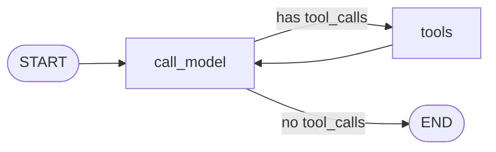

# Milestone 2: Minimal ReAct StateGraph

## Status

Planned

## Goal

Run a real **LangGraph** ReAct loop: `call_model` ↔ `tools` with conditional edges, using the M0 factory + M1 `add` tool (and optionally one more stub), so a user prompt can force a tool call and return a final answer — still without filesystem/shell tools or durable Postgres checkpointing.

## Why this milestone (learning objectives)

- M1 proved **normalized** `AIMessage.tool_calls` / `ToolMessage`. M2 puts that cycle inside a **StateGraph** so you feel what LangGraph actually buys you vs a manual `while` loop.
- Without a graph: no clean place for later checkpointer, interrupt, streaming modes, or subgraphs — those attach to graph runtime, not to ad-hoc Python loops.
- Keep the graph **thin** (Option B): only cognition nodes now; permissions/hooks/sandbox stay out until later milestones.

## Concepts introduced

- **StateGraph + `MessagesState` (or equivalent):** typed/accumulated message list as graph state.
- **Nodes:** `call_model` (LLM + `bind_tools`) and `tools` (execute tool_calls → `ToolMessage`s).
- **Conditional edges:** route to `tools` if `tool_calls` present, else `END` — the ReAct branch.
- **Compiled graph / invoke:** one entrypoint for the agent loop; prep for checkpointer (M5) and streaming (M6).
- **Why not `while True`:** a manual loop can call tools, but cannot natively pause (`interrupt`), resume by `thread_id`, stream graph events, or nest as a subgraph without reinventing runtime.

## Design decisions & alternatives considered

| Decision | Choice | Alternatives rejected |
|---|---|---|
| State | LangGraph `MessagesState` (messages reducer) | Custom TypedDict without reducer (easy to get merge wrong) |
| Tools | Reuse M1 `add`; optional second stub `get_agent_name` for multi-tool routing demo | Jump to filesystem tools (M3 scope) |
| Checkpointer | **In-memory** `MemorySaver` for local multi-turn demo only | Postgres now (M5 — keep durable-store lesson separate) |
| API surface | `build_agent_graph()` + `mcc-agent` / `scripts/agent.sh` CLI | Only notebook-style script (harder to test) |
| Provider | Config-driven via `create_chat_model()` | Hardcode Ollama in graph |

**Simplification:** no recursion limit tuning beyond a safe default; no parallel tool fan-out stress; no HITL. Production agents also set explicit recursion limits, timeout, and tool error handling policies.

## Architecture graph (planned)



Policy/extension plane (permissions, hooks, sandbox) remains **outside** this graph for M2.

## Testing (planned)

### Unit

- [ ] `route_after_model`: AIMessage with `tool_calls` → `"tools"`; without → `END` (or `"__end__"`)
- [ ] `tools` node: given AIMessage with `add` tool_call, appends `ToolMessage` with correct `tool_call_id` and sum content (no LLM)
- [ ] `build_agent_graph()` compiles; graph node names include `call_model` and `tools`
- [ ] Optional: fake LLM in `call_model` path via injectable model (same seam idea as M1 `llm=`) so unit test can run one full invoke without network

### Integration

- [ ] Real provider (default Ollama): invoke graph with “use add to compute 17+25”; final state contains tool trail + answer mentioning 42 (skip if Ollama/model unavailable)
- [ ] Graph respects `LLM_PROVIDER` / `LLM_MODEL` from settings (smoke: construct + one invoke when provider ready)

## Tasks

- [ ] Add `mini_claude_code/agent/` (state helpers, nodes, `build_agent_graph`)
- [ ] Wire `create_chat_model` + `demo_tools()` / `add`
- [ ] CLI `mcc-agent` + `scripts/agent.sh` (pass a prompt; print final messages)
- [ ] Use `MemorySaver` only if we demo two turns in-process; document that durability is M5
- [ ] Unit + integration tests as above
- [ ] Update `docs/architecture.md` current status; fill Results + LEARNING_LOG; commit + push

## Demo / acceptance criteria

1. `./scripts/agent.sh "Use the add tool to compute 17 + 25"` completes without crashing (with Ollama + model).
2. Transcript shows a tool call and a final assistant message (42).
3. Unit tests green without network; integration skips cleanly without Ollama.
4. Still **no** read/write/grep/shell tools (M3/M4).
5. Still **no** Postgres checkpointer (M5).

## Results

*(Fill after implementation.)*

### What we did

### Commands & how to reproduce

### As-built graph

```mermaid
%% fill after implementation
```

- Delta vs planned graph:

### Why this approach

### Deviations from plan

### Pitfalls & aha moments

### Testing results

### Open questions / next dig
