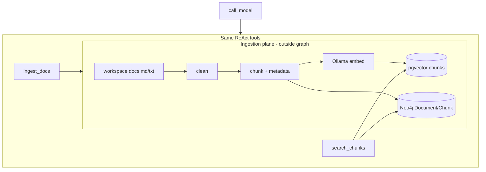
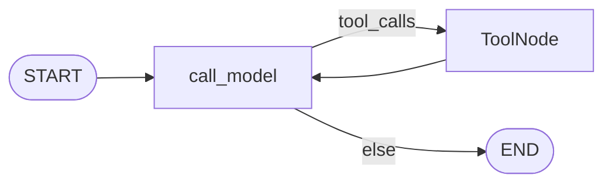

# Milestone 20: Doc ingestion & memory pipeline

## Status

Done

## Goal

Add a **local-first document ingestion pipeline**: load markdown/text from the workspace (or a fixed `docs/` / `workspace/docs/` tree), **clean + chunk + attach metadata**, then write into **clearer schemas** in **pgvector** and/or **Neo4j**. Teach the split: **ingestion is not Neo4j** — Neo4j/pgvector only *store* what the pipeline produces. Reuse M8 embeds/`memory_notes` where possible; do **not** add Elasticsearch (M21) or cloud-only deps. Topology stays `call_model` ↔ `tools`.

## Why this milestone (learning objectives)

- M8 gave one-shot `remember_note` / `remember_fact`. Real agents need **batch ingest** of project docs with stable ids, source paths, and chunk boundaries.
- Common mix-up: “Neo4j does chunking.” Wrong — **chunking/cleaning is a pipeline**; graph/vector DBs store results.
- Without metadata: recall cannot cite “from `docs/foo.md` §2”; without chunking: embeddings are useless on long files.
- Sets up M21 (keyword search) with a shared document/chunk model.

### With vs without

| Concern | Without M20 (M8 only) | With M20 |
|---|---|---|
| Long docs | Stuff whole file into one note/fact | Chunk + metadata |
| Provenance | Opaque text blobs | `source_path`, `chunk_index`, optional title |
| Stores | Ad-hoc remember tools | Pipeline → Neo4j and/or pgvector with documented schemas |
| Mental model | “DB does RAG” | Ingest plane → store plane → agent tools |

## Concepts introduced

- **Ingestion pipeline:** `load → clean → chunk → embed/write` (store-agnostic core).
- **Chunking strategy (teaching):** simple recursive / size+overlap splitter (chars or approximate tokens); label vs production (semantic chunkers, AST-aware).
- **Document / Chunk metadata:** at least `doc_id`, `source_path`, `chunk_index`, `text`, timestamps.
- **Dual write (optional paths):**  
  - **pgvector:** chunk rows + embeddings (extend or supersede thin `memory_notes`).  
  - **Neo4j:** `Document` / `Chunk` nodes (+ `HAS_CHUNK` / `NEXT` optional) — not only flat `Fact`.
- **Agent tools:** e.g. `ingest_docs` (path or glob), `search_chunks` (semantic via existing embedder); keep M8 fact tools.
- **vs compaction / checkpointer:** still not the chat log — ingested docs survive new `thread_id`s.

## Design decisions & alternatives considered

| Decision | Choice | Alternatives rejected |
|---|---|---|
| Scope | Local files under workspace/repo docs; Compose Neo4j + Postgres | Cloud vector DB; S3 crawl |
| Chunker | Simple size+overlap in Python | LangChain TextSplitter-only magic without owning the logic |
| Primary teach store | **Both** pgvector chunks + Neo4j Document/Chunk (minimal edges) | Vectors-only or graph-only |
| Reuse M8 | Keep `remember_note` for ad-hoc blurbs; ingest uses richer table/nodes | Delete M8 tools |
| Job queue | **Sync tool call** (simplification) | Celery/RQ workers |
| ACL / multi-tenant | Document as “prod still needs” | Fake enterprise ACLs |
| ES | **M21** | Bundle into M20 |

**Simplification:** no background workers; no OCR/PDF unless trivial text; Ollama embeddings only; no hybrid re-rank.

**Reorder note:** User-parked **[M26](../ROADMAP.md)** (MCP `no-ai` content policy) can swap ahead of M20 if preferred — say so when approving.

## Architecture graph (planned)




## Testing (planned)

### Unit

- [x] Clean: strip noise / normalize newlines (fixture strings).
- [x] Chunk: size+overlap boundaries; empty input; short doc → one chunk.
- [x] Metadata: `source_path` + monotonic `chunk_index`.
- [x] Schema helpers / serializers without live DB where possible.

### Integration

- [x] Ingest fixture markdown into Postgres pgvector (skip if Postgres/Ollama embed unavailable).
- [x] Ingest creates Neo4j Document/Chunk (skip if Neo4j down).
- [x] `search_chunks` returns ingested text for a known query (skip without embed model).
- [x] Fake-LLM graph: tool call `ingest_docs` then `search_chunks` (DB optional via fakes).

## Tasks

- [x] `memory/ingest.py` (or `ingestion/`): load, clean, chunk, metadata.
- [x] Schema migration / ensure: pgvector chunk table; Neo4j constraints/labels.
- [x] Writers: pgvector + Neo4j; shared pipeline entrypoint.
- [x] Tools: `ingest_docs`, `search_chunks` (+ wire permissions).
- [x] Sample docs under `workspace/docs/` for demos.
- [x] Unit + integration tests; Results + LEARNING_LOG + architecture; commit + push.

## Demo / acceptance criteria

1. Unit tests green offline.
2. With Compose + Ollama embed: ingest sample docs → semantic search hits the right chunk with path metadata.
3. Docs explain pipeline vs store; files vs graph vs vectors (M8 extended).
4. Parent graph nodes unchanged.

## Results

### What we did

- **`memory/ingest.py`:** `clean_text`, size+overlap `chunk_text`, stable `doc_id_for_path`, title extract, path/glob load under workspace.
- **`memory/pipeline.py`:** `ingest_paths` orchestrates jail → chunk → dual write (pgvector and/or Neo4j).
- **`memory/pgvector_chunks.py`:** `memory_chunks` table (`doc_id`, `source_path`, `chunk_index`, `title`, embedding); `search_chunks` cosine.
- **`memory/neo4j_docs.py`:** `Document` / `Chunk` + `HAS_CHUNK` / `NEXT`; keyword `search_chunks_keyword`.
- **Tools:** `ingest_docs` (ask), `search_chunks` (auto); M8 `remember_*` kept.
- **Samples:** `workspace/docs/shipping-checklist.md`, `package-managers.md`.
- **`db_inspect`:** reports `memory_chunks` + Document/Chunk counts.

### Commands & how to reproduce

```bash
./scripts/test.sh tests/unit/test_m20_ingest.py -v
./scripts/test.sh tests/integration/test_m20_ingest_live.py -v
# Agent (Compose + Ollama nomic-embed-text):
./scripts/agent.sh --plan "ingest_docs on docs/ then search_chunks for pnpm"
# Inspect stores:
uv run --directory backend mcc-db-inspect   # or project entrypoint if configured
```

### As-built graph + delta

ReAct topology **unchanged** (`call_model` ↔ `tools`). Delta = ingest plane outside the graph + two tools on the tool list.



### Why this approach

- Owning clean/chunk in Python teaches **pipeline vs store**; dual-write shows the same chunks can feed vectors (fuzzy) and graph (structure/NEXT).
- Keep M8 one-shot tools for blurbs/facts — different memory shapes, not one table for everything.

### Deviations

- `search_chunks` tool prefers pgvector; on embed/DB failure falls back to Neo4j keyword CONTAINS (teaching resilience, not hybrid rank).
- Pipeline avoids importing `tools.path_jail` (circular import via `tools.__init__`); local `_resolve_under_root` mirrors jail semantics.

### Pitfalls

- “Neo4j does chunking” remains a common misconception — call it out in reviews.
- Re-ingest replaces by `doc_id` (path hash); renaming a file creates a new doc_id (old chunks orphan until manual cleanup — labeled simplification).
- Semantic search needs Ollama `EMBEDDING_MODEL`; Neo4j keyword path still works without embeds.

### Testing results

```
12 passed (unit test_m20_ingest) — 2026-09-05
159 unit suite green
integration: 1 passed (Neo4j), 2 skipped (no embed / optional dual) when Ollama embed unavailable
```

### Open questions / next dig

- M21 Elasticsearch beside chunks; ACL; PDF; async ingest queue; **M26** MCP content policy on ingested docs.
