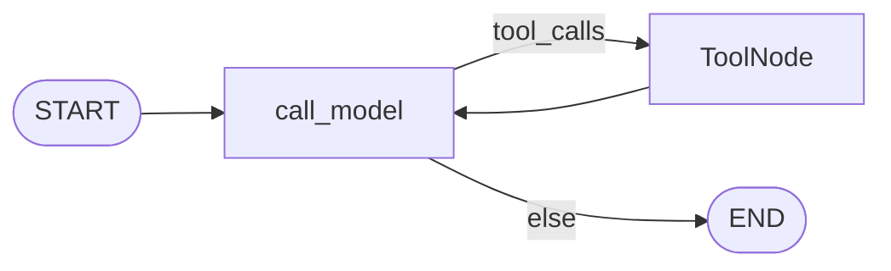
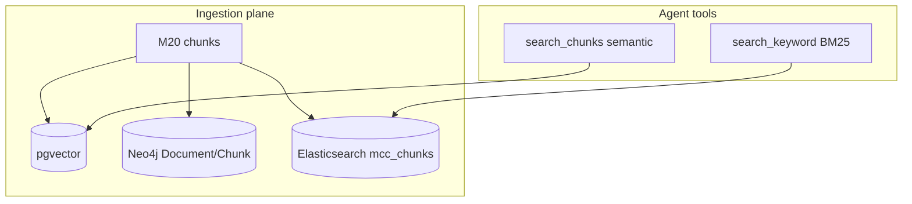

# Milestone 21: Elasticsearch (local full-text)

## Status

Done

## Goal

Add **Elasticsearch** as a **local Compose** service for **keyword / full-text** search over the **same ingested chunks** from M20. Agent gets `search_keyword` beside `search_chunks` (pgvector semantic) and Neo4j (relations / weak CONTAINS). Teach the **three-way choice**: when ES/BM25 wins vs vectors vs graph. Topology stays `call_model` ↔ `tools`. **No hybrid re-rank** in M21 (optional dig after).

## Why this milestone (learning objectives)

- M20 proved ingest → dual-write; primary retrieval is dense (cosine). Exact tokens, rare IDs, and “must contain this string” are where **inverted index + BM25** shine.
- Without ES: you either over-rely on embeddings (miss exact markers) or stretch Neo4j `CONTAINS` (not real full-text scoring).
- Completes the teaching triangle started in M8/M20: **graph / vectors / keyword**.

### With vs without

| Concern | Without M21 | With M21 |
|---|---|---|
| Exact token / error code | Hope cosine or Neo4j CONTAINS | BM25-ranked full-text |
| Mental model | “RAG = only embeddings” | Three retrieval families |
| Ingest | pgvector + Neo4j only | Same pipeline + ES index |
| Scale teaching | Toy keyword fallback | Industry-shaped keyword store (local) |

## Concepts introduced

- **Inverted index + BM25** (engine-owned; we call the API, not reimplement BM25).
- **Index / mapping** for chunk documents (`doc_id`, `source_path`, `chunk_index`, `title`, `text`).
- **Triple write** from M20 pipeline: pgvector + Neo4j + ES.
- **Agent tool:** `search_keyword` (auto, read-safe) distinct from `search_chunks`.
- **When to use which** (documented in Learning Log / Results).

## Design decisions & alternatives considered

| Decision | Choice | Alternatives |
|---|---|---|
| Engine | **Elasticsearch 8.15** single-node in Compose (`xpack.security.enabled=false`) | OpenSearch; hosted Elastic Cloud |
| Wire-in | Extend `ingest_paths` with `write_elasticsearch=True` | Separate ingest-only-ES tool |
| Query API | `elasticsearch` Python client, `multi_match` on `title^2`, `text`, `source_path` | Raw HTTP only; reinvent BM25 |
| Hybrid | **Out of scope** | Bundle hybrid into M21 |
| Neo4j CONTAINS | Keep as emergency fallback for `search_chunks` | Delete Neo4j keyword |
| Resources | 512m heap default | Full cluster |

**Simplification:** no auth, no ILM, no TLS; one index `mcc_chunks`; sync index on ingest.

## Architecture graph (planned)





## Testing (planned)

### Unit

- [x] Mapping / document serializer for a `TextChunk` → ES body (no network).
- [x] Query builder shapes (`multi_match` fields) without live ES.
- [x] Permissions: `search_keyword` auto; ingest still ask.
- [x] Pipeline flag `write_elasticsearch` skipped cleanly when disabled.

### Integration

- [x] Compose ES health; index + search roundtrip for fixture marker (skip if ES down).
- [x] Ingest sample docs → `search_keyword` hits exact token.
- [x] Contrast documented in demo (paraphrase vs exact) — not a flaky assert.

## Tasks

- [x] `docker-compose.yml`: Elasticsearch service + volume + healthcheck; `.env.example` knobs.
- [x] `memory/elasticsearch_chunks.py`: ensure index, write, search.
- [x] Extend `pipeline.ingest_paths` triple-write; settings `ELASTICSEARCH_URL`.
- [x] Tool `search_keyword` + wire permissions / default tools.
- [x] `./scripts/m21-demo.sh`; `mcc-db-inspect elasticsearch`.
- [x] Unit + integration tests; Results + LEARNING_LOG + architecture; commit + push.

## Demo / acceptance criteria

1. `docker compose up` brings ES healthy alongside Postgres/Neo4j.
2. Ingest `workspace/docs` → keyword search finds exact marker with path metadata.
3. Docs table: ES vs pgvector vs Neo4j — when each wins.
4. Parent graph nodes unchanged.

## Results

### What we did

- **Compose:** `mcc-elasticsearch` (ES 8.15.3, security off, `:9200`).
- **`memory/elasticsearch_chunks.py`:** mapping, `write_chunks_es`, `search_keyword` (`multi_match` / BM25).
- **`pipeline.ingest_paths`:** triple-write (`elasticsearch=` in summary).
- **Tool:** `search_keyword` (auto); `ingest_docs` now documents ES write.
- **Deps:** `elasticsearch>=8.15,<9`.
- **Demo:** `./scripts/m21-demo.sh`; inspect via `./scripts/db-inspect.sh elasticsearch`.

### Commands & how to reproduce

```bash
docker compose --env-file .env up -d elasticsearch
./scripts/test.sh tests/unit/test_m21_elasticsearch.py tests/integration/test_m21_elasticsearch_live.py -v
./scripts/m21-demo.sh
curl -s http://localhost:9200/mcc_chunks/_count
./scripts/db-inspect.sh elasticsearch
# Agent:
./scripts/agent.sh "Use ingest_docs on docs/ then search_keyword for M20_MARKER_PURPLE_ORBIT"
```

### As-built graph + delta

ReAct topology **unchanged**. Delta = ES Compose service + ingest third writer + `search_keyword` tool.

### Why this approach

- Completes the retrieval triangle without mixing hybrid ranking into the first ES lesson.
- Same M20 chunks → three stores teaches store choice, not three ingest pipelines.

### When each store wins (M21)

| Store | Best for | Weak at |
|---|---|---|
| **Elasticsearch (BM25)** | Exact tokens, markers, must-contain terms | Paraphrase / synonym without shared tokens |
| **pgvector (cosine)** | Fuzzy / semantic intent | Rare IDs if embedding washes them out |
| **Neo4j** | Relations (`HAS_CHUNK`/`NEXT` scaffold); M8 Facts | Real full-text scoring (CONTAINS is weak) |

### Deviations

- Chose Elasticsearch over OpenSearch (brand familiarity for learning; OpenSearch remains a valid swap).
- Hybrid re-rank deferred.

### Pitfalls

- ES needs ~512MB+ heap; Docker Desktop RAM must allow it.
- First pull of the ES image is large.
- Underscores in markers can be analyzed; exact unique tokens still ranked highly in demo.

### Testing results

```
6 passed (unit test_m21_elasticsearch)
2 passed (integration test_m21_elasticsearch_live)
165 unit suite green — 2026-09-05
./scripts/m21-demo.sh: ES BM25 hit docs/m20-demo.md#0 for M20_MARKER_PURPLE_ORBIT
```

### Open questions / next dig

- Hybrid (ES filter + vector re-rank); read Neo4j `NEXT` expand; **M22** async runtime; **M26** content policy.
