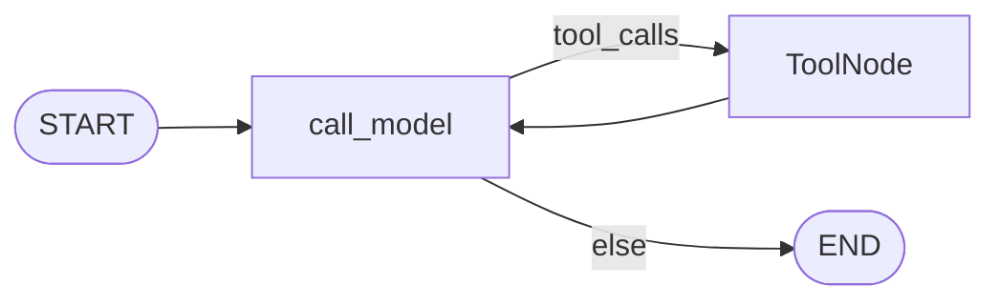

# Milestone 22: Async agent runtime (drop MCP sync wrap)

## Status

Done

## Goal

Make the **default agent runtime async end-to-end** (`ainvoke` / `astream`) so MCP adapter tools run via **native `ainvoke`**, without the M14 **`asyncio.run` sync wrap** on the hot path. Align CLI streaming and HITL resume with async. Keep a **thin sync shim** (`--sync`, `func` on MCP tools, `graph.invoke` for tests). Topology unchanged.

## Why this milestone (learning objectives)

- M14 wrapped MCP tools with `wrap_mcp_tool_for_sync` → each sync tool call `asyncio.run(ainvoke(...))`.
- Worse: permission/hook wraps only exposed `func`, so even async ToolNode fell back to `invoke` → nested `asyncio.run`.
- With M22: wraps expose **`coroutine` + `func`**; default CLI uses **`ainvoke`/`astream`**.

## Concepts introduced

- Async ToolNode → `tool.ainvoke` when graph is `ainvoke`d.
- Permission / hook planes must preserve `coroutine` (not only `func`).
- MCP prepare: sync shim optional; async path never needs nested `asyncio.run`.
- CLI `--sync` compatibility; default async.

## Design decisions & alternatives considered

| Decision | Choice | Alternatives |
|---|---|---|
| Default CLI | `ainvoke` / `astream` | Sync forever |
| `call_model` | **Stay sync** (`bound.invoke`) so `graph.invoke` tests keep working | Async-only node (broke 20 unit tests) |
| MCP tools | Keep `func`+`coroutine` prepare; document shim | Coroutine-only always |
| HITL | `ainvoke_with_hitl` default | Sync-only HITL |

**Simplification:** Slack adapter may still `invoke` (LangGraph runs sync `call_model`); tool `ainvoke` still applies when Slack moves to async later.

## Architecture graph (planned / as-built)



Delta: runtime path async; nodes unchanged.

## Testing (planned)

### Unit

- [x] Permission wrap exposes `coroutine`; `ainvoke` does not nest `asyncio.run`.
- [x] Hooks wrap preserves `ainvoke`.
- [x] Fake async-only tool + `graph.ainvoke` completes without nested run.
- [x] Sync `invoke` still works with permission wrap.
- [x] `ainvoke_with_retry` retries transient errors.

### Integration

- [x] MCP demo `echo` via `ainvoke` without MCP shim `asyncio.run` (skip if MCP unavailable).

## Tasks

- [x] Audit wraps; add coroutines to permissions + hooks.
- [x] `ainvoke_with_hitl`, `consume_agent_astream`; CLI default async + `--sync`.
- [x] MCP prepare flags; demote sync wrap documentation.
- [x] Unit + integration; Results + LEARNING_LOG + architecture; commit + push.

## Demo / acceptance criteria

1. MCP demo + async graph calls echo without nested `asyncio.run`.
2. Unit suite green including sync `invoke` tests.
3. Docs explain async-first vs sync shim.

## Results

### What we did

- **`permissions._wrap_one` / `hooks._wrap_one_with_hooks`:** both `func` and `coroutine` (`await tool.ainvoke`).
- **`mcp_loader`:** `wrap_mcp_tool_for_sync` always attaches coroutine; `_mcc_mcp_sync_shim` flag; `prepare_mcp_tool_async_only`; `load_mcp_tools_async(..., sync_shim=)`.
- **CLI:** default `ainvoke`/`astream`; `--sync` for old path; `ainvoke_with_hitl`.
- **`ainvoke_with_retry`** helper (available; `call_model` stays sync for compatibility).
- **`call_model` stays sync** — labeled deviation (LangGraph sync invoke cannot run async-only nodes).

### Commands & how to reproduce

```bash
./scripts/test.sh tests/unit/test_m22_async_runtime.py -v
./scripts/test.sh tests/integration/test_m22_async_mcp_live.py -v
MCP_USE_DEMO=1 ./scripts/agent.sh --plan "Use the echo tool with text hello-m22"
# Compat:
./scripts/agent.sh --sync --plan "hi"
```

### As-built graph + delta

Topology **unchanged**. Delta = async CLI + coroutine-preserving wraps.

### Why this approach

- Real bug was wraps dropping `coroutine`, not only “CLI is sync.”
- Keeping sync `call_model` preserves the large `invoke`-based unit suite.

### Deviations

- Did not make `call_model` async (would break sync `graph.invoke` without dual registration).
- Hybrid “always coroutine-only MCP” not forced — shim remains for `--sync` / tests.

### Pitfalls

- Patching `asyncio.run` in tests must not patch the harness `asyncio.run` itself.
- StructuredTool requires `args_schema` when constructing manually.

### Testing results

```
8 passed (unit test_m22_async_runtime) + suite 173 unit green
1 passed (integration MCP ainvoke) — 2026-09-05
```

### Open questions / next dig

- Async `call_model` with dual sync/async registration; Slack on async; stateful MCP sessions; **M26** content policy; **M23** plugins.
