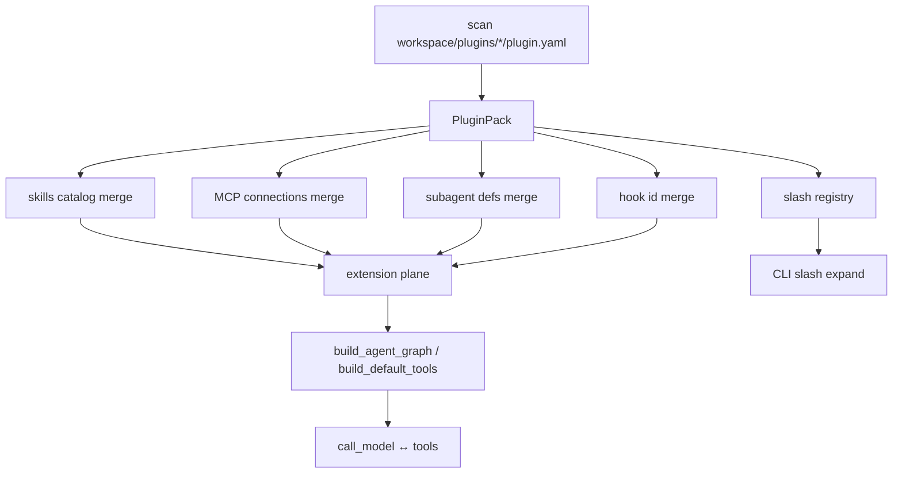
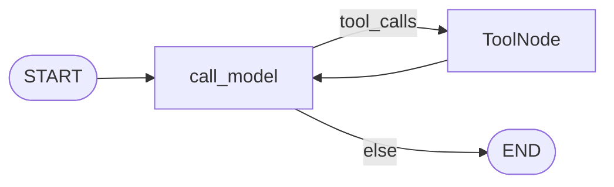
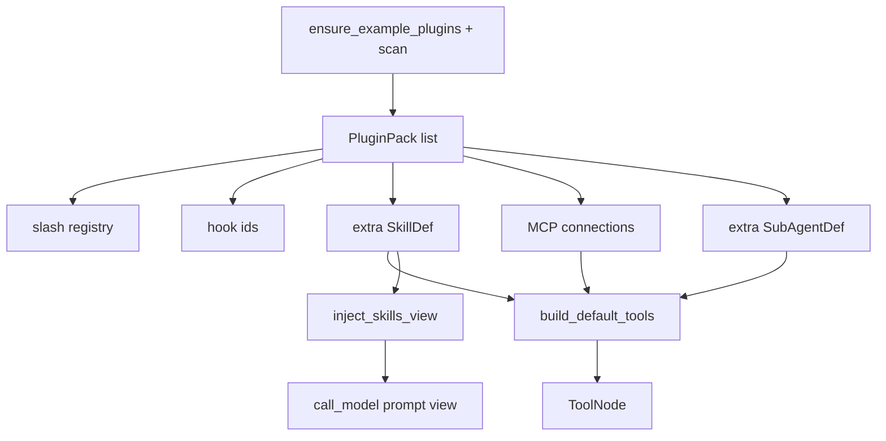

# Milestone 23: Plugin pack expansion (skills / MCP / subagents)

## Status

Done.

## Goal

Extend M16 `plugin.yaml` so a pack can declare **bundled skills**, **MCP server entries**, and **subagent YAML refs**, then **merge** those into the existing M13 / M14 / M12 planes at agent build time. Still **Option B**: no new LangGraph nodes. Ship **2–3 teaching plugins** under `workspace/plugins/` (and package examples) that load via today’s discover path. **Install/trust CLI stays M25; shell hook runners stay M24.**

## Why this milestone (learning objectives)

- M16 packs only ship **slash templates + in-process hook ids**. Industry packs also ship **playbooks (skills)**, **external tools (MCP)**, and **delegation targets (subagents)**.
- Without M23: each capability lives in a separate folder (`skills/`, MCP env, `subagents/`) — packs cannot be one product surface.
- With M23: one directory = one product feature set; runtime **registers into the same extension planes** you already know.
- Contrast (keep sharp):
  - **Slash** → expands HumanMessage once at turn entry
  - **Skill** → catalog / `load_skill` prompt enrichment
  - **MCP** → expands tool list
  - **Subagent** → adds `run_subagent` targets
  - **Hooks** → still Pre/Post around tools (ids only until M24)

### With vs without

| Concern | Without M23 | With M23 |
|---|---|---|
| Pack surface | Slash + hook ids | + skills + MCP + subagents |
| Mental model | Three separate trees | Manifest declares → merge into planes |
| Topology | Tempted to add Plugin node | Unchanged `call_model` ↔ `tools` |

## Concepts introduced

- **Pack expansion:** `plugin.yaml` fields for co-located assets (relative paths under the plugin dir).
- **Merge semantics:** plugin contributions **append / union** into existing loaders (skills catalog, MCP connections, subagent defs); collisions **fail closed** (error), matching slash collision policy.
- **Co-located assets:** `plugins/<id>/skills/…`, `mcp` entries, `subagents/*.yaml` — not a marketplace (M25).
- **Teaching multi-pack:** more than one example pack so `/plugins` and merge order are visible.

## Design decisions & alternatives considered

| Decision | Choice (proposed) | Alternatives |
|---|---|---|
| Manifest shape | Optional keys: `skills: [rel paths or dirs]`, `mcp: {name: connection}`, `subagents: [rel yaml]` | Only symlink into workspace roots |
| Skills merge | Scan plugin skill paths → add to catalog used by `inject_skills_view` / `load_skill` (same `SkillDef`) | Copy files into `workspace/skills/` on load |
| MCP merge | Merge plugin `mcp` dict into connections **after** env/path config (or after demo flags); name collision → error | Override silent |
| Subagents merge | Load plugin YAML defs into same map as `workspace/subagents/` | Separate `run_plugin_subagent` tool |
| Hook section | Unchanged (ids only) — M24 | Shell scripts in M23 |
| Install | Still: place/copy under `workspace/plugins/<id>/` — M25 CLI | `mcc plugins install` in M23 |
| Example packs | (1) keep/extend `review`; (2) `docs-mcp` → fake_docs MCP; (3) `research` → skill + explore-like subagent | One mega-plugin only |

**Simplification:** no remote registry; no dynamic Python import from plugin paths; MCP still stdio/config dicts you already use; no signed trust (M25).

## Architecture graph (planned)




## Testing (planned)

### Unit

- [x] Parse expanded manifest: skills / mcp / subagents fields; reject bad types.
- [x] Skills merge: plugin skill appears in catalog; name collision with workspace skill → error.
- [x] MCP merge: plugin connection present in resolved connections; duplicate server name → error.
- [x] Subagent merge: plugin def callable via loaded defs map; duplicate name → error.
- [x] `PLUGINS_ENABLED=0` → no plugin skills/MCP/subagents.
- [x] Multi-pack: two packs both contribute without collision.

### Integration

- [x] Load example `docs-mcp` pack → `read_doc` / `list_docs` available (skip if MCP spawn fails).
- [x] Load `research` (or similar) → `load_skill` and/or `run_subagent` see plugin assets (fake LLM / tools OK).
- [x] Parent graph topology unchanged (still `call_model` + `tools`).

## Tasks

- [x] Extend `PluginPack` + `load_plugin_manifest` for new fields.
- [x] Wire merge into skills / MCP resolve / subagent load (call sites in graph / default tools / inject).
- [x] Seed 2–3 example plugins (package + workspace seed pattern like M16).
- [x] Unit + integration tests; short demo notes or script.
- [x] Results + LEARNING_LOG + architecture; commit + push.
- [x] Stop for M24 Plan (shell hooks / discovery) after close-out.

## Demo / acceptance criteria

1. At least two plugins under `workspace/plugins/` contribute different plane types (e.g. MCP vs skill/subagent).
2. `/plugins` still lists packs; agent can use merged MCP/skill/subagent without editing core agent code.
3. Collision on skill name / MCP server name / subagent name fails loudly.
4. ReAct topology unchanged; M24/M25 not required for this Done.

## Results

### What we did

- Extended `PluginPack` with `skill_refs`, `mcp`, `subagent_refs`; parsers + jail under pack dir.
- Merge helpers: `collect_plugin_skill_defs`, `collect_plugin_mcp_connections` / `merge_mcp_connections`, `collect_plugin_subagent_defs`.
- MCP `preset: fake_docs|echo_math` for teaching without absolute paths.
- Wired: `build_default_tools`, `resolve_mcp_connections(..., plugins=)`, `inject_skills_view` / `load_skill_defs(extra=)`, `load_subagent_defs(extra=)`.
- `ensure_example_plugins` seeds `review`, `docs-mcp`, `research` into `workspace/plugins/` when missing.
- `/plugins` lists plane tags (`skills=`, `mcp=`, …).
- Demo: `./scripts/m23-demo.sh`.

### Commands & how to reproduce

```bash
./scripts/m23-demo.sh
# or
cd backend && uv run pytest -m unit tests/unit/test_m23_plugins.py -q
cd backend && uv run pytest -m integration tests/integration/test_m23_plugins_live.py -q
# agent: PLUGINS_ENABLED=1 (default) seeds packs; /plugins lists them
```

### As-built graph + delta

Parent ReAct topology **unchanged**. Plugins remain an **extension-plane** merge (slash / hooks / skills / MCP / subagents).





**Delta vs Plan:** as planned; `PluginPack.path` is now the **pack directory** (not the yaml file path) so asset resolution is simpler.

### Why this approach

One pack → many planes teaches industry plugin shape without new graph nodes. Fail-closed collisions prevent silent shadowing. Presets keep teaching MCP entries portable.

### Deviations

- Seeding copies full example trees into workspace on first resolve (not only `plugin.yaml`). Nested assets are gitignored-unignored so demos are reviewable.

### Pitfalls

- With plugins enabled (default), seeded `docs-mcp` contributes `fake_docs` MCP even if `MCP_USE_FAKE_DOCS=0` — by design for the pack lesson; disable via `PLUGINS_ENABLED=0` or remove the pack.
- Eval harness already sets `PLUGINS_ENABLED=0` to avoid noise.

### Testing results

- Unit: 11 passed (`test_m23_plugins.py`); M16 regression green.
- Integration: 4 passed (`test_m23_plugins_live.py`).

### Open questions / next dig

- M24: shell/script hook runners + richer discovery.
- M25: `plugins install` + trust allowlist for MCP/hook spawn.
