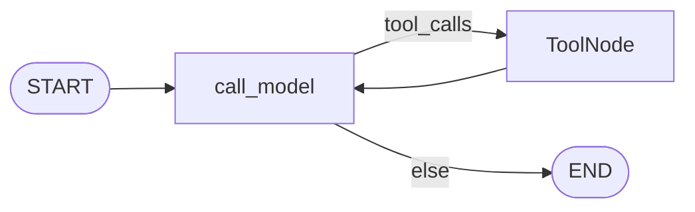
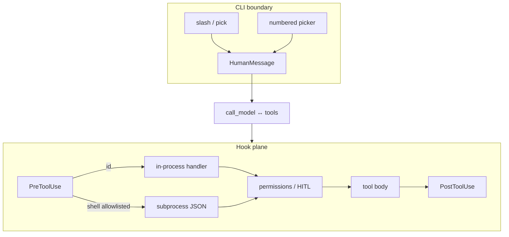

# Milestone 24: Plugin hooks & discovery (industry)

## Status

Done.

## Goal

Bring hooks closer to industry coding agents: support **shell/script hook runners** (JSON on stdin → JSON/decision on stdout) in addition to M15 in-process handler **ids**, and improve slash **discovery** beyond M16 list-only `/help` (numbered picker at the CLI boundary). Still **Option B** — no new LangGraph nodes. **Plugin install + signed trust marketplace stay M25**; this milestone adds an **opt-in allowlist** so shell hooks cannot run by default.

## Why this milestone (learning objectives)

- M15 taught Pre/Post/Stop as an extension plane, but handlers are **only** Python ids in `hook_demos`.
- Real products (e.g. Claude Code–style) often let packs ship **`command` / script** hooks so teams can enforce policy without shipping Python into the agent process.
- Without M24: plugins cannot express portable shell policy; discovery stays a static list.
- With M24: same wrap order (Pre → permissions → body → Post); new runner type behind **deny-by-default**.
- Discovery stays a **CLI/interface** concern — not a graph node (reuse M18 channel slash expand).

### With vs without

| Concern | Without M24 | With M24 |
|---|---|---|
| Hook handlers | In-process ids only | Ids **or** allowlisted shell scripts |
| Trust | N/A (Python already in-process) | Shell hooks off until allowlisted |
| Discovery | `/help` prints list | Numbered picker (`/pick`, `/`) |
| Topology | Tempted to add HookRunner node | Unchanged ReAct loop |

## Concepts introduced

- **Shell hook runner:** spawn command with JSON payload on stdin; parse stdout for allow/deny / rewritten args / rewritten result.
- **Deny-by-default for shell hooks:** `HOOK_SHELL_ENABLED=0` default; allowlist paths; scripts under `workspace/plugins/` allowed when enabled.
- **Manifest hook entries:** string id (M15) **or** `{type: script, path: ...}` / `{type: shell, command: ...}`.
- **Discovery:** numbered picker via `/pick` or empty `/`.

## Design decisions & alternatives considered

| Decision | Choice | Alternatives |
|---|---|---|
| Shell payload | Compact JSON: `{event, tool, args, result?}` | Full Claude Code schema clone |
| Pre outcome | stdout JSON `{allow, reason?, args?}` | Always allow + log only |
| Post outcome | stdout may rewrite via `{result}` | Force string always |
| Trust | Opt-in flag + allowlist / plugins tree | Full marketplace in M24 |
| Discovery | `/pick` + empty `/` numbered list | Full curses TUI |
| SessionStart | Deferred | Required in M24 |

**Simplification:** no HTTP hooks; sync subprocess + timeout; `.py` scripts run via `sys.executable`; stop hooks stay id-only.

## Architecture graph (planned)





## Testing (planned)

### Unit

- [x] Parse hook entry: string id vs `{type: shell|script, ...}`; reject unknown types.
- [x] Shell Pre: fixture script denies → deny; allow → proceed.
- [x] Shell Post: script rewrites result string.
- [x] Deny-by-default: shell entry skipped when `HOOK_SHELL_ENABLED=0`.
- [x] Allowlist: path outside allowlist → reject.
- [x] Picker: format numbered list; selecting number expands command.
- [x] Existing M15 id hooks still work (regression).

### Integration

- [x] Plugin pack with script Pre blocks `run_shell` in graph invoke (fake LLM).
- [x] `/pick` helper expands without building graph.
- [x] Skip N/A — scripts are Python, portable.

## Tasks

- [x] Extend hook config / plugin hook merge to accept shell/script entries.
- [x] Implement `shell_hooks.py` runner (timeout, JSON I/O, allowlist).
- [x] Settings: `HOOK_SHELL_*`.
- [x] Teaching pack `shell-hooks`.
- [x] CLI numbered picker (`/pick`, `/`).
- [x] Unit + integration tests; `./scripts/m24-demo.sh`.
- [x] Results + LEARNING_LOG + architecture; commit + push.

## Demo / acceptance criteria

1. In-process id hooks still work — **met**.
2. Allowlisted shell Pre hook can deny a tool — **met**.
3. Shell hooks disabled → entries do not execute — **met**.
4. Numbered picker expands a slash command — **met**.
5. Parent graph nodes unchanged — **met**.

## Results

### What we did

- `agent/shell_hooks.py`: spawn + JSON parse + allowlist (`HOOK_SHELL_ALLOWLIST` or under `workspace/plugins/`).
- `hooks.py` / `plugins.py`: hook entries may be ids **or** `{type: script|shell, ...}`; plugin script paths resolved under pack dir.
- Pack `shell-hooks`: Pre denies `FORBIDDEN_M24` in `run_shell`; Post appends `[hook:shell-hooks]`.
- Slash: `/pick` and empty `/` → numbered picker; CLI early path + REPL helper.
- Settings / `.env.example`: `HOOK_SHELL_ENABLED` (default 0), allowlist, timeout.
- Demo: `./scripts/m24-demo.sh`.

### Commands & how to reproduce

```bash
./scripts/m24-demo.sh
# interactive picker:
# HOOK_SHELL_ENABLED=1 mcc-agent /pick
```

### As-built graph + delta

Topology **unchanged**. Shell runners live inside the existing hook wrap.

**Delta vs Plan:** SessionStart not implemented (deferred dig). Empty `/` maps to **pick** (not list); `/help` remains the list meta-command.

### Why this approach

Same Pre→perm→body→Post order as M15; only the **handler backend** grows. Deny-by-default teaches trust before M25 install CLI.

### Deviations

- SessionStart / UserPromptSubmit skipped.
- Stop hooks remain id-only (no shell stop).

### Pitfalls

- With `HOOK_SHELL_ENABLED=0`, shell entries are **skipped with a warning** (registry may look empty of shell handlers) — not a hard load error.
- `.py` scripts use `sys.executable` as argv0; allowlist checks the **script path**, not the interpreter.
- Seeded `shell-hooks` is inert until `HOOK_SHELL_ENABLED=1`.

### Testing results

- Unit: 12 passed (`test_m24_hooks.py`); M15/M16 regression green.
- Integration: 2 passed (`test_m24_hooks_live.py`).

### Open questions / next dig

- M25: `plugins install` + richer trust UI; HTTP hooks; SessionStart; industry JSON schema parity.
