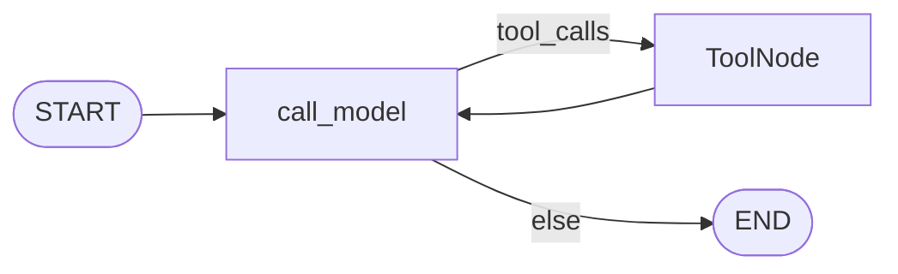
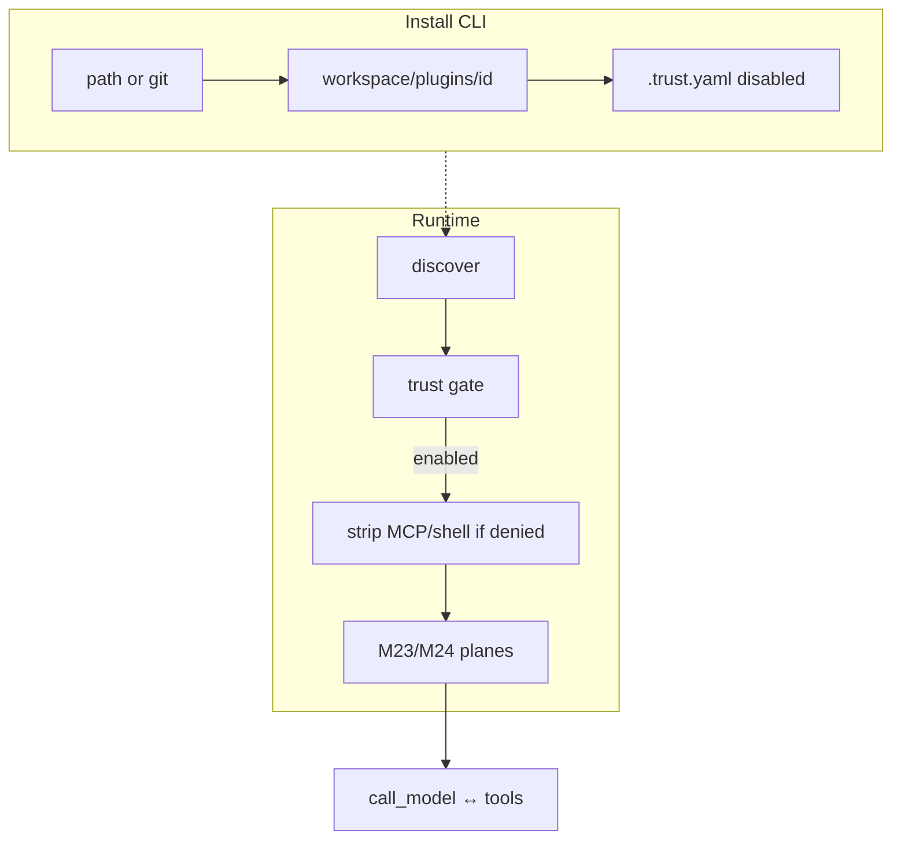

# Milestone 25: Plugin install & trust (local-first)

## Status

Done.

## Goal

Add a **local-first plugin install** path (`mcc-plugins install …`) and a small **trust / enable** layer so packs are not only “copied into `workspace/plugins/` by hand or seed,” but **installed with versioned manifests** and **explicit allow** for dangerous capabilities (shell hooks, MCP spawn). Still **Option B** — no new LangGraph nodes. **Simplification:** no npm marketplace, no signed packages, no remote update channel — document the gap vs production.

## Why this milestone (learning objectives)

- M16–M24 taught packs + merge + shell hooks, but trust was mostly “files already under `workspace/plugins/`.”
- Industry agents treat plugins as **untrusted until approved**: install ≠ enable; shell/MCP are capability grants.
- Without M25: every path under `plugins/` is live; `HOOK_SHELL_ENABLED=1` + plugin tree is a broad grant; no install story.
- With M25: install from path/git → staged copy; `version` / `requires`; trust file allowlists which packs may run shell hooks / contribute MCP; unsigned marketplace gap labeled.

### With vs without

| Concern | Without M25 | With M25 |
|---|---|---|
| Getting a pack | Manual copy / seed only | `install` from path or git |
| Trust | Broad (tree presence) | Explicit enable + capability flags |
| Manifest | Optional name/desc | `version` + `requires` checked |
| Marketplace | N/A | Documented as out of scope |

## Concepts introduced

- **Install vs discover:** install copies/clones into `workspace/plugins/<id>/`; discover still scans that tree.
- **Trust record:** `workspace/plugins/.trust.yaml` — enabled + `allow_shell_hooks` / `allow_mcp`.
- **Versioned manifest:** `version`; optional `requires.mini_claude_code: ">=x.y.z"`.
- **Capability gate:** shell hooks / MCP stripped unless trust grants them.
- **Gap label:** production still needs signing, org policy, updates — not this milestone.

## Design decisions & alternatives considered

| Decision | Choice | Alternatives |
|---|---|---|
| CLI | `mcc-plugins` (`install`, `list`, `trust`, `disable`) | Only docs |
| Install sources | Local path + `git clone` | npm registry |
| New install trust | **Disabled**, no shell/MCP until `trust` | Auto-enable |
| Missing trust entries | Synthesize enabled defaults from pack capabilities (seed compat) | Fail closed all |
| Python import | Still forbidden | Load plugin modules |

## Architecture graph (planned)





## Testing (planned)

### Unit

- [x] Parse `version` / `requires`; reject incompatible requires.
- [x] `install` from temp path copies pack; refuses overwrite without `--force`.
- [x] Trust file: disabled pack not in effective resolve list.
- [x] Capability: shell hooks stripped when `allow_shell_hooks: false`.
- [x] Capability: MCP omitted when `allow_mcp: false` (via trust + enable path).
- [x] Trust YAML roundtrip.

### Integration

- [x] Install via CLI into tmp workspace → trust enable → appears in `resolve_plugins`.
- [x] Git install skipped (covered by unit path; git optional).
- [x] Graph topology unchanged smoke.

## Tasks

- [x] Extend `plugin.yaml`: `version`, `requires`.
- [x] Trust file + gate in `resolve_plugins`.
- [x] CLI install/list/trust/disable; `mcc-plugins` script.
- [x] Demo script; example manifests versioned.
- [x] Unit + integration tests.
- [x] Results + LEARNING_LOG + architecture; commit + push.

## Demo / acceptance criteria

1. `mcc-plugins install <path>` copies a pack — **met**.
2. Pack inactive for runtime until trusted — **met**.
3. `version` / `requires` validated — **met**.
4. Marketplace/signing gap labeled — **met**.
5. Topology unchanged — **met**.

## Results

### What we did

- `plugin_trust.py`: `.trust.yaml` load/save; enable + `allow_mcp` / `allow_shell_hooks`.
- `plugin_install.py`: path copy + git clone; `requires` check; new installs **disabled**.
- `resolve_plugins`: validate requires → synthesize missing trust → filter disabled → strip caps.
- `mcc-plugins` CLI; example packs carry `version: "0.1.0"` + `requires`.
- Demo: `./scripts/m25-demo.sh`.

### Commands & how to reproduce

```bash
./scripts/m25-demo.sh
# or
uv run --directory backend mcc-plugins install backend/src/mini_claude_code/agent/plugin_examples/research
uv run --directory backend mcc-plugins list
uv run --directory backend mcc-plugins trust research --enable
```

### As-built graph + delta

Topology **unchanged**. Trust is a **runtime filter** before M23/M24 merges.

**Delta vs Plan:** Missing trust entries for seeded packs are **auto-synthesized as enabled** with capabilities inferred from the pack (so existing demos keep working). Fresh `install` still starts **disabled**.

### Why this approach

Install ≠ enable teaches industry trust. Capability flags separate “load slash/skills” from “may spawn shell/MCP.”

### Deviations

- No signed receipts; git install needs system `git`.
- `requires` only supports `>=x.y.z` for `mini_claude_code`.

### Pitfalls

- `.trust.yaml` is gitignored (local policy).
- `HOOK_SHELL_ENABLED` still required in addition to `allow_shell_hooks`.
- Synthesized trust on first resolve may create `.trust.yaml` under workspace.

### Testing results

- Unit: 8 passed (`test_m25_plugins_trust.py`); M16/M23/M24 regression green.
- Integration: 3 passed (`test_m25_plugins_trust_live.py`).

### Open questions / next dig

- Signed marketplace; auto-updates; org policy UI; SessionStart from M24.
