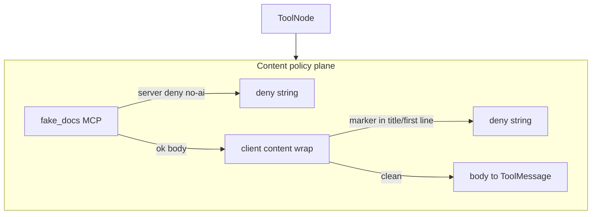
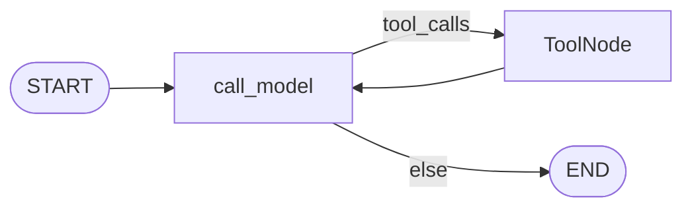
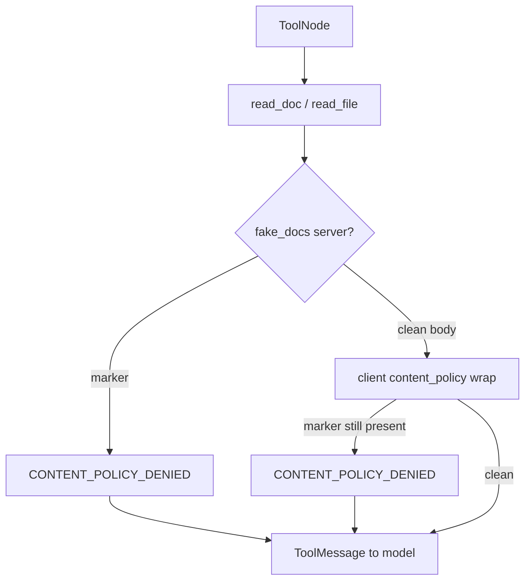

# Milestone 26: MCP tool content policy & safety

## Status

Done.

## Goal

Add **content-aware policy** on tool results (especially MCP reads): if a document’s **title / first line / metadata** contains markers such as `no-ai` or `CONFIDENTIAL`, the tool returns a **deny string** and the **body never enters model context**. Contrast **M9** (tool name ACL), **M15** (hooks on name/args), **server-side** refusal vs **client wrap** after `get_tools`. Teaching demo: **in-repo fake docs MCP** + fixture files — **not** live Google Docs OAuth. Topology stays `call_model` ↔ `tools`.

## Why this milestone (learning objectives)

- M9 answers: “May this *tool* run?” (auto/ask/deny by name).
- M15 can block by *name/args* before the body runs — still not “inspect the document content.”
- Real agents (and enterprise Google Docs / Drive) need: **this resource is readable by humans but not by AI** — content/labels, not only tool ACL.
- Without M26: a permitted `read_doc` can still dump confidential text into the transcript.
- With M26: fail-closed content guard; teach why **client wrap alone cannot trust a hostile MCP server**.

### With vs without

| Concern | Without M26 | With M26 |
|---|---|---|
| `no-ai` doc | Model sees full body if tool is allowed | Deny string; body withheld |
| Mental model | Permissions = tool names only | Tool ACL ≠ content policy |
| Trust boundary | Implicit trust of MCP returns | Server-enforced vs client wrap contrast |

## Concepts introduced

- **Content policy / DLP-for-tools:** inspect title, first line, or metadata markers before returning body.
- **Fail-closed:** marker present → deny; no marker → allow.
- **Client wrap** after MCP `get_tools` (our agent wraps `read_*` tools).
- **Server-enforced** demo: fake docs MCP refuses at source (model never gets body even without wrap).
- **Contrast table:** M9 vs M15 vs M26 vs production Drive labels/ACLs.

## Design decisions & alternatives considered

| Decision | Choice (proposed) | Alternatives |
|---|---|---|
| Demo surface | In-repo **docs MCP** (`mcp_servers/fake_docs.py`) + fixture `.md` under package | Live Google Docs OAuth |
| Markers | First line or title contains `no-ai` / `CONFIDENTIAL` (case-insensitive) | Regex config only; ML classifier |
| Where to enforce | **Both:** (1) server refuses; (2) client wrap as defense-in-depth teaching | Client-only or server-only |
| Builtin tools | Optional wrap for `read_file` when first line matches (same markers) | MCP-only |
| Hook vs wrap | Dedicated **content policy wrap** (clear teaching) + optional Pre hook id | Only M15 hooks |
| Fail-closed | Marker present → deny; no marker → allow | Silent redact |

**Simplification:** no Drive API, no shared drive labels, no org SSO. Label what production still needs.

**Reorder note:** M23–M25 stay parked unless you prefer plugin packs instead.

## Architecture graph (planned)




## Testing (planned)

### Unit

- [x] Marker detection helpers (first line / title; case-insensitive).
- [x] Client wrap: mock tool returning `no-ai` body → deny string, no body leak.
- [x] Client wrap: clean doc → body returned.
- [x] Builtin `read_file` path (optional) respects same markers.
- [x] Permissions still apply (content policy is additional, not a replacement for M9).

### Integration

- [x] Fake docs MCP stdio: `read_doc` on `no-ai` fixture denies at server (skip if MCP load fails).
- [x] Same via agent/`invoke` with fake LLM tool call (skip without demo).
- [x] Clean fixture still readable.

## Tasks

- [x] Fixture docs + `mcp_servers/fake_docs.py` (list/read with server-side policy).
- [x] `content_policy.py`: detect + wrap (`func` + `coroutine`).
- [x] Wire wrap after MCP load / optional builtin read; settings knobs.
- [x] Unit + integration tests; `./scripts/m26-demo.sh`.
- [x] Results + LEARNING_LOG + architecture; commit + push.

## Demo / acceptance criteria

1. Reading a `no-ai` fixture via MCP returns deny; model context has no secret body.
2. Clean fixture still works.
3. Docs contrast M9 / M15 / M26 / production Drive.
4. Parent graph nodes unchanged.

## Results

### What we did

- Added `mini_claude_code.content_policy`: marker parse, `find_policy_marker`, `filter_tool_result`, `apply_content_policy_wrap` (sync + async, M22-safe).
- Added `mcp_servers/fake_docs.py` + `fake_docs_data/` fixtures (`clean-guide`, `secret-no-ai`, `confidential-memo`). **Server** refuses marked bodies.
- Settings: `MCP_USE_FAKE_DOCS`, `CONTENT_POLICY_*`; `resolve_mcp_connections` merges demo + fake docs; `build_default_tools` wraps MCP reads and optional `read_file`.
- `list_docs` / `read_doc` are M9 auto (read-safe).
- Demo: `./scripts/m26-demo.sh`.

### Commands & how to reproduce

```bash
./scripts/m26-demo.sh
# or
cd backend && uv run pytest -m unit tests/unit/test_m26_content_policy.py -q
cd backend && uv run pytest -m integration tests/integration/test_m26_fake_docs_live.py -q
# agent with fake docs:
# MCP_USE_FAKE_DOCS=1 mcc-agent
```

### As-built graph + delta

Parent ReAct topology **unchanged**. Content policy lives in the **extension plane** (server + client wrap around tool results), same layer as permissions/hooks/MCP merge.





**Delta vs Plan:** as planned; wrap module lives at package root `content_policy.py` (shared by MCP server + agent) rather than under `agent/`.

### Why this approach

| Layer | Question answered |
|---|---|
| M9 permissions | May this *tool name* run? |
| M15 hooks | Block/audit by *name/args* before/after invoke? |
| M26 content policy | May this *returned body* enter the transcript? |
| Production Drive | Labels/ACLs at the **document store** — not first-line conventions alone |

Client wrap teaches defense-in-depth and catches local `read_file`; **server-enforced** teaches the trust boundary: a hostile MCP can strip markers before return, so policy must live at the source of truth when possible.

### Deviations

- None material. Optional “strict deny on ambiguous” not implemented — marker present → deny; absent → allow.

### Pitfalls

- Wrapping only `func` would break M22 async — wrap sets both `func` and `coroutine`.
- `list_docs` may show `[restricted:…]` flags (ids/titles) but must not include secret bodies.
- Disabling `CONTENT_POLICY_ENABLED` turns off **client** wrap only; fake_docs server still denies.

### Testing results

- Unit: 12 passed (`test_m26_content_policy.py`).
- Integration: 5 passed (`test_m26_fake_docs_live.py`) — server deny, clean allow, list no leak, graph invoke no secret in messages.

### Open questions / next dig

- Google Drive labels API; redact vs deny; M23 plugin packs; hybrid retrieval digs; hook-id that calls the same `filter_tool_result` for teaching symmetry with M15.
