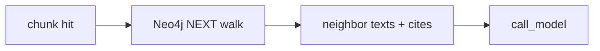

# Milestone 28: Graph-neighbor expand (Neo4j NEXT)

## Status

Planned

## Goal

After a chunk hit, expand ±N neighbors via Neo4j `NEXT` / `HAS_CHUNK`; return citations with path + chunk index. Contrast vector-only “island” hits.

## Why this milestone

Embeddings find similarity; documents are **sequences**. Neighbor expand is cheap structure-aware RAG on top of M20 dual-write.

## Concepts introduced

- Structural context vs semantic recall
- Provenance: path + chunk index in tool results
- When expand helps vs pollutes context

## Design decisions & alternatives considered

| Decision | Tentative choice | Alternatives |
|---|---|---|
| API | `expand_chunks(chunk_id, radius)` tool | Auto-expand inside `search_chunks` (hides lesson) |
| Radius | Small N (1–2) default | Large window (context bloat) |

## Architecture graph (planned)

## Testing (planned)

### Unit

- [ ] Walk radius / order pure helper on fake graph rows

### Integration

- [ ] Ingest multi-chunk doc → expand returns ordered neighbors (skip if Neo4j down)

## Tasks

- [ ] Plan detail + approve
- [ ] Tool + optional search glue
- [ ] Tests; Results + LEARNING_LOG; commit + push

## Demo / acceptance criteria

1. Hit chunk 2 → expand includes chunk 1 and/or 3 with stable cites.
2. Learning Log contrasts expand vs `search_chunks` alone.

## Results

_(fill after implementation)_
