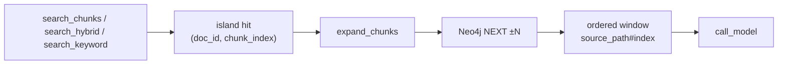

# Milestone 28: Graph-neighbor expand (Neo4j NEXT)

## Status

Done

## Goal

Add **`expand_chunks`**: given a chunk identity (`doc_id` + `chunk_index`, or `{doc_id}:{chunk_index}`), walk Neo4j **`NEXT`** (and reverse) for radius **±N**, return neighbor texts with stable citations (`source_path#chunk_index`). Keep vector / hybrid / keyword search as **island finders**; expand is the **sequence glue**. Do **not** silently auto-expand inside `search_chunks` / `search_hybrid`.

## Why this milestone

Embeddings (and BM25) return **similarity islands**. Real docs are **ordered sequences** — the sentence before/after a hit often holds the constraint, definition, or API name the model needs. M20 already dual-wrote `Document`/`Chunk` with `HAS_CHUNK` + `NEXT`; M28 teaches **structure RAG** on that graph instead of pretending Neo4j “does chunking” or stuffing whole files into context.

## Concepts introduced

- **Structural context** vs **semantic / lexical recall**
- **Provenance in tool results**: path + chunk index (same logical key family as M20/M27)
- **Radius tradeoff**: expand helps continuity; large N pollutes the prompt
- Why **`NEXT` walk** beats emergency `CONTAINS` keyword on the graph (`search_chunks_keyword` stays fallback only)
- Agent-visible two-step pattern: *find island → expand neighborhood* (not one opaque “smart RAG” tool)
- **Tool plane only** — no new LangGraph node / forced LLM layer (same ReAct)

## Design decisions & alternatives considered

| Decision | Choice | Alternatives |
|---|---|---|
| API | New tool **`expand_chunks`** | Auto-expand inside `search_chunks` / `search_hybrid` (hides the lesson) |
| Anchor identity | `doc_id` + `chunk_index` (optional `chunk_id` string `{doc_id}:{chunk_index}`) | pgvector UUID only (**wrong** join; same lesson as M27) |
| Walk | Bidirectional **`NEXT`** for radius `N` (default **1**, clamp 1–3); Cypher `*0..3` then filter by `|Δindex|` | Index-only sibling fetch via `HAS_CHUNK` (secondary; primary teach = edges) |
| Include center | Yes — ordered window `[center−N … center+N]` capped to doc bounds | Neighbors-only |
| Text source | Neo4j `Chunk.text` | Re-fetch from pgvector by keys |
| Glue with search | Not auto-piped | Auto-pipe every search hit (context bloat) |
| Topology | No new LangGraph nodes; tool plane only | Extra “expand” graph node |
| CONTAINS | Keep as emergency keyword only | Use CONTAINS to “find neighbors” |

**Simplification:** no entity/`MENTIONS` edges; no multi-hop across documents; no community detection. One doc’s linear `NEXT` chain only.

## Architecture graph (planned / as-built)



ReAct topology **unchanged** (`call_model` ↔ tools).

## Testing (planned)

### Unit

- [x] Pure window helper: center + radius → expected index list (bounds, radius clamp)
- [x] Format citations / ordered hit list from fake `GraphChunkHit` rows
- [x] Permission: `expand_chunks` in `READ_SAFE_TOOLS`; Plan Mode allows it
- [x] Tool registered on default memory tool list
- [x] `parse_chunk_ref` + delegate to Neo4j walk (mocked)

### Integration

- [x] Write multi-chunk doc → expand middle returns ordered ±1; edge has no negative indices (skip if Neo4j down)

## Tasks

- [x] Library: `memory/expand.py` + `expand_chunks_via_next` in `neo4j_docs.py`
- [x] Tool + permissions
- [x] Unit + integration + `./scripts/m28-demo.sh`
- [x] Results + LEARNING_LOG + architecture; commit + push

## Demo / acceptance criteria

1. After write of a ≥3-chunk doc: expand from middle includes neighbors with stable cites.
2. Tool description: find with search first; expand for sequence — not a search replacement.
3. Learning Log contrasts expand vs `search_chunks` alone; notes tool-plane-only design.
4. Unit green; integration present (skip OK without Neo4j).

## Results

### What we did

- **`memory/expand.py`:** `clamp_radius`, `expand_index_window`, `parse_chunk_ref`, `format_*`, `expand_chunks`.
- **`neo4j_docs.expand_chunks_via_next`:** bidirectional `NEXT*0..3` + `|Δindex| <= radius` filter; missing center → `[]`.
- **`expand_chunks` tool** + `READ_SAFE_TOOLS`.
- **`./scripts/m28-demo.sh`**.

### Commands & how to reproduce

```bash
./scripts/test.sh tests/unit/test_m28_expand.py -v
./scripts/test.sh tests/integration/test_m28_expand_live.py -v
./scripts/m28-demo.sh
```

### As-built graph + delta

Topology **unchanged**. Delta = retrieval tool plane only (`expand_chunks`).

### Why this approach

Makes structure RAG an **agent-visible** second step after island search, reusing M20 `NEXT` without hiding it inside hybrid/vector tools.

### Deviations

None material vs Plan. Cypher uses fixed `*0..3` path bound (Neo4j param limits) then filters by radius — equivalent to Plan’s clamp 1–3.

### Pitfalls

- Auto-expand inside search hides the island vs sequence lesson and bloats every hit.
- Joining on pgvector UUID instead of `(doc_id, chunk_index)` / `{doc_id}:{chunk_index}` breaks expand.
- Large radius dumps whole docs into context — clamp exists for a reason.

### Testing results

```
6 passed (unit test_m28_expand)
1 passed (integration test_m28_expand_live) — 2026-09-07
```

### Open questions / next dig

- M29 MCP HTTP / sticky session; optional auto-expand policy dig later.
