# Milestone 29: MCP HTTP transport & sticky session

## Status

Done

## Goal

Ship an in-repo **Streamable HTTP** MCP demo server (not stdio), wire the LangChain MCP adapter with a **sticky** `client.session(...)` so tool calls reuse one HTTP session for the CLI/process lifetime, and **contrast** M14’s cold `get_tools()` path (new session per tool call / stdio spawn). Stdio demos (`echo_math`, `fake_docs`) stay available and unchanged as the cold/spawn baseline.

## Why this milestone

M14 proved “MCP tools merge into ToolNode.” That path still feels like a **subprocess demo**: `MultiServerMCPClient.get_tools()` opens a **fresh session per tool call** (adapter docs say so explicitly). Production MCP often speaks **HTTP**, keeps **session state** (auth headers, cursors, counters), and must reason about **lifecycle** (open → use → close) and **stale tool lists** after reconnect. Without M29, “MCP” in this repo never leaves the stdio teaching box.

## Concepts introduced

- **Transport:** stdio vs Streamable HTTP
- **Cold discovery:** `await client.get_tools()` — tools work, but each invoke may handshake again
- **Sticky session:** `async with client.session(name)` + `load_mcp_tools(session)` — one live connection reused
- **Stateful server proof:** session-scoped counter accumulates **only** under sticky HTTP
- **Stale tool list / reconnect:** list captured at open time; reconnect = re-load (documented)
- **Headers (thin):** `X-MCC-Demo: http-counter` — **not** OAuth

## Design decisions & alternatives considered

| Decision | Choice | Alternatives |
|---|---|---|
| Server transport | FastMCP **`streamable-http`** on `127.0.0.1` (ephemeral port in tests) | SSE only; WebSocket; external SaaS |
| Client transport | Adapter **`streamable_http`** (+ aliases `http` / `streamable-http`) | SSE fallback |
| Sticky scope | Dedicated asyncio **loop/thread** for sticky HTTP sessions (works from sync graph build + async CLI) | Enter session only on CLI async loop |
| Cold path | Keep M14 `get_tools()` for **stdio** | Force sticky for stdio too |
| Opt-in | `MCP_USE_HTTP_DEMO=1` + `MCP_HTTP_DEMO_URL` (server must already be up) | Always-on HTTP |
| Proof tool | Session-keyed `bump_counter` / `get_counter` | Process-global counter (hides cold vs sticky) |
| Topology | No new LangGraph nodes | Extra mcp_session node |
| Auth | Static demo header only | OAuth (**out of scope**) |

**Simplification:** localhost teaching bind; no OAuth; no mid-run tool-list refresh.

## Architecture graph (planned / as-built)

```mermaid
flowchart TB
  subgraph cold [M14 cold path — stdio]
    Build1[build_default_tools] --> GetTools["client.get_tools()"]
    GetTools --> T1[ToolNode]
    T1 -.->|each call| Spawn["new session / stdio spawn"]
  end

  subgraph sticky [M29 sticky path — HTTP]
    Boot[CLI / runtime boot] --> Sess["client.session(http_counter)"]
    Sess --> Load["load_mcp_tools(session)"]
    Load --> T2[ToolNode]
    T2 --> Same["same HTTP session"]
    Same --> HTTP[Streamable HTTP MCP server]
    HTTP --> State["per-session counter"]
  end
```



ReAct topology **unchanged**. Delta = MCP client lifecycle + transport.

## Testing (planned)

### Unit

- [x] Parse / normalize HTTP connection dict
- [x] Sticky session holder open/use/close (mocked)
- [x] `MCP_USE_HTTP_DEMO` resolve
- [x] Demo tools in `READ_SAFE_TOOLS`

### Integration

- [x] Sticky bumps accumulate (2 → get=2)
- [x] Cold `get_tools` path does **not** accumulate (both bumps return 1)

## Tasks

- [x] `mcp_servers/http_counter.py` + `mcp_http_demo` spawn helper
- [x] `mcp_sticky.py` + partitioned load in `mcp_loader.py`
- [x] Settings / `.env.example` / example JSON / `./scripts/m29-demo.sh`
- [x] Unit + integration tests
- [x] Results + LEARNING_LOG + architecture; commit + push

## Demo / acceptance criteria

1. HTTP MCP tools without stdio child for that server — **met**.
2. Sticky accumulates; cold resets — **met**.
3. Learning Log contrasts sticky vs cold — **met**.
4. Unit green; integration present — **met**.

## Results

### What we did

- **`mcp_servers/http_counter.py`:** Streamable HTTP FastMCP; session-scoped counter via `Context.session`.
- **`tools/mcp_sticky.py`:** `StickyHttpMcpRuntime` (dedicated loop/thread) + partition/normalize helpers.
- **`tools/mcp_loader.py`:** cold stdio `get_tools` + sticky HTTP; `MCP_USE_HTTP_DEMO`.
- **`tools/mcp_http_demo.py`:** spawn helper for tests/demos.
- **`./scripts/m29-demo.sh`**, example JSON, permissions for demo tool names.

### Commands & how to reproduce

```bash
# terminal A (optional manual server)
uv run python -m mini_claude_code.mcp_servers.http_counter

./scripts/test.sh tests/unit/test_m29_mcp_http.py -v
./scripts/test.sh tests/integration/test_m29_mcp_http_live.py -v
./scripts/m29-demo.sh
```

### As-built graph + delta

Topology **unchanged**. Delta = MCP transport + sticky client lifecycle.

### Why this approach

Teaches URL-reachable MCP + session lifecycle without productizing OAuth/SaaS. Session-keyed counter makes the cold vs sticky contrast measurable.

### Deviations

Sticky sessions run on a **dedicated thread/loop** (not only the CLI loop) so sync `build_default_tools` still works. Equivalent teaching outcome.

### Pitfalls

- Process-global counters hide the sticky lesson — must key by session.
- `MCP_USE_HTTP_DEMO` expects the HTTP server **already listening** (tests spawn it).
- Tool list is captured at sticky open; server tool changes mid-run stay stale until restart.

### Testing results

```
7 passed (unit test_m29_mcp_http)
2 passed (integration test_m29_mcp_http_live) — 2026-09-08
```

### Open questions / next dig

- M30 LangGraph Store; optional OAuth / public bind dig later.
