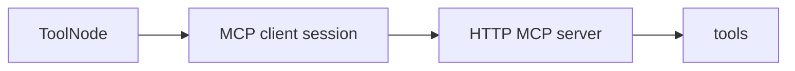

# Milestone 29: MCP HTTP transport & sticky session

## Status

Planned

## Goal

Add an in-repo **HTTP** (Streamable HTTP or SSE) MCP server; connect via adapter with a **sticky** `client.session(...)` (or equivalent) so tool calls reuse one session — contrast stdio spawn + cold `get_tools` at graph build.

## Why this milestone

M14 taught protocol merge via stdio. Production MCP often speaks HTTP and keeps session state (auth, cursors). Without this, “MCP” stays a subprocess demo.

## Concepts introduced

- Transport: stdio vs HTTP
- Sticky session vs per-build discovery
- Stale tool list / reconnect

## Design decisions & alternatives considered

| Decision | Tentative choice | Alternatives |
|---|---|---|
| Transport | Streamable HTTP if adapter supports; else SSE | stdio-only forever |
| Session | Long-lived during CLI process | New session per tool call (anti-pattern to show) |

## Architecture graph (planned)

## Testing (planned)

### Unit

- [ ] Connection config parse for HTTP entry
- [ ] Session lifecycle mock (open/use/close)

### Integration

- [ ] Live HTTP demo tool round-trip (skip if port/bind unavailable)

## Tasks

- [ ] Plan detail + approve
- [ ] Demo server + client wiring
- [ ] Tests; Results + LEARNING_LOG; commit + push

## Demo / acceptance criteria

1. Agent calls HTTP MCP tool without stdio child for that server.
2. Docs contrast sticky session vs M14 cold load.

## Results

_(fill after implementation)_
