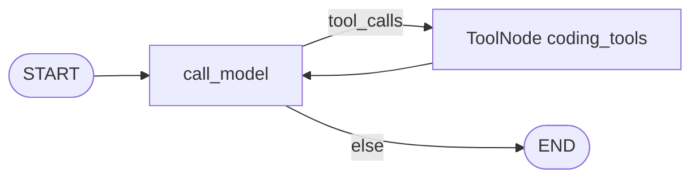
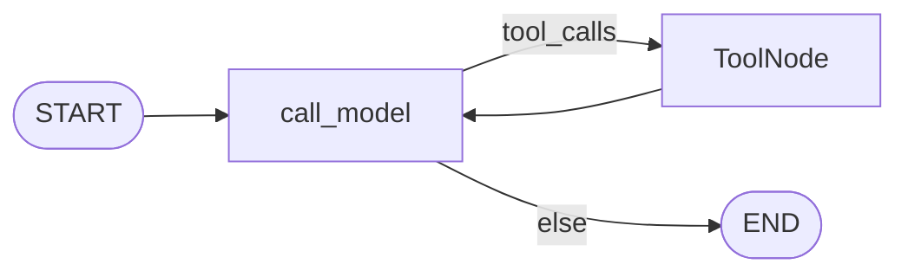
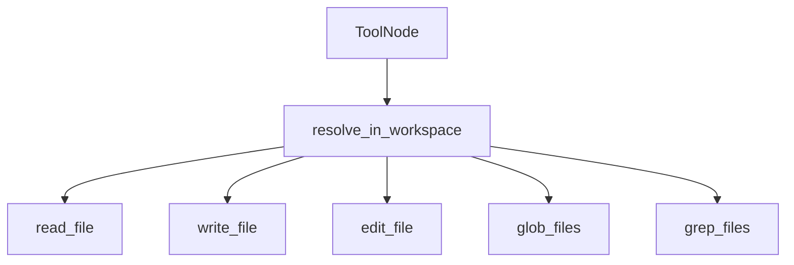

# Milestone 3: Filesystem tools

## Status

Done

## Goal

Give the ReAct agent **workspace-scoped** filesystem tools — `read_file`, `write_file`, diff-based `edit_file`, `glob_files`, `grep_files` — so it can inspect and change code under a configured root, still on the same `call_model` ↔ `tools` graph (no shell yet).

## Why this milestone (learning objectives)

- M2 proved the thin ReAct loop with toy tools. A coding agent’s first real capability is **grounded file I/O**, not more graph topology.
- Without a **path jail** (workspace root), “helpful” models can read/write arbitrary paths — the classic coding-agent footgun before sandboxing (M11).
- Diff-based edit teaches why agents prefer **search/replace patches** over rewriting whole files (token cost + reviewability).

## Concepts introduced

- **Workspace root / path jail:** resolve all tool paths under `WORKSPACE_ROOT`; reject `..` escape.
- **Tool surface for coding:** list/search/read before write; edit as targeted replace.
- **Same graph, richer ToolNode:** topology unchanged; capability grows via tool registration.
- **Simplification vs production:** process-local FS (host permissions), not container FS — until M11.

## Design decisions & alternatives considered

| Decision | Choice | Alternatives rejected |
|---|---|---|
| Graph | Keep M2 StateGraph; default tools = coding FS tools | New nodes per file op |
| Edit style | `edit_file(path, old_str, new_str)` requiring unique `old_str` | Whole-file rewrite only |
| Search | `grep_files` via Python regex + glob | Embeddings now |
| Workspace | `WORKSPACE_ROOT` or default `<repo>/workspace` | Free cwd |
| Demo tools | Still available via `tools=demo_tools()` for M1/M2 tests | Delete add tool |

**Simplification:** no `.gitignore`-aware grep; soft read size cap; errors returned as tool strings so the loop can recover.

## Architecture graph (planned)



## Testing (planned)

### Unit

- [x] Path jail join + escape
- [x] read/write round-trip
- [x] edit unique / ambiguous / missing
- [x] glob + grep
- [x] write escape returns ERROR (no file outside)

### Integration

- [x] Live agent write+read under temp WORKSPACE_ROOT (skip if no LLM / flake)

## Tasks

- [x] `WORKSPACE_ROOT` + default `workspace/`
- [x] `path_jail.py` + `fs.py` (`build_coding_tools`)
- [x] Agent defaults to coding tools; injectable `tools=`
- [x] Unit + integration tests
- [x] Results + LEARNING_LOG; commit + push

## Demo / acceptance criteria

1. Agent can write/read under workspace — **met** (integration + manual)
2. Path escape fails — **met** (unit)
3. Graph still two nodes — **met**
4. No shell yet — **met**

## Results

### What we did

- Added path jail + five FS tools closed over workspace root.
- Agent default toolset switched to coding tools; `demo_tools()` kept for parity/M2 tests via `tools=`.
- Default workspace: `<repo>/workspace` (override with `WORKSPACE_ROOT`).

### Commands & how to reproduce

```bash
# Unit
cd backend && uv run pytest -m unit

# Integration (needs Ollama)
cd backend && uv run pytest -m integration -k m3

# Manual demo (writes under ./workspace by default)
./scripts/agent.sh "Use write_file to create demo.txt with contents hello-m3, then read_file demo.txt."
```

### As-built graph





- Delta vs planned: unchanged topology; tools built via `build_coding_tools(root)`.

### Why this approach

- Coding ability is tool registration, not more graph nodes (Option B).
- Path jail is the minimum safety before Docker sandbox.
- Unique `old_str` edits keep changes reviewable.

### Deviations from plan

- Integration may skip if the model fails to call `write_file` (flake) — assertion only when file appears.

### Pitfalls & aha moments

- Closing tools over `workspace_root` at graph-build time keeps jail explicit and testable with `tmp_path`.
- Absolute glob patterns rejected so models cannot bypass the jail via `/etc/...`.

### Testing results

- Unit: `tests/unit/test_m3_fs_tools.py` (+ full unit suite green).
- Integration: `tests/integration/test_m3_fs_live.py`.

### Open questions / next dig

- M4: shell + git (still host subprocess until M11).
- Optional: honor `.gitignore` in glob/grep.
