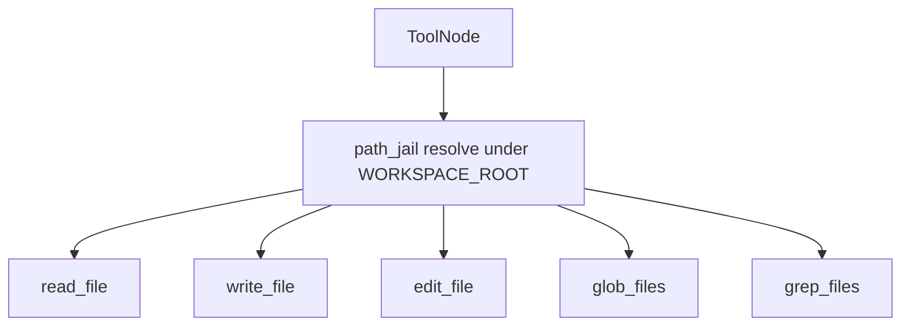

# Milestone 3: Filesystem tools

## Status

Planned

## Goal

Give the ReAct agent **workspace-scoped** filesystem tools — `read_file`, `write_file`, diff-based `edit_file`, `glob_files`, `grep_files` — so it can inspect and change code under a configured root, still on the same `call_model` ↔ `tools` graph (no shell yet).

## Why this milestone (learning objectives)

- M2 proved the thin ReAct loop with toy tools. A coding agent’s first real capability is **grounded file I/O**, not more graph topology.
- Without a **path jail** (workspace root), “helpful” models can read/write arbitrary paths — the classic coding-agent footgun before sandboxing (M11).
- Diff-based edit teaches why agents prefer **search/replace patches** over rewriting whole files (token cost + reviewability), matching how Claude Code / Cursor-style edits work in spirit.

## Concepts introduced

- **Workspace root / path jail:** resolve all tool paths under `WORKSPACE_ROOT`; reject `..` escape.
- **Tool surface for coding:** list/search/read before write; edit as targeted replace.
- **Same graph, richer ToolNode:** topology unchanged; capability grows via `demo_tools` → `coding_tools` registration.
- **Simplification vs production:** process-local FS (host permissions), not container FS — labeled until M11.

## Design decisions & alternatives considered

| Decision | Choice | Alternatives rejected |
|---|---|---|
| Graph | Keep M2 StateGraph; swap/extend tool list | New nodes per file op (needless topology churn) |
| Edit style | `edit_file(path, old_str, new_str)` requiring unique `old_str` | Whole-file rewrite only; full unified-diff parser (heavier) |
| Search | `grep_files` via Python or `rg` if present | Embeddings now (later / pgvector) |
| Workspace | `WORKSPACE_ROOT` env (default: repo root or `./workspace`) | Agent can set cwd freely (unsafe) |
| Write policy | Allow write/edit under jail | Ask-mode HITL (M9/M10) |

**Simplification:** no file-lock, no binary safety beyond skip/large-file cap, no `.gitignore`-aware grep by default (optional nicety). Production adds ignore rules, size limits, and approval for writes.

## Architecture graph (planned)


Delta vs M2: **same edges**; `ToolNode` now binds filesystem tools (+ keep `add` optional for regression or drop from default agent toolset).



## Testing (planned)

### Unit

- [ ] Path jail: relative path joins root; `../` escape raises/returns error
- [ ] `read_file` / `write_file` round-trip under temp workspace
- [ ] `edit_file`: unique `old_str` replaces; missing/ambiguous `old_str` fails clearly
- [ ] `glob_files` / `grep_files` return expected hits on a fixture tree
- [ ] Agent graph still compiles with coding tools; fake-LLM can call `read_file` once (optional)

### Integration

- [ ] Live agent: “create hello.txt with contents X under workspace, then read it back” (skip if no LLM)
- [ ] Live agent: edit a fixture file via `edit_file` and verify disk (skip if no LLM)

## Tasks

- [ ] Add `WORKSPACE_ROOT` to settings / `.env.example`
- [ ] Implement `mini_claude_code/tools/fs.py` (+ path helpers)
- [ ] Register coding tools in agent `build_agent_graph` (replace or extend `demo_tools`)
- [ ] Fixture workspace for tests; document demo prompts
- [ ] Unit + integration tests
- [ ] Results + LEARNING_LOG + architecture note; commit + push

## Demo / acceptance criteria

1. With Ollama up: agent can create/read/edit a file **only** under `WORKSPACE_ROOT`.
2. Attempting path escape fails without writing outside the jail.
3. Graph mermaid still shows two nodes (`call_model`, `tools`).
4. No shell/git tools yet (M4).

## Results

*(Fill after implementation.)*

### What we did

### Commands & how to reproduce

### As-built graph

```mermaid
%% fill after implementation
```

- Delta vs planned graph:

### Why this approach

### Deviations from plan

### Pitfalls & aha moments

### Testing results

### Open questions / next dig
