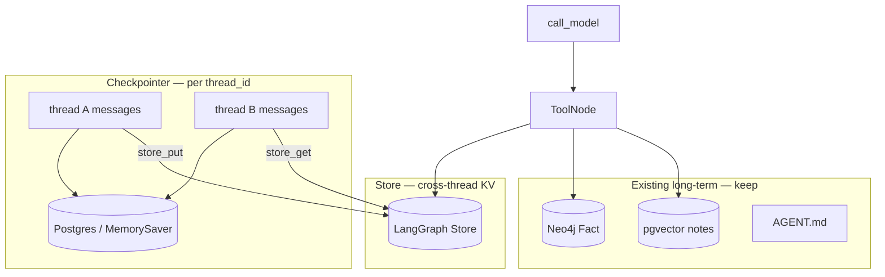

# Milestone 30: LangGraph Store (cross-thread memory)

## Status

Done

## Goal

Introduce LangGraph **Store** as the framework-native **cross-thread key-value** memory: wire `compile(..., store=…)`, add thin tools **`store_put` / `store_get`**, and prove **thread A writes → thread B reads** under the same Store namespace. Teach the three-way split:

| Primitive | Scope | Role |
|---|---|---|
| **Checkpointer** (M5) | one `thread_id` | Durable *transcript* / graph state |
| **Store** (M30) | namespace across threads | Durable *KV map* (user/project prefs, small blobs) |
| **Neo4j Fact** / pgvector / `AGENT.md` (M8+) | project corpus | *Semantic* / fuzzy / always-on norms — keep as-is |

Do **not** replace Neo4j facts with Store; do **not** treat Store as a second chat log.

## Why this milestone

Learners routinely say “we have Postgres memory” and mean the **checkpointer**. That only resumes **one thread’s messages**. Cross-thread recall today already works via Neo4j/pgvector/`AGENT.md`, but those are **our** stores — not the LangGraph **Store API**. M30 makes the framework primitive visible beside the semantic ones.

## Concepts introduced

- Thread state vs Store namespaces
- When Store vs Neo4j `Fact` vs pgvector notes vs `AGENT.md`
- Namespace design: `("mcc", "project", <id>)` — never `thread_id`
- Sync / async Store factories beside checkpointer
- Agent-visible tools vs silent prompt injection

## Design decisions & alternatives considered

| Decision | Choice | Alternatives |
|---|---|---|
| Backend | Default **`InMemoryStore`**; **`PostgresStore` / `AsyncPostgresStore`** via `STORE_BACKEND=postgres` | Always postgres (harder offline) |
| Wire | `compile(checkpointer=…, store=…)` + tools closed over Store | Auto-inject Store into every prompt |
| CLI | Open Store beside checkpointer (and when session off) | Store only when checkpointing |
| Tools | `store_put` / `store_get` | Replace `remember_fact` |
| Namespace | `("mcc", "project", STORE_PROJECT_ID)` | Per-`thread_id` (**wrong**) |
| Permissions | `store_get` auto; `store_put` ask (Plan Mode deny) | Always auto writes |

**Simplification:** no Store TTL / vector index on Store items; value shape `{"text": ...}`.

## Architecture graph (planned / as-built)



ReAct topology **unchanged**.

## Testing (planned)

### Unit

- [x] Namespace helper (not `thread_id`)
- [x] InMemoryStore put/get; tools + permissions
- [x] Graph accepts `store=` with/without checkpointer

### Integration

- [x] PostgresStore put → new client get (skip if Postgres down)

## Tasks

- [x] `agent/store.py` + settings
- [x] Wire graph + CLI + tools
- [x] Unit + integration + `./scripts/m30-demo.sh`
- [x] Results + LEARNING_LOG + architecture; commit + push

## Demo / acceptance criteria

1. Put under one logical thread context; get under another — **met** (same Store, different thread_ids irrelevant).
2. Docs/tools state Store ≠ checkpointer ≠ Neo4j — **met**.
3. Unit green; integration present — **met**.

## Results

### What we did

- **`agent/store.py`:** `store_namespace`, `open_store` / `open_async_store`, put/get helpers.
- **`store_put` / `store_get` tools** when Store is passed into `build_memory_tools`.
- **`build_agent_graph(..., store=)`** → `compile(checkpointer=…, store=…)`.
- **CLI** always opens Store for the run; banner prints backend + namespace.
- Settings: `STORE_BACKEND`, `STORE_PROJECT_ID`.

### Commands & how to reproduce

```bash
./scripts/test.sh tests/unit/test_m30_store.py -v
./scripts/test.sh tests/integration/test_m30_store_live.py -v
./scripts/m30-demo.sh
```

### As-built graph + delta

Topology **unchanged**. Delta = `compile(store=…)` + Store tools.

### Why this approach

Makes LangGraph’s cross-thread KV explicit and agent-visible without collapsing Neo4j/pgvector lessons into one “memory” blob.

### Deviations

Default `STORE_BACKEND=memory` (safer offline) rather than always mirroring checkpoint postgres — set `STORE_BACKEND=postgres` for durable KV across processes.

### Pitfalls

- Putting `thread_id` into the Store namespace defeats the lesson.
- Chat-only “remember” without `store_put` / `remember_fact` stays in checkpointer only.
- InMemoryStore dies with the process — use postgres backend for multi-process durability.

### Testing results

```
6 passed (unit test_m30_store)
1 passed (integration test_m30_store_live) — 2026-09-09
```

### Open questions / next dig

- M31 time-travel / branch sessions; optional Store search / TTL dig later.
