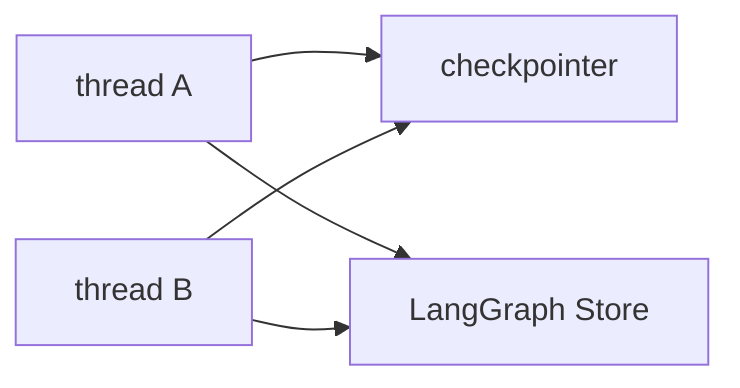

# Milestone 30: LangGraph Store (cross-thread memory)

## Status

Planned

## Goal

Introduce LangGraph **Store** for cross-thread key-value memory; small remember/recall path beside Neo4j facts. Teach: checkpointer = thread durability; Store = user/project map across threads.

## Why this milestone

Learners conflate “Postgres checkpointer” with “long-term memory.” Store is the framework-native cross-thread primitive; Neo4j remains semantic facts.

## Concepts introduced

- Thread state vs Store namespaces
- When Store vs Neo4j `Fact` vs pgvector notes
- Isolation by `user_id` / `assistant_id` (simplification OK)

## Design decisions & alternatives considered

| Decision | Tentative choice | Alternatives |
|---|---|---|
| Backend | Postgres-backed Store if available; else in-memory for tests | Neo4j-only (misses Store API lesson) |
| API | Thin tools `store_put` / `store_get` | Auto-inject Store into every prompt (too magic) |

## Architecture graph (planned)

## Testing (planned)

### Unit

- [ ] Namespace keying helper
- [ ] Memory Store put/get across two thread configs

### Integration

- [ ] Postgres Store resume across process if backend supports (skip if unavailable)

## Tasks

- [ ] Plan detail + approve
- [ ] Wire Store into graph/tools
- [ ] Tests; Results + LEARNING_LOG; commit + push

## Demo / acceptance criteria

1. Remember in thread A; recall in thread B with same Store namespace.
2. Learning Log Q&A: Store ≠ checkpointer ≠ Neo4j facts.

## Results

_(fill after implementation)_
