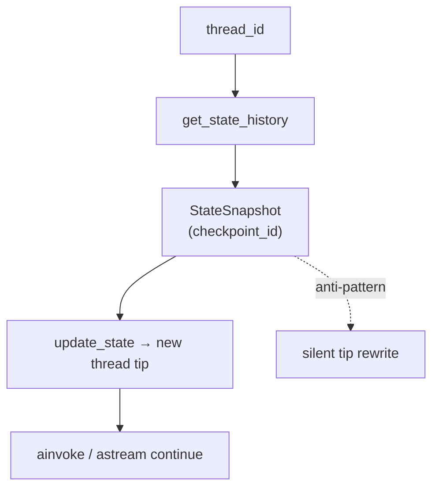

# Milestone 31: Time-travel & branch sessions

## Status

Done

## Goal

Expose LangGraph **checkpoint identity** for a `thread_id`: **list** history (`get_state_history` / `aget_state_history`), **fork** a new tip from a past `checkpoint_id` via `update_state` (immutable lineage — no silent rewrite), and wire CLI **`--list-checkpoints`**, **`--fork-from`**, plus REPL **`/rewind`**. Teach: resume today = latest tip only (M5); time-travel = pick a past snapshot and grow a **new** future.

## Why this milestone

M5 taught “same `thread_id` → continue chat.” That always resumes the **tip**. Production debugging and “try again from before the bad tool call” need **`checkpoint_id`**. LangGraph already stores a linked history; tutorials often skip listing/forking. M31 makes fork-vs-overwrite the design choice you own — *never silent history rewrite*.

## Concepts introduced

- `thread_id` vs `checkpoint_id`
- `StateSnapshot` / history listing
- Fork vs overwrite
- Pinning `checkpoint_id` in config freezes `get_state` on that snapshot (continue from tip after fork)

## Design decisions & alternatives considered

| Decision | Choice | Alternatives |
|---|---|---|
| Mutability | **Fork only** to a **new `thread_id`** (copy `values`) | Same-thread tip rewrite (anti-pattern) |
| List default | Completed/idle snapshots (`next` empty); `--all-checkpoints` for raw | Always show every intermediate |
| CLI | `--list-checkpoints`, `--fork-from`, `--fork-thread-id` | Web timeline (M34) |
| REPL | `/rewind` meta-command | Plugin slash template |
| After fork | Switch `thread_id`; **clear** pinned `checkpoint_id` so later turns use tip | Keep fork id forever (stale reads) |

## Architecture graph (planned / as-built)



ReAct topology **unchanged**.

## Testing (planned)

### Unit

- [x] Format / resolve refs; parse `/rewind`
- [x] MemorySaver: two turns → fork earlier → diverge; source tip unchanged
- [x] Reject same-thread fork target

### Integration

- [x] Postgres fork leaves source tip (skip if down)

## Tasks

- [x] `agent/time_travel.py` + CLI + REPL `/rewind`
- [x] Unit + integration + `./scripts/m31-demo.sh`
- [x] Results + LEARNING_LOG + architecture; commit + push

## Demo / acceptance criteria

1. `--list-checkpoints` shows history — **met**.
2. `--fork-from` / `/rewind` → new thread; source tip unchanged — **met**.
3. Learning Log: fork ≠ overwrite; Store ≠ chat time-travel — **met**.
4. Tests green — **met**.

## Results

### What we did

- **`agent/time_travel.py`:** list/format/resolve; `fork_from_checkpoint` / async twin (new thread only).
- **CLI:** `--list-checkpoints`, `--fork-from`, `--fork-thread-id`, `--all-checkpoints`.
- **REPL:** `/rewind` [index|id].
- After fork, session config keeps new `thread_id` and drops pinned `checkpoint_id`.

### Commands & how to reproduce

```bash
./scripts/test.sh tests/unit/test_m31_time_travel.py -v
./scripts/test.sh tests/integration/test_m31_time_travel_live.py -v
./scripts/m31-demo.sh

# after a real multi-turn session:
# mcc-agent --thread-id SOURCE --list-checkpoints
# mcc-agent --thread-id SOURCE --fork-from 2 --repl
```

### As-built graph + delta

Topology **unchanged**. Delta = checkpointer history API + CLI/REPL.

### Why this approach

Fork-to-new-thread makes two lineages obvious in `db-inspect` and avoids silent tip rewrite.

### Deviations

None material. Default list filters to idle snapshots for readability.

### Pitfalls

- Leaving `checkpoint_id` in config after fork makes `get_state` / mental model stuck on the frozen snapshot.
- Index refs use the **filtered** list; raw ids still work via history scan.
- Store (M30) is cross-thread KV — not chat rewind.

### Testing results

```
5 passed (unit test_m31_time_travel)
1 passed (integration test_m31_time_travel_live) — 2026-09-10
```

### Open questions / next dig

- M32 parallel tools; optional same-thread branch tip dig; M34 trace UI.
