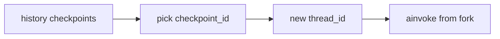

# Milestone 31: Time-travel & branch sessions

## Status

Planned

## Goal

List checkpoints for a `thread_id`; **fork** a new thread (or configurable id) from a past `checkpoint_id`; CLI `/rewind` or `--fork-from`. Teach edit-past → new future without mutating immutable history.

## Why this milestone

Debugging agents and “try again from step 3” need checkpoint identity. This is a LangGraph superpower underused in many tutorials.

## Concepts introduced

- Checkpoint identity vs thread id
- Fork vs overwrite
- UI/CLI affordances for history

## Design decisions & alternatives considered

| Decision | Tentative choice | Alternatives |
|---|---|---|
| Mutability | Fork only (no rewrite) | Update-state in place (show as anti-pattern) |
| CLI | `--fork-from` + optional `/rewind` | Web-only timeline (M34) |

## Architecture graph (planned)

## Testing (planned)

### Unit

- [ ] Fork config builder
- [ ] MemorySaver: two turns then fork → divergent third turn

### Integration

- [ ] Postgres fork across connections (skip if down)

## Tasks

- [ ] Plan detail + approve
- [ ] CLI + helper APIs
- [ ] Tests; Results + LEARNING_LOG; commit + push

## Demo / acceptance criteria

1. After a bad tool call, fork from prior checkpoint and continue cleanly.
2. Docs state history is not silently rewritten.

## Results

_(fill after implementation)_
