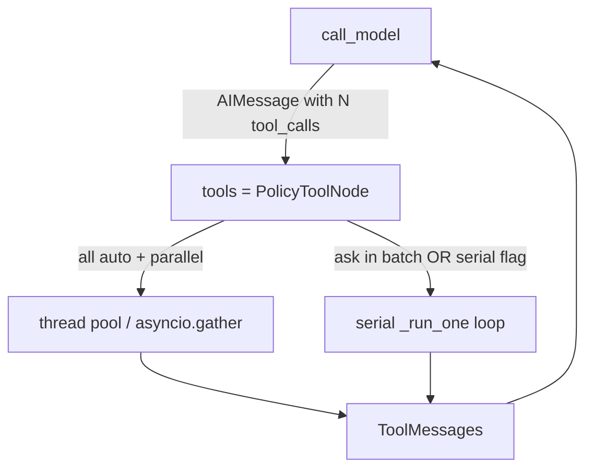

# Milestone 32: Parallel tools & fan-out

## Status

Done

## Goal

Make **multi-`tool_calls` concurrency** an owned runtime concept: prove wall-time win vs a deliberate **serial** baseline, keep the M9/M10/M15/M26 wrap onion intact, add a safe policy when any call in the batch is **`ask`** (HITL must not race), and document **error isolation** (one tool fail ≠ kill the batch).

**Correction:** LangGraph `ToolNode` already fans out. M32 adds **`PolicyToolNode`** — measure, control (`TOOL_PARALLEL` / `--serial-tools`), and policy-gate HITL — not a second executor stack.

## Why this milestone

Models routinely emit several `tool_calls` on one `AIMessage`. Believing the runtime is serial leaves latency on the table and hides HITL races. Fan-out is an **agent-runtime** scheduling concern.

## Concepts introduced

- Parallel `tool_calls` semantics
- Framework default gather vs owned serial A/B
- Error isolation (`handle_tool_errors`)
- HITL: ask in batch → force serial
- `TOOL_MAX_CONCURRENCY` (sync pool / async semaphore)

## Design decisions & alternatives considered

| Decision | Choice | Alternatives |
|---|---|---|
| Executor | Subclass **`ToolNode`** as `PolicyToolNode` | Hand-rolled fan-out |
| Serial | Same wraps, one call at a time | Always parallel |
| HITL | Any `ask` in batch → serial step | Parallel ask (unsafe) |
| Errors | `handle_tool_errors=True` | Fail-fast cancel siblings |
| Topology | Still one `"tools"` node | Map-reduce subgraph |

## Architecture graph (planned / as-built)



ReAct topology **unchanged**.

## Testing (planned)

### Unit

- [x] Parallel faster than serial on two slow auto tools
- [x] Error isolation
- [x] Ask in batch → serial
- [x] Async ainvoke parallel

### Integration

- [x] Fake LLM two tool_calls through `build_agent_graph`
- [x] Live optional (soft assert)

## Tasks

- [x] Settings + `tool_fanout.py` + graph/CLI
- [x] Tests + `./scripts/m32-demo.sh`
- [x] Results + LEARNING_LOG + architecture; commit + push

## Demo / acceptance criteria

1. Measurable latency win — **met** (~1.8× on demo sleeps).
2. Ask batch serial — **met**.
3. Learning Log: ToolNode already parallel + policy — **met**.
4. Tests green — **met**.

## Results

### What we did

- **`agent/tool_fanout.py`:** `PolicyToolNode` + `batch_needs_serial` + `make_tools_node`.
- **Settings:** `TOOL_PARALLEL`, `TOOL_MAX_CONCURRENCY`.
- **CLI:** `--serial-tools`; banner `tool_fanout: parallel|serial`.
- **`graph.py`:** `"tools"` node is `PolicyToolNode` (wrap onion unchanged).

### Commands & how to reproduce

```bash
./scripts/test.sh tests/unit/test_m32_tool_fanout.py -v
./scripts/test.sh tests/integration/test_m32_tool_fanout_live.py -v
./scripts/m32-demo.sh
# mcc-agent --serial-tools "…"   # force serial A/B
```

### As-built graph + delta

Topology unchanged. Delta = policy wrapper around ToolNode scheduling.

### Why this approach

Teach framework reality + own HITL/serial knobs without rewriting ToolNode.

### Deviations

No map-reduce gather subgraph (labeled simplification in Plan).

### Pitfalls

- Unknown tool names resolve to **`ask`** → batch serializes even when `TOOL_PARALLEL=1`.
- Do not keep believing “ToolNode is serial” — measure with `--serial-tools` A/B.
- Parallel `run_shell` = parallel Docker containers (cost).

### Testing results

```
5 passed (unit test_m32_tool_fanout)
2 passed (integration test_m32_tool_fanout_live) — 2026-09-11
m32-demo: parallel ~0.28s vs serial ~0.51s on 2×250ms tools
```

### Open questions / next dig

- M33+ per ROADMAP; optional cancel-siblings-on-first-fail dig.
