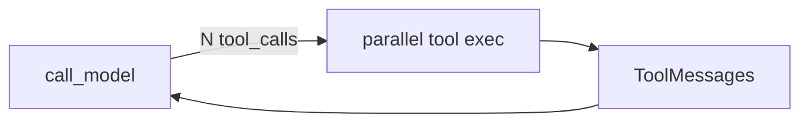

# Milestone 32: Parallel tools & fan-out

## Status

Planned

## Goal

Execute multiple `tool_calls` **concurrently** when safe; preserve permission/hook/content-policy planes; document error isolation and latency win vs serial ToolNode.

## Why this milestone

Models already emit parallel tool calls; serial execution wastes wall time. Fan-out is an agent-runtime concern, not a new product feature.

## Concepts introduced

- Parallel `tool_calls` semantics
- Error isolation / partial failure
- Interaction with HITL ask (may force serial for ask tools)

## Design decisions & alternatives considered

| Decision | Tentative choice | Alternatives |
|---|---|---|
| Default | Parallel for auto tools; serial if any ask | Always serial (status quo) |
| Cap | Max concurrency setting | Unbounded gather |

## Architecture graph (planned)

## Testing (planned)

### Unit

- [ ] Fake slow tools finish faster in parallel than serial
- [ ] One failure still returns others (policy documented)

### Integration

- [ ] Live model emitting two read-only tools (skip without key)

## Tasks

- [ ] Plan detail + approve
- [ ] Runtime change + settings
- [ ] Tests; Results + LEARNING_LOG; commit + push

## Demo / acceptance criteria

1. Measurable latency improvement on two independent read tools.
2. Ask/HITL tools do not race approvals.

## Results

_(fill after implementation)_
