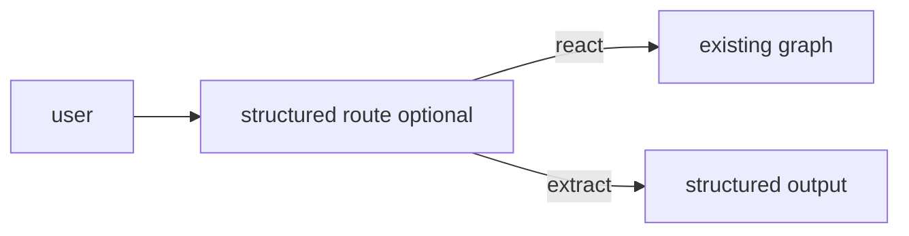

# Milestone 33: Structured outputs & forced tool choice

## Status

Planned

## Goal

Add a path using `with_structured_output` / JSON schema for closed decisions, and `tool_choice` force/forbid for “must call X.” Contrast with free-form ReAct, skills, and subagents.

## Why this milestone

Not every turn should be open-ended chat-with-tools. Routing, grading, and extraction are more reliable with schemas.

## Concepts introduced

- Structured output vs tool calling
- `tool_choice` none / required / named
- When to leave ReAct alone

## Design decisions & alternatives considered

| Decision | Tentative choice | Alternatives |
|---|---|---|
| Scope | Optional router node or tool for one demo flow | Rewrite entire graph to schema-only |
| Provider | Use factory; skip if provider lacks support | Fake-only unit path |

## Architecture graph (planned)

## Testing (planned)

### Unit

- [ ] Schema parse / validation helper
- [ ] tool_choice config plumbing

### Integration

- [ ] Live structured call on one provider (skip if unsupported)

## Tasks

- [ ] Plan detail + approve
- [ ] Demo path + docs contrast
- [ ] Tests; Results + LEARNING_LOG; commit + push

## Demo / acceptance criteria

1. One flow returns validated structured data without tool soup.
2. One flow forces a specific tool call.

## Results

_(fill after implementation)_
