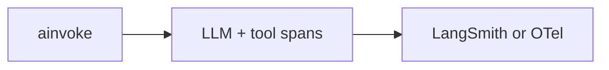

# Milestone 34: Observability traces (LangSmith / OTel)

## Status

Planned

## Goal

Export agent runs as traces (LangSmith and/or OpenTelemetry): LLM spans, tool spans, token usage correlation. Optional minimal timeline UI only if it teaches the trace model.

## Why this milestone

Without traces, failures are folklore. M17 usage footer is local; traces are how teams debug agents in production.

## Concepts introduced

- Trace / span hierarchy for ReAct
- Correlation ids with `thread_id`
- Privacy: what not to export

## Design decisions & alternatives considered

| Decision | Tentative choice | Alternatives |
|---|---|---|
| Backend | LangSmith env opt-in **or** OTLP exporter | Custom JSON logs only |
| UI | stderr link / LangSmith URL first | Build full frontend (only if needed) |

## Architecture graph (planned)

## Testing (planned)

### Unit

- [ ] Span naming helper / redaction helper

### Integration

- [ ] Export smoke when creds present (skip otherwise)

## Tasks

- [ ] Plan detail + approve
- [ ] Wire tracing + docs
- [ ] Tests; Results + LEARNING_LOG; commit + push

## Demo / acceptance criteria

1. One run visible as parent span with tool children.
2. Learning Log: traces vs `--usage` footer.

## Results

_(fill after implementation)_
