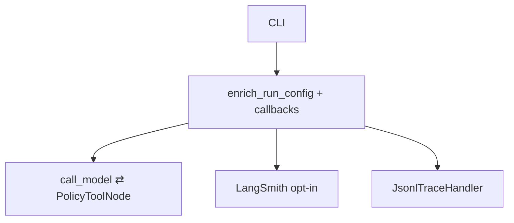

# Milestone 34: Observability traces (LangSmith / OTel)

## Status

Done

## Goal

Export/teach agent **traces**: parent run + LLM/tool spans, correlate `thread_id` + M17 usage, privacy redaction. Primary: **LangSmith env opt-in**. Offline: **JSONL** via `JsonlTraceHandler`. No OTel stack, no web UI. Topology unchanged.

## Why this milestone

Stream ≠ durable debug. Usage footer ≠ span tree. Traces are how teams postmortem agents.

## Concepts introduced

- Trace / span hierarchy
- Stream vs usage vs traces vs checkpoints
- Config metadata/tags/`run_name`
- LangSmith opt-in + local JSONL
- Redaction

## Design decisions & alternatives considered

| Decision | Choice | Alternatives |
|---|---|---|
| Sink | LangSmith env + local JSONL | OTel now |
| Graph | Config + callbacks only | New nodes |
| UI | Banner only | Web timeline |

## Architecture graph (planned / as-built)



## Testing (planned)

### Unit

- [x] Redact / enrich / span tree / JSONL handler

### Integration

- [x] Local JSONL + graph smoke; LangSmith env skip without key

## Tasks

- [x] `tracing.py` + Settings + CLI + demo
- [x] Tests; Results + LEARNING_LOG; commit + push

## Demo / acceptance criteria

1. Local JSONL shows run/llm/tool events — **met**.
2. Contrast vs `--usage` / stream / checkpoints — **met**.
3. Topology unchanged — **met**.

## Results

### What we did

- **`agent/tracing.py`:** status banner helpers, `enrich_run_config`, `redact_*`, `JsonlTraceHandler`, `span_tree_lines`.
- **CLI:** banner; always enrich metadata; `--trace-local` / `MCC_TRACE_JSONL`.
- **`.env.example`:** LangSmith vars documented.

### Commands & how to reproduce

```bash
./scripts/test.sh tests/unit/test_m34_tracing.py -v
./scripts/test.sh tests/integration/test_m34_tracing_live.py -v
./scripts/m34-demo.sh

# offline JSONL:
# mcc-agent --trace-local /tmp/mcc.jsonl --no-stream 'Say hi'

# LangSmith (optional):
# LANGCHAIN_TRACING_V2=true LANGSMITH_API_KEY=... mcc-agent '…'
```

### As-built graph + delta

Topology **unchanged**. Delta = config metadata + optional callbacks.

### Why this approach

Teach span model with one SaaS path + offline dump; avoid APM sprawl.

### Deviations

LangSmith integration test asserts env presence only (no billed remote create in CI).

### Pitfalls

- Flag without API key → banner warns; no remote export.
- JSONL is teaching-grade, not OTel-compatible.
- Prompts/tool I/O truncated + redacted — still review before sharing files.

### Testing results

```
6 passed (unit test_m34_tracing)
1 passed + 1 skipped (integration) — 2026-09-12
```

### Open questions / next dig

- OTel exporter dig; M35 handoff.
