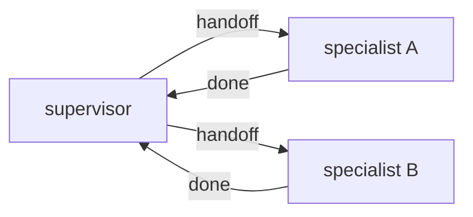

# Milestone 35: Multi-agent handoff (swarm-lite)

## Status

Planned

## Goal

Beyond M12 parent→child `run_subagent`: peer **handoff** / supervisor pattern with an explicit transfer tool, isolated message views, and anti-ping-pong caps.

## Why this milestone

Hierarchical subagents ≠ multi-agent control transfer. Swarm/handoff is how many “teams of agents” products actually route work.

## Concepts introduced

- Handoff as control transfer
- Context isolation vs shared scratchpad
- Termination / bounce limits

## Design decisions & alternatives considered

| Decision | Tentative choice | Alternatives |
|---|---|---|
| Pattern | Supervisor + 2 specialists | Fully connected swarm (harder to teach) |
| State | Separate threads or named graphs | One shared MessagesState (leak risk) |

## Architecture graph (planned)

## Testing (planned)

### Unit

- [ ] Handoff tool updates active agent; bounce cap enforced

### Integration

- [ ] Fake LLMs complete a two-step handoff (no network)

## Tasks

- [ ] Plan detail + approve
- [ ] Implement pattern + demo
- [ ] Tests; Results + LEARNING_LOG; commit + push

## Demo / acceptance criteria

1. Task transfers to specialist and returns without infinite loop.
2. Docs contrast handoff vs `run_subagent`.

## Results

_(fill after implementation)_
