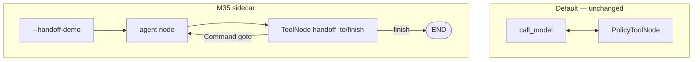

# Milestone 35: Multi-agent handoff (swarm-lite)

## Status

Done

## Goal

Teach **control transfer** beyond M12 `run_subagent`: sidecar supervisor + researcher/writer with explicit `handoff_to` / `finish`, isolated views, bounce cap. Main ReAct unchanged.

## Why this milestone

Hierarchical nested invoke ≠ peer/supervisor handoff. Swarm-lite fails via ping-pong and context leak — caps + filters make that visible.

## Concepts introduced

- Handoff vs nested subagent
- Supervisor-star topology
- Isolated message views + scratchpad
- Bounce cap
- `Command(update=…, goto=…)` from tools

## Design decisions & alternatives considered

| Decision | Choice | Alternatives |
|---|---|---|
| Surface | Sidecar + `--handoff-demo` | Rewrite main ReAct |
| Topology | Supervisor star | Fully connected swarm |
| Primitive | `handoff_to` / `finish` + Command | Prompt-only role switch |

## Architecture graph (planned / as-built)



## Testing (planned)

### Unit

- [x] apply_handoff / cap / filter / fake graph

### Integration

- [x] Fake two-step handoff (no network)

## Tasks

- [x] `handoff.py` + CLI + demo + tests + docs; commit + push

## Demo / acceptance criteria

1. Transfer + return without infinite loop — **met**.
2. Contrast vs `run_subagent` — **met**.
3. Main topology unchanged — **met**.

## Results

### What we did

- **`agent/handoff.py`:** state, `apply_handoff`, `filter_messages_for_agent`, `build_handoff_graph`, `run_handoff_demo`.
- **CLI:** `--handoff-demo`.
- **Demo:** `./scripts/m35-demo.sh`.

### Commands & how to reproduce

```bash
./scripts/test.sh tests/unit/test_m35_handoff.py -v
./scripts/test.sh tests/integration/test_m35_handoff_live.py -v
./scripts/m35-demo.sh
# mcc-agent --handoff-demo 'Research then draft a one-line summary'
# mcc-agent --handoff-demo --handoff-into-react '…'   # bridge into main ReAct
```

### As-built graph + delta

Product ReAct **unchanged**. Delta = sidecar handoff graph only.

### Why this approach

Same sidecar teaching style as M33/M34; control-transfer is the new concept.

### Deviations

Specialists have no FS tools (reason from task/scratchpad) — keeps demo focused on control flow.
Optional **`--handoff-into-react`**: after sidecar finishes, bridge summary into main ReAct as a new prompt (two graphs, not shared state).

### Pitfalls

- `Command` from tools must include matching `ToolMessage` for the `tool_call_id`.
- Star only: researcher cannot hand off directly to writer.
- Plain text without `finish` ends the demo (avoid free-chat loops).
- Bridge is **prompt handoff**, not merging checkpointer threads of the two graphs.

### Testing results

```
7 passed (unit)
1 passed (integration fake) — 2026-09-12
```

### Open questions / next dig

- M36 RAG eval quality; optional fully connected swarm dig.
