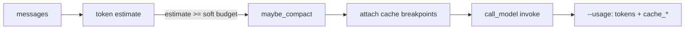

# Milestone 37: Prompt caching & budgeted compaction

## Status

Done

## Goal

Make long sessions cheaper and more predictable by (1) wiring **provider prompt-cache** affordances where they exist, (2) triggering M7 compaction from a **soft token budget** (not only a vague size feel), and (3) surfacing **cache / budget** signals in the existing `--usage` footer. Product ReAct topology stays `call_model` ↔ `tools`.

## Why this milestone

M7 already compact when `estimate_tokens` exceeds `CONTEXT_COMPACT_THRESHOLD` (chars/4). That teaches the *idea* of compaction, but production cost curves are driven by:

- **Budgets**: soft caps (“prefer compact before we burn another 8k input”) vs hard provider windows.
- **Prompt caches**: Anthropic `cache_control` breakpoints (and similar elsewhere) so stable prefixes (system / tools / AGENT.md) are billed at cache rates on later turns.

Without M37, every turn re-pays full input price for a mostly-stable prefix, and compaction remains a single threshold with no “how close to budget?” reporting.

## Concepts introduced

- **Prompt cache breakpoint** — mark a stable content block so the provider can reuse it across calls (Anthropic: `cache_control` on system/tool blocks).
- **Soft token budget** — optional target below which we try to stay via compaction; distinct from hard context-window max.
- **Cache hit reporting** — read provider usage fields (`cache_read` / `cache_creation` when present) into `--usage`.
- **Provider asymmetry** — Anthropic vs OpenAI-compatible vs Ollama; thin helpers, no fake universal cache API (**simplification**).

## Design decisions & alternatives considered

| Decision | Choice | Alternatives |
|---|---|---|
| Topology | Keep compaction + cache prep inside `call_model` policy plane | New `budget` / `cache` graph nodes (extra hops; little teaching value) |
| Cache abstraction | Thin `prompt_cache.py` + provider-specific builders | Pretend one `enable_cache=True` works everywhere |
| What to cache | Last leading SystemMessage (AGENT.md / skills / facts prefix) + Anthropic invoke `cache_control` | Cache entire conversation (volatile; defeats the point) |
| Budget trigger | `effective_compact_threshold` = `min(threshold, budget)` when both > 0 | Only hard max; or compact every N turns |
| Estimator | Keep chars/4 as default | Require tiktoken everywhere |
| Usage footer | Extend `UsageAccumulator` with cache_* + prompt/budget lines | Separate `--cache-stats` flag |
| Live proof | Integration: Anthropic invoke with markers; skip without key | Fail CI without Anthropic |

## Architecture graph (planned)



## Testing (planned)

### Unit

- [x] Soft budget trigger math + compact path
- [x] Cache-header builder per provider
- [x] Usage footer cache + budget lines
- [x] Graph wires Anthropic invoke kwargs + marks leading system

### Integration

- [x] Live Anthropic cache-marked invoke (skip without key)

## Tasks

- [x] `agent/prompt_cache.py` + budget wiring + usage + tests + docs; commit + push

## Demo / acceptance criteria

1. Over-budget thread compacts before next call — **met** (unit + `effective_compact_threshold`).
2. `--usage` shows cache fields when reported; else `cache: n/a` — **met**.
3. Docs note provider differences — **met** (Learning Log + Results).

## Results

### What we did

- **`agent/prompt_cache.py`**: Anthropic `cache_control` on last leading `SystemMessage` + invoke kwarg; other providers no-op.
- **`effective_compact_threshold`** in `compact.py`; settings `CONTEXT_TOKEN_BUDGET`, `PROMPT_CACHE_ENABLED`.
- **`call_model`**: budget → compact → memory inject → cache mark → invoke with kwargs; note prompt stats on usage acc.
- **`usage.py`**: `cache_read` / `cache_creation` + prompt_estimate / soft_budget / effective_compact_at footer lines.
- **`./scripts/m37-demo.sh`**

### Commands & how to reproduce

```bash
./scripts/test.sh tests/unit/test_m37_prompt_cache_budget.py -v
./scripts/test.sh tests/integration/test_m37_prompt_cache_live.py -v
./scripts/m37-demo.sh
# Soft budget demo tip:
# CONTEXT_TOKEN_BUDGET=200 CONTEXT_COMPACT_THRESHOLD=10000 uv run mcc-agent --usage -p 'say hi'
```

### As-built graph + delta

Product topology **unchanged**. Delta = policy-plane budget + Anthropic cache helpers + usage footer fields.


### Why this approach

Teach real cost levers (budget + provider cache) beside M7 without inventing a fake cross-provider cache API.

### Deviations

- Estimator still chars/4 (labeled simplification; Plan allowed).
- Soft judge / tiktoken not added.
- Live test does not assert a guaranteed `cache_read` hit (short prompts / first call).

### Pitfalls

- Fake `invoke(**kwargs)` must accept kwargs when testing Anthropic path.
- Ambient Neo4j facts can prepend a SystemMessage — mark the **last** leading system, not the first.
- Ollama/OpenAI: cache helpers are intentional no-ops.

### Testing results

```
6 passed (unit)
1 skipped (integration — no ANTHROPIC_API_KEY in CI env)
M7 + M17 usage regression: green
```

### Open questions / next dig

- M38 remote CI gate per ROADMAP; optional tool-definition cache breakpoints; tiktoken estimator dig.
