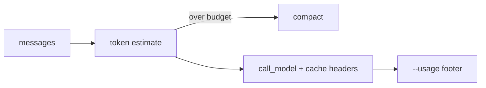

# Milestone 37: Prompt caching & budgeted compaction

## Status

Planned

## Goal

Use provider **prompt-cache** affordances where available; trigger compaction from better token estimates + a soft budget; show cost/cache impact via `--usage`.

## Why this milestone

M7 compaction is size-heuristic. Real agents manage **budgets** and provider cache breakpoints — major cost levers.

## Concepts introduced

- Prompt cache breakpoints (provider-specific)
- Token budget vs character heuristic
- Cache hit reporting in usage footer

## Design decisions & alternatives considered

| Decision | Tentative choice | Alternatives |
|---|---|---|
| Abstraction | Thin per-provider cache hints | Fake universal cache API |
| Compaction | Budget-triggered + keep tail | Always summarize |

## Architecture graph (planned)

## Testing (planned)

### Unit

- [ ] Budget trigger math
- [ ] Cache-header builder per provider mock

### Integration

- [ ] Live cache headers on one supporting provider (skip otherwise)

## Tasks

- [ ] Plan detail + approve
- [ ] Budget + cache wiring
- [ ] Tests; Results + LEARNING_LOG; commit + push

## Demo / acceptance criteria

1. Over-budget thread compacts before next call.
2. Docs note provider differences as simplifications.

## Results

_(fill after implementation)_
