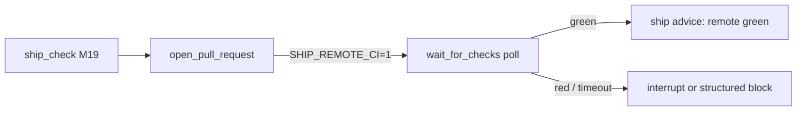

# Milestone 38: Remote CI gate (GitHub Checks)

## Status

Done

## Goal

Extend M19’s **local** `ship_check` gate with an **opt-in remote CI wait**: after `open_pull_request` (or against an existing PR), poll GitHub Checks / Actions until green, red, or timeout; on red/timeout use **HITL** (`interrupt`) instead of silently claiming the ship is done. ReAct topology stays `call_model` ↔ `tools`.

## Why this milestone

M19 proved “local green before PR.” Production bots still fail when Actions is red while the laptop was green. Teaching target: local ≠ remote, bounded poll/timeout, HITL on red — without becoming full CD.

## Concepts introduced

- Checks API / combined status polling
- Poll state machine: pending → green | red | timed_out
- HITL on remote red
- Contrast M17 / M19 / M38

## Design decisions & alternatives considered

| Decision | Choice | Alternatives |
|---|---|---|
| Default | Opt-in `SHIP_REMOTE_CI=1` | Always wait |
| When | After live `open_pull_request` + standalone `wait_for_checks` | Block before opening PR |
| On red | Structured fail + optional HITL | Auto-fix CI |
| Scope | Thin REST poll | Merge queue / CD |

## Architecture graph (planned / as-built)



## Testing (planned)

### Unit

- [x] Poll state machine + timeout
- [x] Dry-run / disabled skip
- [x] Fake HTTP green path
- [x] HITL reject path
- [x] Wrap after open_pull_request

### Integration

- [x] Live poll opt-in (`M38_LIVE_PR=1` + `GH_TOKEN` + `M38_PR_NUMBER`); skip otherwise

## Tasks

- [x] Settings + `remote_ci.py` + wiring + tests + docs; commit + push

## Demo / acceptance criteria

1. Opt-in wait reports green/red/timeout — **met** (unit + live skip path).
2. Red/timeout not silent success — **met** (HITL + JSON state).
3. Learning Log contrast — **met**.

## Results

### What we did

- **`tools/remote_ci.py`**: classify / poll / HITL; `wait_for_checks` tool; wrap `open_pull_request`
- Settings: `SHIP_REMOTE_CI`, timeout, poll interval, `SHIP_REMOTE_CI_HITL`
- Permissions: `wait_for_checks` = auto (HITL inside on red/timeout)
- **`./scripts/m38-demo.sh`**

### Commands & how to reproduce

```bash
./scripts/test.sh tests/unit/test_m38_remote_ci.py -v
./scripts/test.sh tests/integration/test_m38_remote_ci_live.py -v
./scripts/m38-demo.sh
# Live (optional):
# M38_LIVE_PR=1 M38_PR_NUMBER=<n> GH_TOKEN=... ./scripts/test.sh \
#   tests/integration/test_m38_remote_ci_live.py -v
```

### As-built graph + delta

Topology **unchanged**. Delta = ship/PR policy plane only.

### Why this approach

Teach remote gate beside M19 without merge-queue sprawl; HITL blocks silent ship claims.

### Deviations

- Combined status + check-runs (no GraphQL rollup).
- Live test is opt-in env flags (not always-on CI).

### Pitfalls

- Dry-run / disabled → `skipped` (not green).
- Empty checks stay pending until timeout.
- PR URL must include owner/repo when workspace origin is missing (tmp_path tests).

### Testing results

```
12 passed (unit)
1 skipped (integration without M38_LIVE_PR)
M19 ship unit regression: green
```

### Open questions / next dig

- ROADMAP after M38; optional required-check allowlist; merge-when-green dig.
