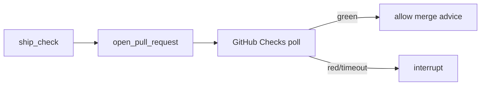

# Milestone 38: Remote CI gate (GitHub Checks)

## Status

Planned

## Goal

After M19 local `ship_check`, optionally **poll GitHub Actions / Checks** before advising merge / completing a ship flow; timeout + HITL on red or stuck runs.

## Why this milestone

Local green ≠ CI green. Channel/CLI agents that open PRs should learn the wait/poll/timeout loop without becoming full CD.

## Concepts introduced

- Checks API / workflow run polling
- Timeout and partial failure
- HITL on remote red

## Design decisions & alternatives considered

| Decision | Tentative choice | Alternatives |
|---|---|---|
| Default | Opt-in `SHIP_REMOTE_CI=1` | Always wait (slow demos) |
| Action on red | Block + HITL | Auto-fix (dangerous) |

## Architecture graph (planned)

## Testing (planned)

### Unit

- [ ] Poll state machine with fake statuses
- [ ] Timeout path

### Integration

- [ ] Live poll against a known workflow (skip without `GH_TOKEN`)

## Tasks

- [ ] Plan detail + approve
- [ ] Tool/gate wiring
- [ ] Tests; Results + LEARNING_LOG; commit + push

## Demo / acceptance criteria

1. Opt-in wait sees green check on a demo PR (or skip path documented).
2. Red remote check triggers HITL, not silent ship.

## Results

_(fill after implementation)_
