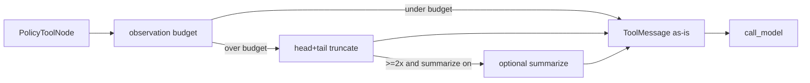

# Milestone 39: Tool observation budgets

## Status

Done

## Goal

Add a **policy-plane observation budget**: after each tool runs, enforce a unified max size on `ToolMessage` content (head+tail keep, clear truncation marker), optional **summarize-when-huge** for oversized dumps, and a stderr `[obs-budget]` signal when truncation fires. Topology unchanged. Complements M7/M37.

## Why this milestone

Scattered per-tool `MAX_*` constants do not teach the runtime concern: **observations are the #1 context bomber**. A central ceiling protects the next `call_model` after compaction/prompt-cache work.

## Concepts introduced

- Observation vs transcript
- Unified budget vs per-tool MAX_*
- Head+tail truncation
- Optional summarize-when-huge (≥ 2× budget)
- Contrast M7 compact vs M39 observation shrink

## Design decisions & alternatives considered

| Decision | Choice | Alternatives |
|---|---|---|
| Where | `PolicyToolNode._combine_tool_outputs` post-process | New graph node; tool-only constants |
| Default | `TOOL_OBSERVATION_MAX_CHARS=32000` | Disable by default |
| Summarize | Opt-in `TOOL_OBSERVATION_SUMMARIZE` when ≥ 2× | Always summarize |
| Scope | All tools after combine (incl. MCP) | Shell-only |

## Architecture graph (planned / as-built)



## Testing (planned)

### Unit

- [x] Under/over budget; summarize 2× gate; PolicyToolNode apply; settings defaults

### Integration

- [x] Fake-LLM graph: huge tool → truncated ToolMessage in state

## Tasks

- [x] Helpers + PolicyToolNode wire + tests + docs; commit + push

## Demo / acceptance criteria

1. Tiny budget truncates huge dump before next model call — **met**.
2. M7/M37 vs M39 contrast documented — **met**.
3. Per-tool MAX_* remain inner defense — **met**.

## Results

### What we did

- **`agent/observation_budget.py`**: head+tail, summarize-when-huge, ToolMessage/output helpers
- **`PolicyToolNode`**: apply budget after `_combine_tool_outputs`
- Settings: `TOOL_OBSERVATION_MAX_CHARS`, `TOOL_OBSERVATION_SUMMARIZE`, `TOOL_OBSERVATION_HEAD_RATIO`
- **`./scripts/m39-demo.sh`**

### Commands & how to reproduce

```bash
./scripts/test.sh tests/unit/test_m39_observation_budget.py -v
./scripts/test.sh tests/integration/test_m39_observation_budget_live.py -v
./scripts/m39-demo.sh
```

### As-built graph + delta

Topology **unchanged**. Delta = policy plane on tool outputs only.

### Why this approach

Teach a single observation ceiling beside history compact / token budget without a new node.

### Deviations

- Summarize uses same chat model when enabled (labeled simplification).
- Marker may slightly exceed `max_chars` by a few dozen characters (documented bound in tests).

### Pitfalls

- `TOOL_OBSERVATION_MAX_CHARS<=0` disables the gate (inner tool MAX_* still apply).
- Summarize only fires at ≥ 2× budget to avoid paying an LLM call for mild overruns.

### Testing results

```
9 passed (unit)
1 passed (integration)
M32 fan-out regression: green
```

### Open questions / next dig

- GitHub Actions for this repo (so M38 has real Checks); worktree isolation; provider failover.
