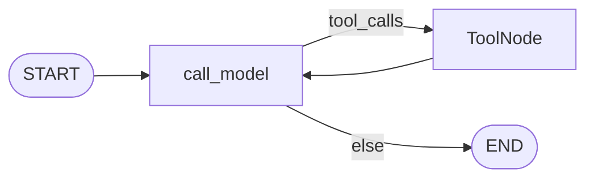

# Milestone 4: Shell & git tools

## Status

Done

## Goal

Add **workspace-scoped** `run_shell` and focused **git** tools (`git_status`, `git_diff`, `git_log`, `git_commit`) so the ReAct agent can inspect VCS state and run commands — still on the same `call_model` ↔ `tools` graph, still **host subprocess** (explicit temporary insecurity until M11 sandbox).

## Why this milestone (learning objectives)

- Coding agents need shell (tests/formatters) and git (status/diff/commit).
- Shell is high-risk: cwd ≠ sandbox; denylist is teaching-only.
- Dedicated git tools + `run_shell` together: clear schemas vs general commands.

## Concepts introduced

- **VCS:** Version Control System (here: git).
- **Host subprocess tools** with cwd fixed to workspace.
- **Thin denylist** (not a security boundary).
- **Git via `subprocess` + `git` binary** (vs GitPython/pygit2).

## Design decisions & alternatives considered

| Decision | Choice | Alternatives rejected |
|---|---|---|
| Shell + git | Both: `run_shell` and structured `git_*` | Shell-only or git-only |
| Git implementation | `subprocess` → `git` CLI | GitPython / pygit2 (later optional) |
| Commit | `git add -A` then commit (simplification) | Selective staging + HITL |
| Policy | Regex denylist + timeout + output cap | Real sandbox (M11) |

## Architecture graph (planned)


## Testing (planned)

### Unit

- [x] denylist / echo+cwd / timeout
- [x] git status/diff/log/commit on temp repo
- [x] default toolset includes FS+shell+git

### Integration

- [x] live `run_shell` echo (skip if no LLM / flake)

## Tasks

- [x] `shell.py`, `git_tools.py`, `default.py` (`build_default_tools`)
- [x] Agent defaults to full toolset
- [x] `SHELL_TIMEOUT_SEC` setting
- [x] Tests + docs + push

## Demo / acceptance criteria

1. Agent can `run_shell` echo — **met** (integration)
2. Unit git fixture green — **met**
3. Docs state host subprocess until M11 — **met**

## Results

### What we did

- Added `run_shell` (cwd=workspace, denylist, timeout) and `git_status` / `git_diff` / `git_log` / `git_commit`.
- Default agent tools = FS + shell + git via `build_default_tools`.
- Explicit comments: cwd is not a sandbox.

### Commands & how to reproduce

```bash
./scripts/test.sh tests/unit/test_m4_shell_git.py -v
./scripts/test.sh -m integration -k m4
./scripts/agent.sh "Use run_shell to run: echo hello-m4"
# Optional git demo (init git inside workspace first):
# cd workspace && git init && git config user.email a@b.c && git config user.name t
```

### As-built graph



- Delta: topology unchanged; ToolNode now includes shell/git.

### Why this approach

- Structured git tools teach better tool design; shell covers the long tail of commands.
- Both still subprocess — honesty about security before M11.

### Deviations from plan

- None material.

### Pitfalls & aha moments

- **cwd ≠ jail:** `run_shell("cat /etc/passwd")` can still work; denylist does not fix that.
- Temp git tests need `user.email` / `user.name` or commit fails.

### Testing results

- Unit: `tests/unit/test_m4_shell_git.py`
- Integration: `tests/integration/test_m4_shell_live.py`

### Open questions / next dig

- M5: Postgres checkpointer + real multi-turn sessions
- M11: replace host shell with Docker sandbox
