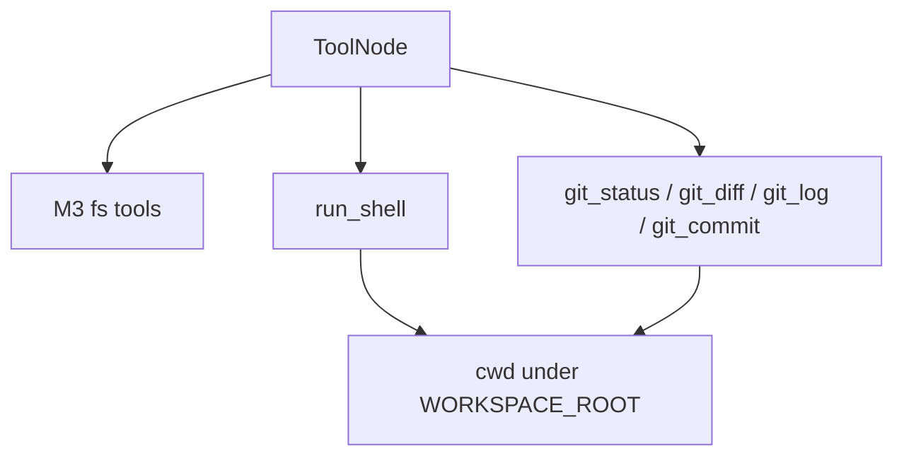

# Milestone 4: Shell & git tools

## Status

Planned

## Goal

Add **workspace-scoped** `run_shell` and focused **git** tools (`git_status`, `git_diff`, `git_log`, optional `git_commit`) so the ReAct agent can inspect VCS state and run commands — still on the same `call_model` ↔ `tools` graph, still **host subprocess** (explicit temporary insecurity until M11 sandbox).

## Why this milestone (learning objectives)

- A coding agent without shell/git cannot run tests, formatters, or reason about diffs the way Claude Code does.
- Shell is the highest-risk tool class: path jail on FS tools is not enough if `run_shell` can `cd / && rm -rf`. M4 must teach **cwd jail + basic denylist**, and label what production still needs (container, seccomp, allowlists).
- Keep topology unchanged (Option B): new capability = more tools in `ToolNode`, not new graph nodes.

## Concepts introduced

- **Host subprocess tools:** `subprocess` with cwd fixed to `WORKSPACE_ROOT` (or a subdir under it).
- **Command policy (thin):** block obvious footguns (`rm -rf /`, `sudo`, etc.) — **simplification**, not a security boundary.
- **Git as structured tools** vs raw `run_shell("git ...")`: clearer schemas for the model; still can shell out to `git` binary.
- **Temporary insecurity:** document that M11 Docker sandbox replaces host execution.

## Design decisions & alternatives considered

| Decision | Choice | Alternatives rejected |
|---|---|---|
| Graph | Same M2/M3 StateGraph; extend tool list | Separate “shell agent” graph |
| Shell API | `run_shell(command: str, timeout_sec: int = 30)` | Full PTY / interactive shell (too heavy) |
| CWD | Always under workspace root | Inherit process cwd (escape risk) |
| Git | Dedicated tools wrapping `git` with cwd=workspace | Only raw shell (worse schema / harder to test) |
| Commit | `git_commit(message)` optional; no push | Auto-push (dangerous for learning demos) |
| Policy | Small denylist + timeout + capture stdout/stderr caps | Full seccomp (M11 territory) |

**Simplification:** denylist is best-effort string matching; determined attackers bypass it. Production: sandbox + allowlist + human approval (M9–M11).

## Architecture graph (planned)




## Testing (planned)

### Unit

- [ ] `run_shell` succeeds for `echo hello` under temp workspace; cwd is workspace
- [ ] `run_shell` rejects path escape via `cd ..` / denied patterns (document which)
- [ ] `run_shell` respects timeout (short sleep vs limit)
- [ ] `git_status` / `git_diff` / `git_log` against a temp git repo fixture
- [ ] `git_commit` creates a commit when there are staged/meaningful changes (fixture)
- [ ] Agent graph compiles with FS + shell + git tools

### Integration

- [ ] Live agent: `run_shell` to create a file or `echo` then verify (skip if no LLM)
- [ ] Live agent: `git_status` on repo or temp workspace git (skip if no LLM / no git)

## Tasks

- [ ] Implement `mini_claude_code/tools/shell.py` + `git_tools.py` (or one module)
- [ ] Merge into default agent toolset with M3 FS tools
- [ ] Settings knobs if needed (`SHELL_TIMEOUT_SEC` optional)
- [ ] Unit + integration tests with temp git repos
- [ ] Label insecurity in code comments + milestone Results
- [ ] Results + LEARNING_LOG + architecture; commit + push

## Demo / acceptance criteria

1. `./scripts/agent.sh "Run echo hello-m4 via run_shell and show me the output."` works with Ollama.
2. Agent can report `git_status` for a git workspace (demo may use repo root **only if** `WORKSPACE_ROOT` points at a safe dir — default remains `workspace/`; for git demos either init git in `workspace/` or document setting `WORKSPACE_ROOT` to repo for local experiments).
3. Unit tests green without network.
4. Docs explicitly say: **host subprocess until M11**.

## Results

*(Fill after implementation.)*

### What we did

### Commands & how to reproduce

### As-built graph

```mermaid
%% fill after implementation
```

- Delta vs planned graph:

### Why this approach

### Deviations from plan

### Pitfalls & aha moments

### Testing results

### Open questions / next dig
